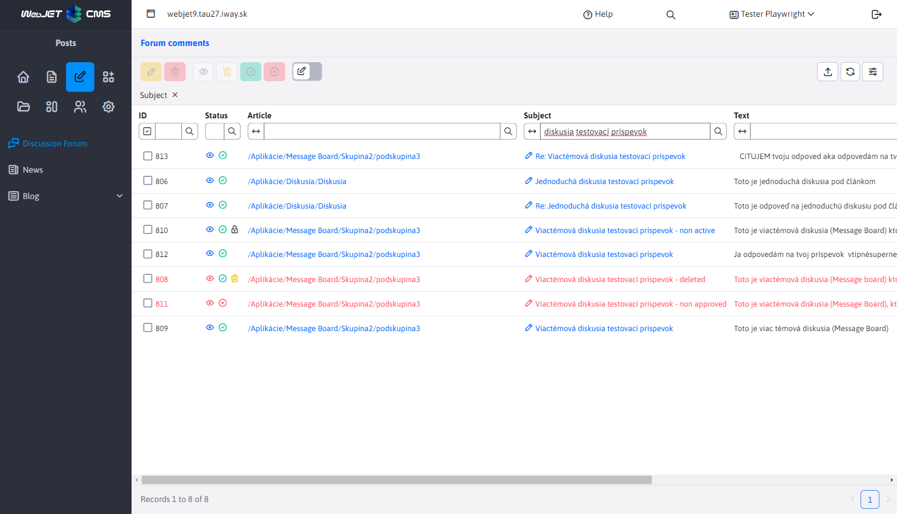
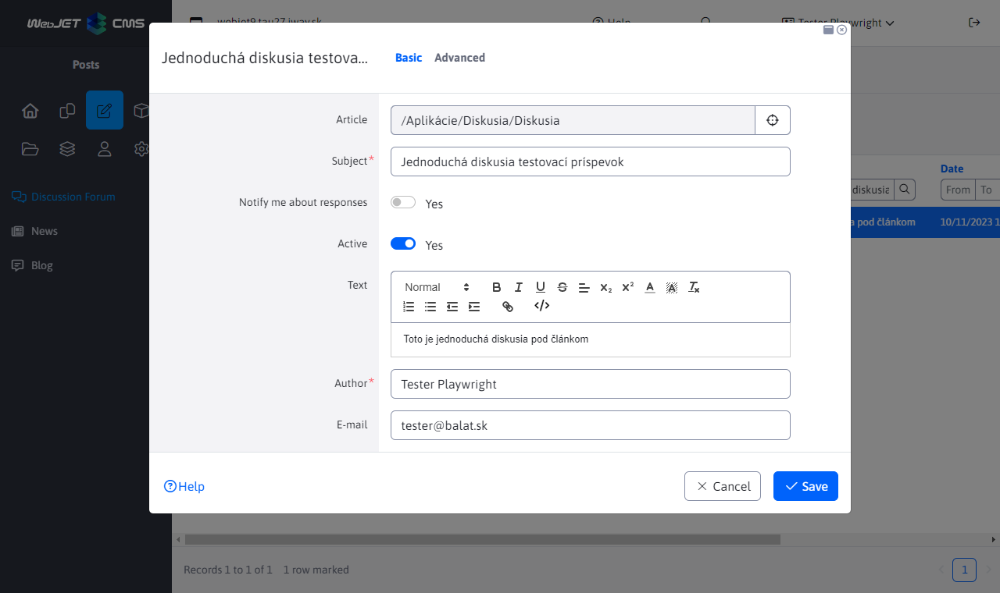
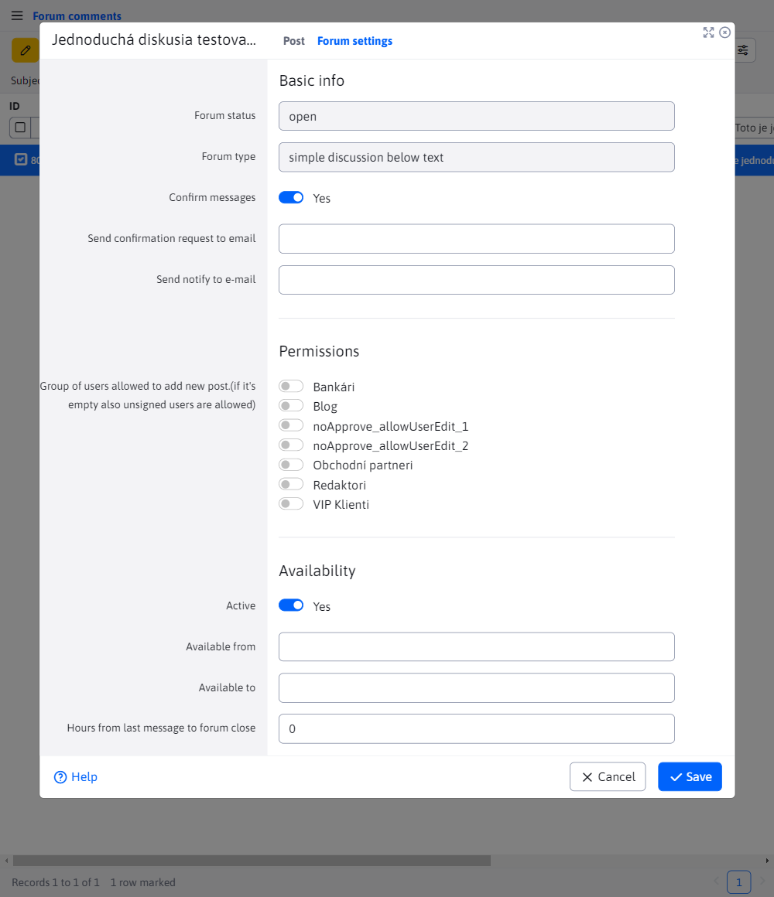
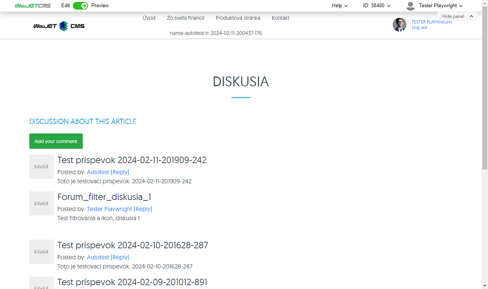
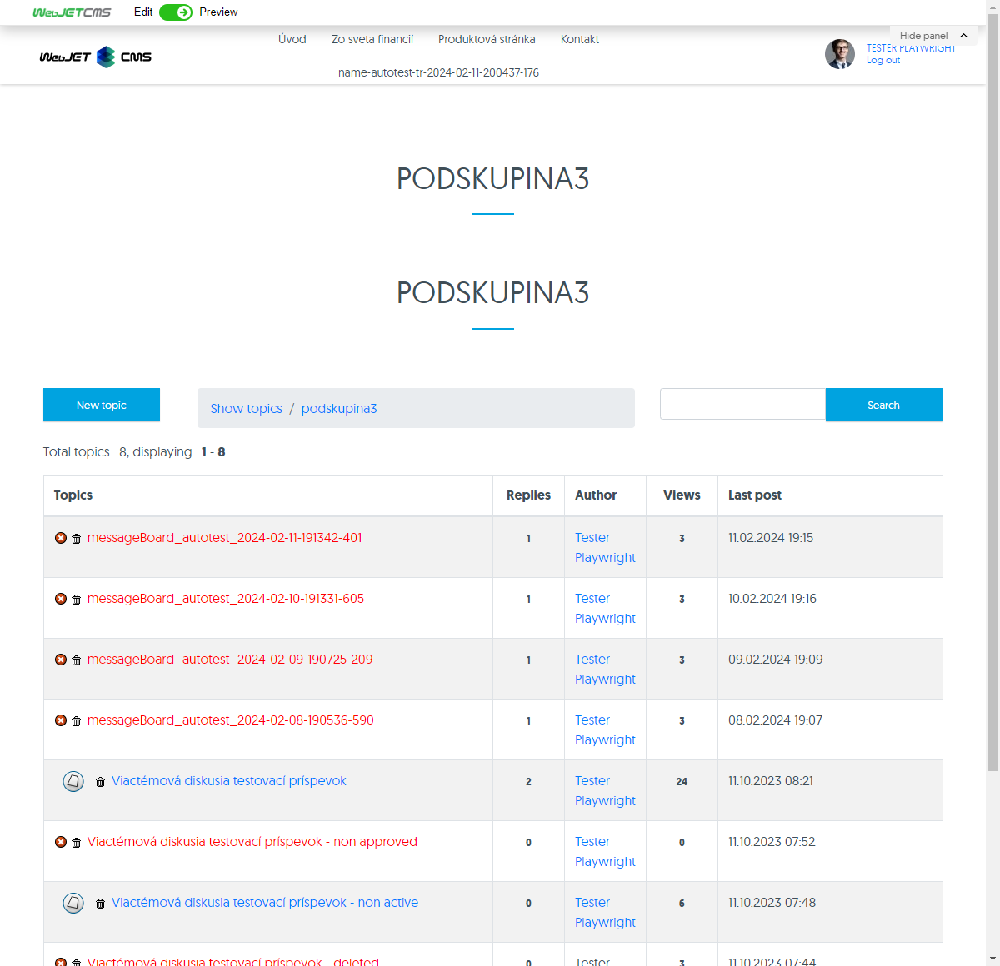
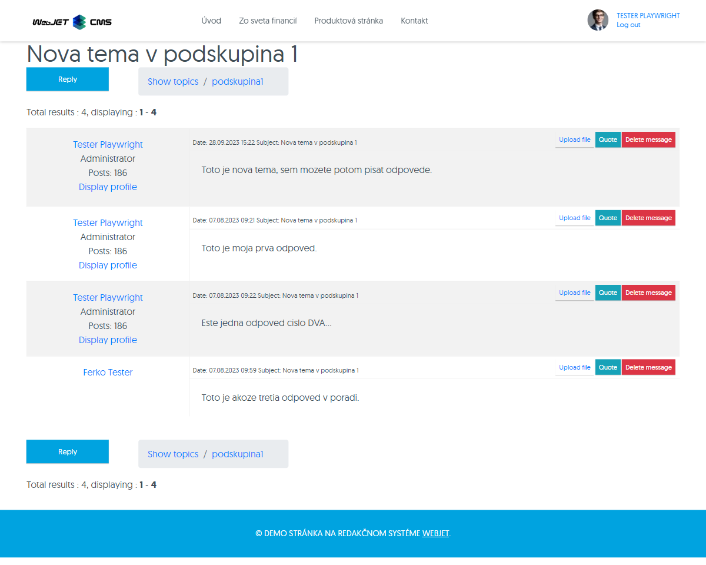
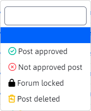
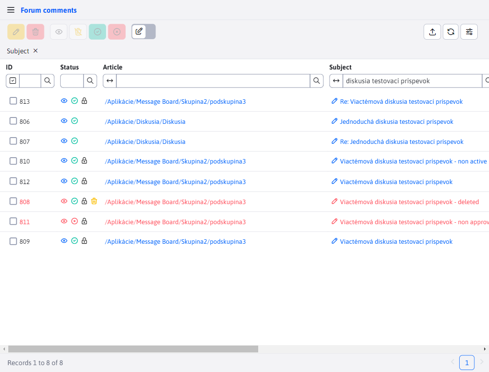
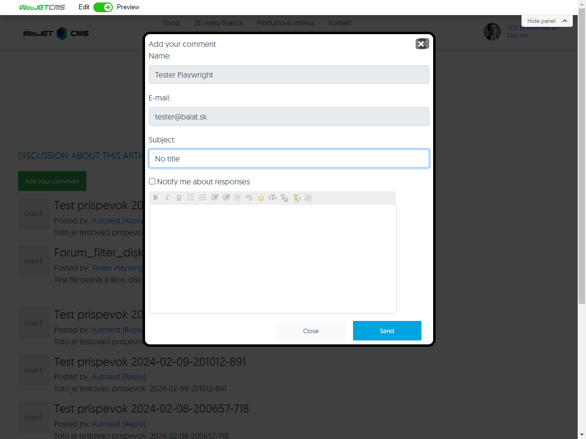
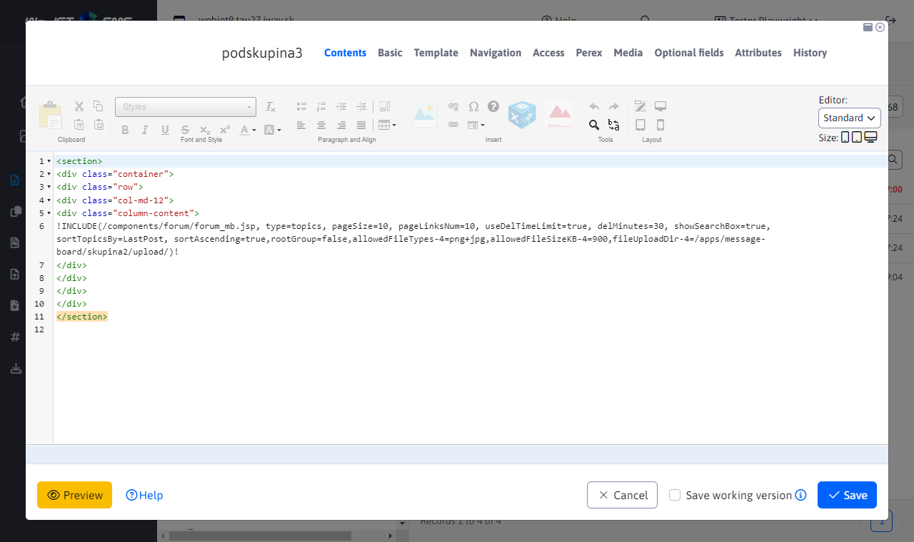

# Discussion list

The discussion list is located in the Posts section. It contains a list of all posts that belong to the **Discussion Forum** and the **Discussion Board**.



## Post editing

To edit a post, use the  button, which will bring up the editor and is active only if at least one post is selected. The editor can also be called up by clicking on the value of the **Title** column in the table.



Post editing is located in the **Post** editor tab and contains the following fields:

- **Article** - the website to which the discussion is attached
- **Title** - subject/title of the post
- **Send notification when replying to a post** - you can set up sending a notification email
- **Active** - you can set the activity of the post
- **Text** - the actual text of the post
- **Author** - name of the author of the post
- **E-mail** - email address of the author of the post, a notification is sent to it if the reply option to the post is selected

## Discussion/forum setup

The settings for the entire forum/discussion (all posts on one web page) are located in the **Discussion Settings** tab. It is divided into 3 sections.



### Section - Basic data

It contains basic information about the discussion forum in the following fields:

- **Discussion forum status** - informs about discussion activity. If any of the restrictions are exceeded, or the activity is manually disabled, the discussion forum status will be: "closed" (more in [Section - Validity](#section-validity))
- **Forum type** - has the value "simple discussion under the article" or "multi-topic discussion (```Message Board```)"
- **Announcements - subtopics can only be created by administrators** - this field will only be displayed in the case of a "multi-topic discussion". If this option is selected, announcements/subtopics will only be able to be created by administrators (more in [Section - Access rights](#section-access-rights))
- **Confirmation of posts** - if you check this option, every time a new post is added, an email will be sent to the specified address with the text of the post and a link to this table, in which the post is automatically filtered.
- **Send confirmation request to email** - field containing the email address where confirmation requests will be sent. The field itself will only be displayed if the **Confirmation of posts** option is selected. In this case, the editor will require you to enter this email address.
- **Send notification to email** - this field has the same role as the field contains the email address to which an email will be sent whenever any post is added to the discussion forum.

### Section - Access rights

The section contains access rights settings. More precisely, the selection of **User groups that can add a new post (if empty, even unregistered users can)**. All groups, no groups, or a combination of them can be selected.

!>**Note:** in the case of a "multi-topic discussion" forum, you can also select **Administrator groups**. If you have selected the option **Announcements - only administrators can create subtopics** in the **Basic data** section, then by selecting these administrator groups you determine who will be able to create subtopics.

### Section - Validity

The section contains the following fields:

- **Active** - you can set the activity of the discussion forum. This is also subject to the following date and time restrictions.
- **Validity date (from)** - set the date and time from which the forum should be active.
- **Expiry date (until)** - set the date and time when the forum will expire.
- **Number of hours since last post, to close discussion** - if you set a value greater than 0, the restriction will be active.

## View post

To view the post, use the  button or directly click on the value of the **Article** column in the table.

The button is active only if at least one post is marked and works depending on the type of discussion the post belongs to.

**Discussion forum**

If the post belongs to the Discussion Forum, pressing the  icon or the link in the **Article** column has the same result. You will be redirected to a web page where you will see all posts, not just the one you came through. This means that a specific post will not be filtered.



**Discussion board**

If the post falls under the "Discussion Board", also known as ```Message board```, the function will differ depending on what you press.

- If you use the link in the **Article** column, you will be redirected to the main page of the multi-topic discussion, where you will see a list of all the topics in the discussion. From there, you can go directly to the topic by clicking on its title.



- If you use the  button, you will be redirected directly to the discussion topic, where there will be a list of posts. Again, the specific post will not be filtered, but you will see the entire list.



## Actions over forums and posts

This chapter discusses possible actions you can take on a forum post or on the entire forum.

It should be noted that **individual actions do not affect each other**. In practice, this means that an already deleted post can also be rejected and also locked. Or any combination of these actions.

### Deleting and restoring a post

To delete a post, use the  button and it is only active if at least one post is selected. There are two modes for deleting:

- Marked as deleted - the post will not be deleted from the database, it will only be marked as deleted and will still be available in the table. Such a post can be restored using the restore button .
- Real deletion from the database - the post will be deleted from the database and will never be accessible again.

Which background deletion mode is used depends on the configuration variable ```forumReallyDeleteMessages``` set. If this configuration variable is set to the value ```true```, the record will also be deleted from the database.

!>**Warning:**


  - Both the delete and restore actions are recursive actions. This means that not only the post itself is deleted/restored, but the entire thread below it, including all replies to this post and replies to replies.
  - Deleted posts are no longer displayed in the discussion and will be displayed again with uploaded files after restoration.

### Deleting and restoring a forum

If you decide to delete the entire forum, all posts under it will be deleted with it. The entire forum is hidden from visitors and it is not possible to return to it even using the remembered URL address.

If you choose to restore the entire forum, all posts will be restored with it. The forum will be accessible to visitors again, including all posts and uploaded files.

### Approving and rejecting a contribution

The  button is used to approve a post and the  button is used to reject a post. Both of these buttons are active only if at least one post is marked. These actions are not limited and a post can be approved or rejected at any time.

!>**Warning:**


  - Both the approval and rejection actions are recursive actions. This means that not only the post itself is approved/rejected, but the entire branch below it, including all replies to this post and replies to replies.
  - Rejected posts are no longer displayed in the forum and will reappear in the forum with uploaded files after they are approved.

### Forum approval and rejection

If you decide to reject an entire forum, all posts under it will be rejected with it. The entire forum is hidden from users and it is not possible to return to it even using a remembered URL.

If you decide to approve the entire forum, all posts will be approved with it. The forum will be accessible to users again, including all posts and uploaded files.

### Locking and unlocking a post

To lock a post, you need to set the **Active** field value to ```false``` (do not select the option). The field is located in the post editor, more precisely in the **Basic** tab. Selecting the **Active** option (setting the value to ```true```) will unlock the forum post.


!>**Warning**

  - the lock action (setting a post as active) and the lock action (setting a forum as inactive) are recursive actions. This means that not only the post itself is locked/unlocked, but the entire thread under it, so also all replies to this post and replies to replies...
  - locked posts continue to be displayed in the discussion with uploaded files, but it is not possible to reply to them, quote them, delete them or upload files to them. After unlocking, all functions are enabled for users again.

### Locking and unlocking a forum

Locking the entire forum is done by setting the value of the **Active** field to ```false``` (not selecting the option). The field is located in the post editor, more precisely in the **Discussion Settings** tab and in the **Validity** section. Selecting the **Active** option (setting the value to ```true```) unlocks the entire forum.


If you choose to lock the entire forum, or it is locked after the expiration date, the forum is still visible to visitors, but cannot be edited in any way. This means that visitors cannot add/delete posts or upload files. The forum is marked in red with an icon indicating that the forum is locked.

If you decide to unlock the entire forum, or the expiration period expires, the entire forum will be unlocked and will be editable again, as will all posts in this forum (all posts will be preserved, including uploaded files, and all options will be enabled for users again).

## Discussion status

The table contains a special column **Status**, which contains icons indicating the status of the discussion.


Each entry (regardless of status) contains a clickable "eye" icon that has the same function as the eye button  to view the post (more in the [Viewing a post](#viewing-a-post) section).

The remaining status icons also have meanings. A list of these icons and their descriptions can be found by filtering above the **Status** column.



From this list, the icon representing the Deleted Post also functions as a button (as in the case of the eye icon) and has the same functionality as the corresponding button for restoring a post (more in the [Deleting and restoring a post](#deleting-and-restoring-a-post) section).

As mentioned in the [Forum and Post Actions] section, the individual statuses do not affect each other, so a post can be locked and deleted at the same time, or unapproved and locked at the same time. You can see such a combination of statuses in the following image.



## Working with the forum

In this section, I will discuss the user's work with the forum depending on its type. Or in other words, the user's options when working with the forum and posts/replies.

More detailed information about how the forum behaves in individual states (the forum itself and posts, not the user's options in the forum) is in the [Action on forums and posts](#actions-on-forums-and-posts) section.

### Simple discussion

When it comes to a simple discussion forum, the visitor has only 2 options:

- adding a new post
- reply to an existing post

A regular visitor cannot see posts that are either deleted or disapproved (nor can they see replies to those posts). However, they can see locked posts.


**Adding a new post**

Anyone can add a new post in a simple discussion. If it is a logged in user, their name and email will be automatically entered into the form. In the case of a non-logged in user, the forum will require at least a name (email is not required). The newly added post will automatically be saved at the top of the list (or at the bottom - it may depend on the set order direction).

It is true that adding a new post is only possible if **the forum is not locked**, so it is active. Otherwise, the visitor will see all posts and replies, but will not be able to add new posts.



**Reply to existing post**

When replying to an existing post, the same user rules apply as when adding a new post. You can only reply to a post (there is no limit to the number of replies), but you cannot reply to a reply.

Please note that the option to reply to posts GLOBALLY is only available if **the forum is not locked**, so it is active. In a locked forum, apart from adding a new post, you cannot reply to posts, so it is read-only.

Please note that the option to reply to individual posts (LOCAL) is only available if **the post is not locked**, i.e. active. If only some posts are locked, they are visible with their replies, but further replies to such a post cannot be added.

### Multi-topic discussion (Message Board)

Regarding the multi-topic discussion forum, the visitor has the following options:

- creating a new topic
- replying to a post
- replying to a reply
- attach a file to a reply/quote
- delete reply

A regular visitor cannot see posts that are either deleted or disapproved (nor can they see replies to those posts). However, they can see locked posts.


**Replying to a post**

Replying to a post has the same rules as described for replying to a post in a simple discussion.

Also, as with a simple discussion, adding a new post (reply) is only possible if **the forum is not locked**, so it is active. Otherwise, the user will see all posts and replies, but will not be able to add new posts (replies).

**Replying to replies (Quote)**

If we are directly in a discussion, then responding to the topic of the discussion is called a reply (as mentioned above). However, if we are already responding to replies, we call it **quoting**. It is possible to quote all posts and even other quotes. In practice, it might look something like this:

```
príspevok
|_odpoveď 1, na príspevok
| |_odpoveď (citácia) 1, na odpoveď 1
| |_odpoveď (citácia) 2, na odpoveď 1
|   |_odpoveď (citácia) 1, na citáciu 2
|_odpoveď 2, na príspevok
```

We create a tree of answers and quotes to answers or quotes to other quotes. Such a tree can have several levels (this is not limited).

Please note that the option to quote replies GLOBALLY is only available if **the forum is not locked**, so it is active. A locked forum is read-only.

Please note that the option to quote replies LOCALLY is only available if **the reply (aka post) to the post is not locked**, so the reply is active. If only some replies are locked, they are visible with their quotes, but further quotes to such replies cannot be added.

If all conditions are not met, the corresponding button to perform the action will not be displayed.

**Attach a file to a reply/quote**

Files can be attached to both the response and the citation.

It is valid that:
- **only logged in user** can attach file/s
- the user must belong to a group that is allowed to attach files
- user may attach a file **only to own replies/quotes**
- an unlimited number of files can be attached
- the file must meet the set limits as well as the type
- **Note:** if the entire forum or only some replies/quotes are locked, the same logic applies as for replying to a post or quotes.

If all conditions are not met, the corresponding button to perform the action will not be displayed.

Who can upload files, what files, and what size, is set on the discussion forum website by setting the parameter `fileUploadDir-ID_SKUPINY=/files/cesta/k/priecinku/` as shown in the image below.



**Delete reply/quote**

The forum provides the ability to delete both replies and quotes. For more information on the action itself, see the [Deleting and restoring posts](#deleting-and-restoring-posts) section.

It is valid that:

- **only logged in users** can delete a reply/quote
- a user may only delete posts that they themselves have created

If all conditions are not met, the corresponding button to perform the action will not be displayed.

### Administrator view vs user view

It is true that the administrator can do anything when working with the forum, without restrictions. This means:

- sees all forums, even deleted and unapproved ones (regular users cannot see them)
- in a simple discussion, users can add posts and reply to posts without any restrictions (the user is limited by the status of the forum or post)
- in multi-topic discussions, can reply/quote/upload/delete without limits (user is limited by forum status, replies/quotes, etc.)

The only limitation of the Administrator is that he cannot see deleted/unapproved replies/quotes (aka posts) in a multi-topic discussion. The reason is so that these posts do not interfere with his reading of the discussion.

The administrator still has the option to edit such posts. You can read more about these edits in the [Forum and Post Actions](#forum-and-post-actions) section.
