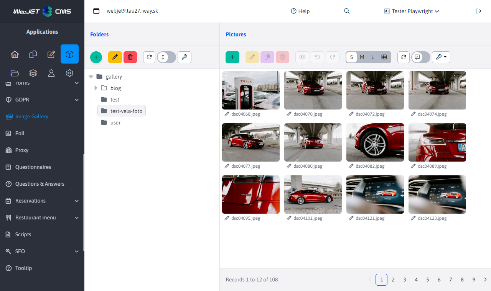
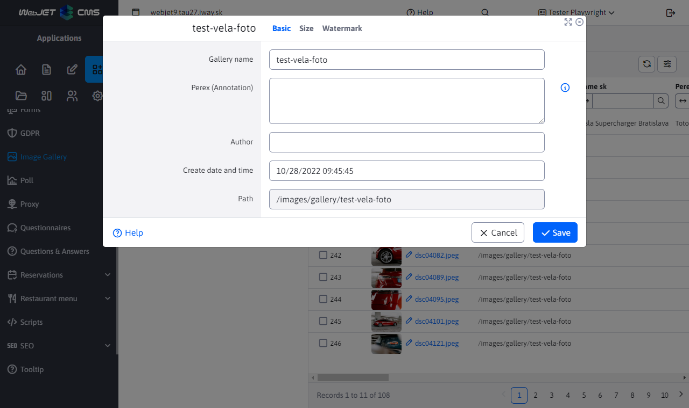
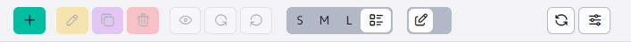
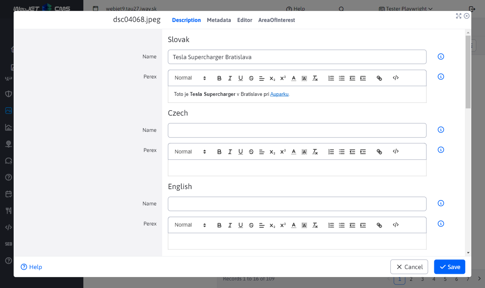
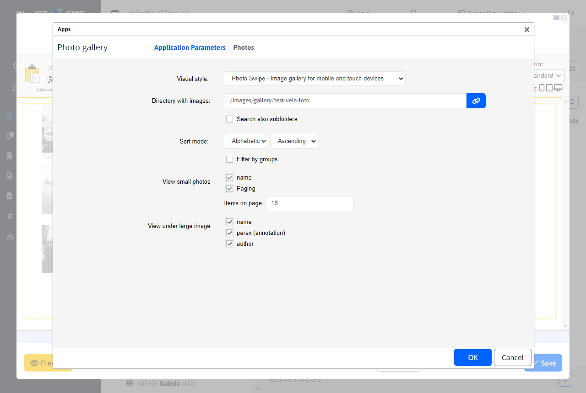
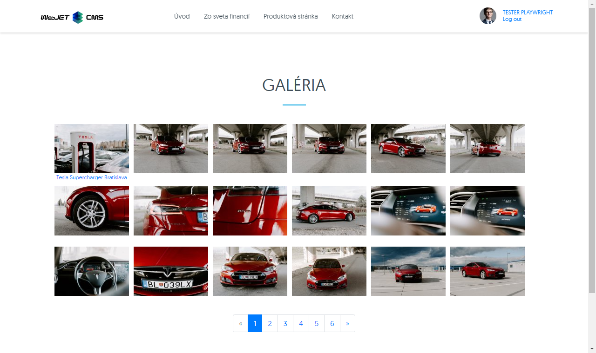

# Gallery

The gallery app allows you to create a photo gallery in an easy way. Just upload pictures from your digital camera to the gallery. WebJET will automatically reduce the photos to the desired format. 3 copies are created from each photo:
- Thumbnail image - small resolution photo, approx. 160x120 pixels, used in the image list
- Image in normal resolution - photo in resolution for a normal monitor, i.e. about 600x400 pixels - this photo will be displayed after clicking on the preview image
- Original photo - primarily serves as a copy of the uploaded photo for the possibility of resizing smaller images. However, depending on the gallery settings, the original photo can be downloaded to get the best quality version.
The dimensions of the thumbnail image and the normal resolution image can be set in the folder properties and possibly changed at any time (the images are automatically pregenerated from the original photo).

## Working with the gallery application

The gallery administration is divided into two columns, similarly to the website. In the first one is the folder structure and in the second one the photos themselves are displayed. The icons for adding, editing, deleting, etc. refer to the corresponding column.

### Structure management

In the folders column, you can browse and add/edit/delete a folder of the gallery tree structure.

Among others, the folder settings contain the following fields:
- Gallery name - the name of the gallery, when created, a folder will be created by this name. For an already created gallery if you change the name the files will remain in the original folder, this name is only "virtual".
- Method of resizing
	- Customized display - the image size is set so that the dimension does not exceed the set size
	- Crop to fit - the image is cropped to fill the specified dimensions, and if the aspect ratio doesn't match it is cropped.
	- Exact size - the image size is set exactly according to the folder, if the aspect ratio is different the image will be deformed.
	- Exact width - the image size uses the specified width and calculates the height according to the aspect ratio. However, the height can be larger than the specified dimension.
	- Exact height - the image size uses the specified height and calculates the width according to the aspect ratio. However, the width can be larger than the specified dimension.
	- Do not generate thumbnails - the gallery will only use the original image and will not generate thumbnail images. Thumbnail images can then be generated as needed using `/thumb` prefix.
In the Watermark tab, you can set up the brand/logo to be inserted into the image as a watermark. It is also possible to use a vector SVG image whose size is adjusted to the size of the generated image according to the setting in the conf. variable `galleryWatermarkSvgSizePercent` a `galleryWatermarkSvgMinHeight`.

Folders will be displayed in the tree structure:
- z `/images/gallery`.
- z `/images/{PRIECINOK}/gallery` While `{PRIECINOK}` is any folder. If for some reason you need to separate a gallery for a project/micro-site.
- from the database table `gallery_dimension` there is an entry with the gallery dimension setting for the path in the column `image_path` (but that starts at /images).
When using domain aliases (conf. variable set `multiDomainAlias:www.domena.com=ALIAS`), the folder is displayed/opened by default `/images/ALIAS/gallery`. For backward compatibility, other gallery folders (e.g. `/images/gallery`), but those that contain the domain alias of another domain in the folder name will not be displayed.

Folders have the following icons:
- <i class="ti ti-folder-filled" role="presentation"></i> full folder icon = standard folder, has gallery dimensions set
- <i class="ti ti-folder" role="presentation"></i> empty folder icon = folder does not have gallery dimensions set, typically it is `{PRIECINOK}`, see above.

### Photo management

Upload new photos to the gallery by clicking the Add icon in the Images column (hold down the CTRL key to select more images) or by dragging and dropping them directly from your computer.

The toolbar contains icons `SML` to set the size of the displayed photos (their size is changed only for display in the administration), or the last option displays the images in a standard table, where you can e.g. use the Edit Cell function.

Click on the photo to select it, then you can select the function by clicking on the toolbar (edit, delete, view, rotate...). You can click directly on the file name to quickly view the editor.

The editor contains the following tabs:
- Description - short and long description of the photo in different languages (depending on the language of the page, the corresponding description will be displayed).
- Metadata - additional data, the priority field can be used to organize photos in the gallery.
- Editor - edit the photo in the image editor, you can crop, rotate, add objects, text, etc.
- Area of interest - sets [area of interest](http://docs.webjetcms.sk/v8/#/front-end/thumb-servlet/bod-zaujmu) on the photo for displaying e.g. in the news list etc.

## Embedding an application in a web page

Embedding a gallery into a page is also very easy. You select the gallery application. In the "Application Parameters" tab, just specify the directory where the gallery images are located, the ability to browse subdirectories, the number of images on the page, etc.

You have the option to choose the visual style of the gallery:
- `Photo Swipe` - Responsive gallery with the ability to scroll photos with your finger, compatible with mobile devices.
- `PrettyPhoto` - older version of the view, scrolling photos is solved by clicking on the left/right arrow icon.
The "Photos" tab is used to add more photos to the gallery or create a new folder.

For each photo you can set a title and perex (long description/annotation) in the administration. The title can be displayed when the image is in the list, and the perex when the large image is displayed (after clicking on the image in the list).

The resulting gallery on the web page may look like this:

## Possible configuration variables

- `imageMagickDir` - If set, the command is used to resize the images `convert` from the package `ImageMagick` (default value: `/usr/bin`).
- `galleryAlwaysUseImageMagick` - if set to `true`, the resizing of images \&lt; 500 pixels will also be done by calling an external program `ImageMagick` (default value: `true`).
- `galleryWatermarkSaturation` - Adjusts the transparency of the watermark in the resulting image. Number 0-100, 0 means full transparency, 100 means opacity. (default value: 70).
- `galleryWatermarkGravity` - The position of the watermark in the resulting image. Options by cardinal directions in English: `NorthWest, North, NorthEast, West, Center, East, SouthWest, South, SouthEast` (default value: `Center`).
- `galleryEnableWatermarking` - Turns off/on watermarking for images. Watermarking can significantly slow down large image imports due to recursive searching for watermark settings. (Default: `true`).
- `galleryEnableExifDate` - When a photo is uploaded, the creation date is obtained as its date from `exif` information, to turn it off you need to set this variable to false (default value: `true`).
- `galleryStripExif` - If it is set to `true` so they are removed from the photo `exif` information, it is primarily about its rotation for correct display of scales (default value: `true`).
- `galleryImageQuality` - Image quality parameter for conversion via `ImageMagick`, shall be written in the format `šírka_px:kvalita;šírka_px:kvalita`, e.g. `0:30;100:50;400:70`, the best or end interval is used (default value:).
- `galleryVideoMode` - Video conversion mode settings for photo gallery, possible values: `all`=both small and large video will be generated, `big`=only a large video will be generated, `small`=only a small video is generated (default value: `big`).
- `thumbServletCacheDir` - Path to the cache directory `/thumb` images, for a server with a high number of images we recommend moving it to a location other than /WEB-INF/ for the sake of application server startup speed (default: `/WEB-INF/imgcache/`).
- `defaultVideoWidth` - Preset video width (default value: `854`).
- `defaultVideoHeight` - Preset video height (default value: `480`).
- `defaultVideoBitrate` - Preset `bitrate` video (default value: `2048`).
- `galleryConvertCmykToRgb` - If it is set to `true` so it detects if the photo is in `CMYK` and if so, it is converted to RGB (default value: `false`).
- `galleryConvertCmykToRgbInputProfilePath` - Path (RealPath) to the entrance fee `ICC` profile on disk (default value:).
- `galleryConvertCmykToRgbOutputProfilePath` - The path (RealPath) to the output `ICC` profile on disk (default value:).
- `galleryUseFastLoading` - If it is set to `true` will be used for the gallery listing simplified file test, speeds up the display on network file systems (default value: `false`).
- `galleryCacheResultMinutes` - Number of minutes during which the list of images in the gallery is cached, the change is detected by the change of the directory date (available only on Linux OS) (default value: 0).
- `imageAlwaysCreateGalleryBean` - If it is switched on `true` will be the record in `gallery` DB table to create also for images outside the photo gallery (default value: false).
- `galleryUploadDirVirtualPath` - if set to `true` the URL of the web page is used as the directory for file upload (normally only the directory structure without the web page name is used) (default value: false).
- `wjImageViewer` - To configure the display type of the preview image embedded in the page, you can `wjimageviewer` or `photoswipe` (default: photoswipe).
- `galleryWatermarkApplyOnUpload` - Used to automatically apply watermarks when images are uploaded to the gallery (default: false).
- `galleryWatermarkApplyOnUploadDir` - Directory where images are placed for automatic watermarking when uploaded. The name of the image must be `default.png`, with multidomain is the ability to have for each domain a different, in your face `doména.png` (e.g. `www.interway.sk.png`) (default value: `/templates/{INSTALL_NAME}/assets/watermark/`).
- `galleryWatermarkApplyOnUploadExceptions` - List of path names for which the watermark will not be applied when the file is uploaded to WebJET (default value: `logo,nowatermark,system,funkcionari`).
- `galleryWatermarkSvgSizePercent` - The height in percentage that the SVG watermark will occupy of the image height (default value: 5).
- `galleryWatermarkSvgMinHeight` - Minimum SVG watermark height in pixels (default: 30).
