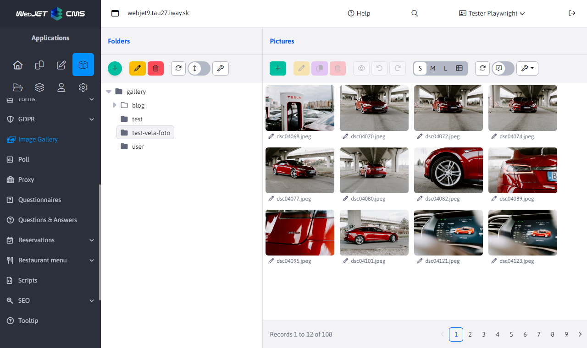
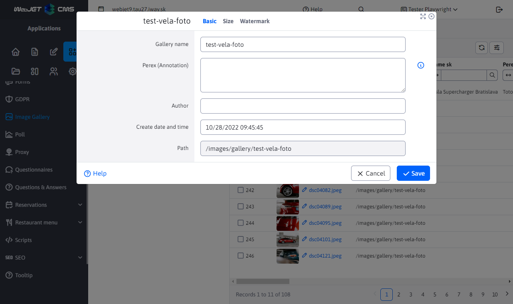
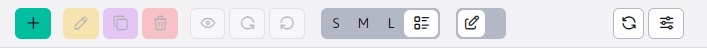
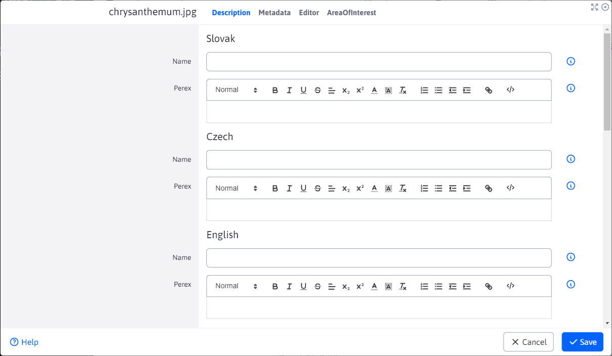
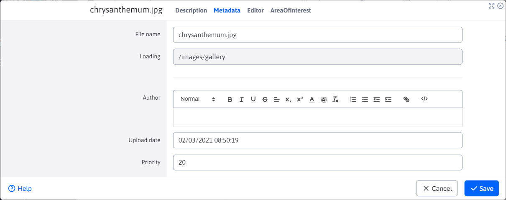
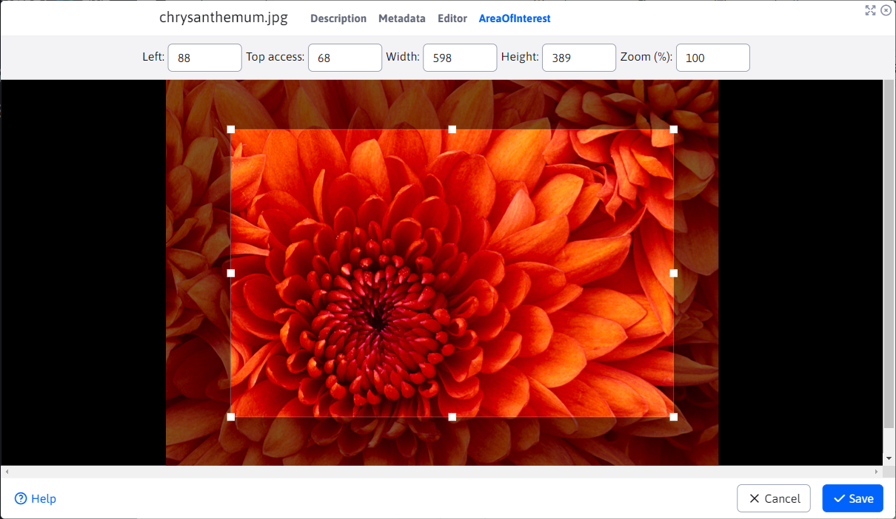
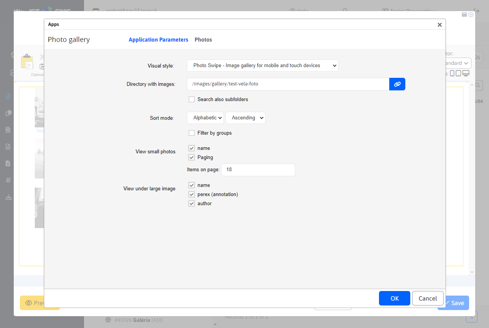
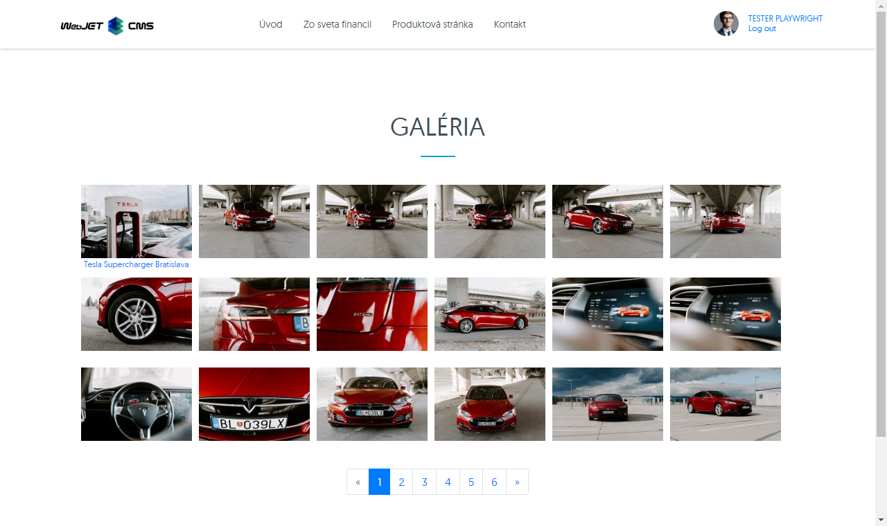

# Gallery

The gallery application allows you to easily create a photo gallery. Just upload images from your digital camera to the gallery. WebJET automatically reduces the photos to the desired format. The supported formats are `JPG`, `JPEG`, `GIF`, `PNG` and `WebP`. 3 copies are created for each photo:

- Preview image - a photo in low resolution, approximately 160x120 pixels, used in the image list
- Image in normal resolution – photo in resolution for a normal monitor, i.e. approx. 600x400 pixels – this photo will be displayed after clicking on the preview image
- Original photo – primarily serves as a copy of the uploaded photo for the possibility of regenerating the dimensions of smaller images. However, depending on the gallery settings, it is possible to download the original photo to obtain the highest quality version.

The dimensions of the preview image and the image in regular resolution can be set in the folder properties and changed at any time (the images are automatically generated from the original photo).

## Working with the Gallery app

The gallery administration is divided into two columns, similar to a website. The first column contains the folder structure, and the second column displays the photos themselves. The icons for adding, editing, deleting, etc. are related to the respective column.



You can [search](../../webpages/README.md#searching-in-the-tree-structure) in the tree structure, just like you would in a web page. Only folders stored in the database, i.e. those with a full icon, are searched.<i class="ti ti-folder-filled" role="presentation"></i> .

### Structure management

In the folders column, you can browse and add/edit/delete a folder in the gallery tree structure. For more information, see [Structure Management](structure.md).



### Photo management

You can upload new photos to the gallery by clicking the Add icon in the Images column (hold down the CTRL key to select multiple images) or by dragging them directly from your computer.

The toolbar contains icons `SML` to set the size of the displayed photos (their size changes only for display in the administration), or the last option displays the images in a standard table, where you can, for example, use the Edit cell function.



Click on the photo to select it, then you can select a function by clicking on the toolbar (edit, delete, view, rotate...). You can click directly on the file name to quickly display the editor.

The editor contains the following tabs:

**Description**

Short and long description of the photo in different language variants.

These descriptions are important for international users. A short description provides a quick overview of the photo's content, while a long description provides more detailed information. The descriptions are automatically displayed based on the selected page language.



**Metadata**

Contains additional data:

- **File name**: The unique file name of the photo that allows it to be identified in the system.
- **Folder**: The path or location within storage where a photo is stored. Helps organize and search for photos.
- **Author**: Name or pseudonym of the person who created the photo.
- **Date Uploaded**: The date and time the photo was uploaded to the system. Helps track the chronology and allows you to search for photos by the time they were uploaded.
- **Priority**: A level of importance or preference that can be used to organize photos in the gallery. A lower priority means the photo will be displayed in more prominent places.
- **Image source URL**: The URL from which we obtained the image.



**Image Editor**

It contains an image editor where you can easily rotate, crop, resize, add text and apply various effects to your photo, more info [in the Image Editor section](../../image-editor/README.md)


**Area of ​​interest**

Sets the [area of ​​interest](../../../frontend/thumb-servlet/interest-point.md) on the photo for display, e.g. in the news list and the like.

It is used if we need to have the original photo, but only display a certain section of it - we do not crop the photo, but only set the area of ​​interest.



## Embedding an application into a website

Inserting a gallery into a page is also very easy. You select the gallery application. In the "Application Parameters" tab, you just need to specify the directory where the gallery images are located, the ability to browse subdirectories, the number of images per page, etc.



You have the option to choose the visual style of the gallery:

- `Photo Swipe` - ​​responsive gallery with the ability to scroll photos with your finger, compatible with mobile devices.
- `PrettyPhoto` - ​​older version of the display, moving photos is done by clicking on the left/right arrow icon.

The "Photos" tab is used to add more photos to the gallery or create a new folder.

For each photo, you can set a name and a caption (long description/annotation) in the administration. The name can be displayed next to the image in the list and when viewing the large image (after clicking on the image in the list).

The resulting gallery on the website may look like this:



## Moving an image

Changing the **Folder** value in the **Metadata** tab will change the storage location within the repository. You can change the folder when editing or duplicating an image. You can select the target folder via the selection window, or you can enter the path directly. The path must **always** start with `/images/gallery`. This functionality is useful when moving, as the gallery does not support the `drag&drop` action.

If the specified folder does not yet exist, it will be created automatically. The properties of the created folder will be set according to the nearest parent folder. This also works for several levels at once, so an entire nesting tree can be created automatically.

## Possible configuration variables

- `imageMagickDir` - ​​If set, `ImageMagick` will be used to resize images. The system first looks for the command `magick` (version 7), if it does not exist, `convert` (version 6) will be used (default value: `/usr/bin`).
- `galleryWatermarkSaturation` - ​​Sets the transparency of the watermark in the resulting image. Number 0-100, 0 means full transparency, 100 opacity. (default value: 70).
- `galleryWatermarkGravity` - ​​Position of the watermark in the resulting image. Options according to the cardinal points in English: `NorthWest, North, NorthEast, West, Center, East, SouthWest, South, SouthEast` (default value: `Center`).
- `galleryEnableWatermarking` - ​​Disables/enables watermarking for images. Watermarking can significantly slow down large image imports due to recursively searching for watermark settings. (default: `true`).
- `galleryEnableExifDate` - ​​When uploading a photo, the date of creation is obtained from `exif` information, to disable it, you need to set this variable to false (default value: `true`).
- `galleryStripExif` - ​​If set to `true`, `exif` information is removed from the photo, primarily rotating it to display thumbnails correctly (default value: `true`).
- `galleryImageQuality` - ​​Image quality parameter for conversion via `ImageMagick`, written in the format `šírka_px:kvalita;šírka_px:kvalita`, i.e. `0:30;100:50;400:70`, the best or end interval is used (default value:).
- `galleryVideoMode` - ​​Setting the video conversion mode for the photo gallery, possible values: `all`=both small and large videos are generated, `big`=only large videos are generated, `small`=only small videos are generated (default value: `big`).
- `thumbServletCacheDir` - ​​Path to the directory for the image cache `/thumb`, for a server with a large number of images, we recommend moving it to a location other than /WEB-INF/ to speed up the application server startup (default value: `/WEB-INF/imgcache/`).
- `defaultVideoWidth` - ​​Preset video width (default: `854`).
- `defaultVideoHeight` - ​​Preset video height (default: `480`).
- `defaultVideoBitrate` - ​​Preset `bitrate` video (default: `2048`).
- `galleryConvertCmykToRgb` - ​​If set to `true`, it checks if the photo is in `CMYK` and if so, it is converted to RGB (default value: `false`).
- `galleryConvertCmykToRgbInputProfilePath` - ​​Path (RealPath) to the input `ICC` profile on disk (default value:).
- `galleryConvertCmykToRgbOutputProfilePath` - ​​Path (RealPath) to the output `ICC` profile on disk (default value:).
- `galleryUseFastLoading` - ​​If set to `true`, a simplified file test is used for gallery listing, speeding up display on network file systems (default value: `false`).
- `galleryCacheResultMinutes` - ​​Number of minutes during which the list of images in the gallery is cached, the change is detected according to the directory change date (available only on Linux OS) (default value: 0).
- `imageAlwaysCreateGalleryBean` - ​​If enabled on `true`, a record in the `gallery` DB table will also be created for images outside the photo gallery (default value: false).
- `galleryUploadDirVirtualPath` - ​​if set to `true`, the URL of the website will be used as the directory for uploading files (normally only the directory structure without the website name is used) (default value: false).
- `wjImageViewer` - ​​Configures the type of preview display of the image inserted into the page, can be `wjimageviewer` or `photoswipe` (default value: photoswipe).
- `galleryWatermarkApplyOnUpload` - ​​Used to automatically apply a watermark when uploading images to the gallery (default value: false).
- `galleryWatermarkApplyOnUploadDir` - ​​Directory where images for automatic watermarking are placed when uploading. The image name must be `default.png`, with multidomain it is possible to have a different one for each domain, in the form of `doména.png` (e.g. `www.interway.sk.png`) (default value: `/templates/{INSTALL_NAME}/assets/watermark/`).
- `galleryWatermarkApplyOnUploadExceptions` - ​​List of path names for which a watermark will not be applied when uploading a file to WebJET (default value: `logo,nowatermark,system,funkcionari`).
- `galleryWatermarkSvgSizePercent` - ​​The height in percentage that the SVG watermark will occupy from the image height (default value: 5).
- `galleryWatermarkSvgMinHeight` - ​​Minimum height of the SVG watermark in points (default: 30).

### ImageMagick custom parameters

When performing image operations via `ImageMagick` (resizing, cropping, rotating), you can set your own parameters using configuration variables. The parameters are written in command line format, e.g. `-strip -interlace Plane -quality 85`.

The value of a configuration variable can contain **two lines** separated by a newline:

- **Line 1** - parameters inserted **before the operation** (after the input file), e.g. `-filter Lanczos`
- **Line 2** - parameters inserted **after the operation** (before the output file), e.g. `-define png:compression-level=9`

If only one line is specified (without a newline), all parameters are inserted before the operation.

Example of the resulting command with two lines:

```sh
magick vstup.png -filter Lanczos -strip -resize 640x427! -interlace Plane -sampling-factor 4:2:0 vystup.png
            ↑ riadok 1 (pred operáciou)                   ↑ riadok 2 (za operáciou)
```

- `imageMagickCustomParams` - ​​Basic custom parameters for all `ImageMagick` operations. They will be used if a more specific parameter for the given operation or format is not set (default value: `-filter Lanczos` line 1, `-interlace Plane -sampling-factor 4:2:0 -unsharp 2x0.5+0.5+0` line 2).
- `imageMagickCustomParams_resize` - ​​Custom parameters for the resize operation (default value: ).
- `imageMagickCustomParams_crop` - ​​Custom parameters for the crop operation (default value: ).
- `imageMagickCustomParams_rotate` - ​​Custom parameters for the rotation operation (default value: ).
- `imageMagickCustomParams_jpg` - ​​Custom parameters for format `JPG` (default value: `-define jpeg:optimize-coding=true` on line 2).
- `imageMagickCustomParams_png` - ​​Custom parameters for format `PNG` (default value: `-define png:compression-level=9 -define png:compression-strategy=1` on line 2).
- `imageMagickCustomParams_webp` - ​​Custom parameters for WebP format (default value: `-quality 80 -define webp:method=6 -define webp:auto-filter=true -define webp:sns-strength=50` on line 2).

**Parameter search order:**

The system searches for settings in the following order of specificity (using the example of operation `resize` for format `jpg`):

1. `imageMagickCustomParams_resize_jpg` - ​​most specific, for a specific operation and format
2. If not set, `imageMagickCustomParams_resize` (operation parameters) + `imageMagickCustomParams_jpg` (format parameters) are searched for - these are **combined** (joined) line by line
3. If not set for the operation either, `imageMagickCustomParams` (basic parameters) + `imageMagickCustomParams_jpg` (format parameters) will be used

When combining parameters, the rows are combined separately - row 1 of the basic parameters is combined with row 1 of the format parameters, and so is row 2.

If the custom parameters contain the `compression-level` or `quality` setting, any existing `-quality` parameter will be automatically removed from the command to avoid a conflict.

If you need to have an empty value on the first line, enter the expression `---`, which is processed as an empty value (it is not possible to enter an empty value on the first line because when saving and reading values ​​from the database, whitespace characters are cut off at the beginning and end).

### Reducing the size of the original image

If the original image takes up a lot of disk space, it is possible to set its size to be reduced during upload using configuration variables:

- `metadataRemoverCommand` - ​​if set, metadata removal from uploaded files is activated, or `imageMagick` is used to reduce the size - set to `/usr/bin/convert`.
- `metadataRemoverParams` - ​​parameters, to reduce the image via `imageMagick` set to `{filePath} -resize 1920x1080 {filePath}`. Adjust the size as needed.
- `metadataRemoverExtensions` - ​​extensions to use, set to `jpg,jpeg,png,gif` for images.
- `metadataRemoveMinFileSize` - ​​minimum file size in bytes below which metadata removal is skipped. If the value is `0` or not set, the check is not performed and metadata is always removed.

The `ImageMagick` tool on the server is required.