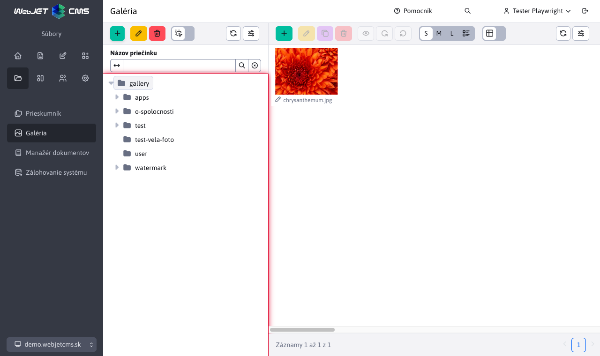

# Structure management

In this section you can manage the gallery structure. You can create new folders, move, delete and edit existing folders, or filter them by name.

The folders will be displayed in the tree structure:

- from `/images/gallery`.
- from `/images/{PRIECINOK}/gallery` where `{PRIECINOK}` is any folder. If for some reason you need to separate the gallery for some project/micro-site.
- from the database table `gallery_dimension` there is a record with the gallery dimensions setting for the path in the column `image_path` (which starts with /images).

When using domain aliases (config variable `multiDomainAlias:www.domena.com=ALIAS` set), the folder `/images/ALIAS/gallery` will be displayed/opened by default. For backward compatibility, other gallery folders (e.g. `/images/gallery`) will also be displayed, but those that contain a domain alias of another domain in the folder name will not be displayed.

The folders have the following icons:

-<i class="ti ti-folder-filled" role="presentation"></i> full folder icon = standard folder, has gallery dimensions set
-<i class="ti ti-folder" role="presentation"></i> empty folder icon = folder does not have gallery dimensions set, typically `{PRIECINOK}`, see above.

## Basic tab

On this tab, you can edit basic folder information, including:

- **Gallery name** - the name of the gallery, when creating a folder will be created under this name. For an already created gallery, if you change the name, the files will remain in the original folder, this name is only "virtual".
- **Annotation** - short summary/description of the gallery
- **Author**
- **Date and time of creation** - date and time the gallery was created, the default is the current date and time, but you can change it
- **Parent folder** - setting the parent folder (the highest is the folder `/images/gallery`, or `/images/{PRIECINOK}/gallery`)
- **Path** - the value represents the path to the gallery as a combination of parent folders and the gallery name, for example `/images/gallery/novy_priecinok`. This value is automatically updated when the parent folder is changed. It cannot be changed manually.
- **Update gallery path in web pages** - a special option that appears **ONLY** when editing an existing folder when the value of the **Parent folder** field has been changed.

## Dimensions tab

The tab offers options that apply to gallery images:

- **How ​​to resize**
  - **Custom display** - the image size is set so that the dimension does not exceed the set size
  - **Crop to size** - the image is cropped to fit the specified dimensions, and if the aspect ratio does not match, it is cropped.
  - **Exact size** - the image size is set exactly according to the folder, and if the aspect ratio is different, the image will be distorted.
  - **Exact width** - the image size will use the specified width and calculate the height based on the aspect ratio. However, the height can be larger than the specified dimension.
  - **Exact height** - the image size will use the specified height and calculate the width based on the aspect ratio. However, the width can be larger than the specified dimension.
  - **Do not generate thumbnails** - the gallery will only use the original image and will not generate thumbnails. Thumbnails can then be generated as needed using the `/thumb` prefix.
- **Regenerate images** - if selected, will regenerate the sizes of all images in the gallery according to the current settings
- **Apply to all subfolders** - if the option is selected, the setting will also be applied to all subfolders
- **Small image size** - width and height of the image
- **Maximum size of large image (if not specified, original will be kept)** - width and height of image

## Watermark tab

In the watermark tab, you can set the insertion of a brand/logo into the image as a watermark. It is also possible to use a vector SVG image, the size of which adapts to the size of the generated image according to the settings in the config. variables `galleryWatermarkSvgSizePercent` and `galleryWatermarkSvgMinHeight`.

You can read more in the separate documentation [Watermark Settings](watermark.md).

## Moving the Gallery folder

There are 2 ways to move a folder:

- **editing** - in folder editing by changing the value **Parent folder**
- `drag and drop` - ​​moving a folder in the structure

Consequences of moving a folder:

- adding **redirect** - automatically adds a redirect from the original folder path to the new path
- updating **websites** - updating the path directly in the body of the website. It is a time-consuming action
  - when **editing**, the option **Update gallery path in web pages** will appear and if selected, all web pages that contain the path to this gallery will be updated
  - when **drag and drop**, all web pages are updated automatically without the possibility of selection

## Setting the tree structure view

If necessary, you can click the icon in the tree structure<i class="ti ti-adjustments-horizontal"></i> Settings display the settings dialog:

- **Folder name on disk** - displays the folder name on disk, which may be different from the Gallery name specified in the gallery settings.
- **Tree:Table Column Width Ratio** - Sets the column width ratio of the displayed tree structure and data table to better utilize the monitor width. The default ratio is 4:8. Warning: with some ratios and inappropriate monitor size, the toolbar/buttons may not be displayed correctly.
- **Sort tree by** - Select the directory parameter by which the folder tree should be sorted. The selection box supports the following parameters
  - **Name**
  - **Date created**
  - **Last edited**
- **Sort tree direction** - Toggles the direction of the folder tree. Selecting the option will use the **Ascending** direction, and not selecting the option will use the **Descending** direction.

