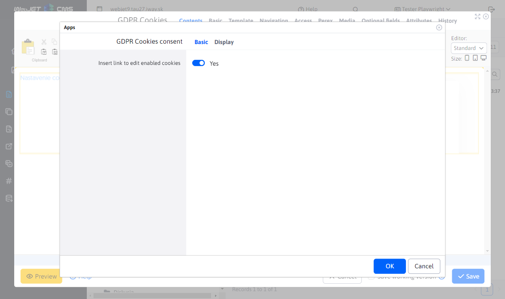
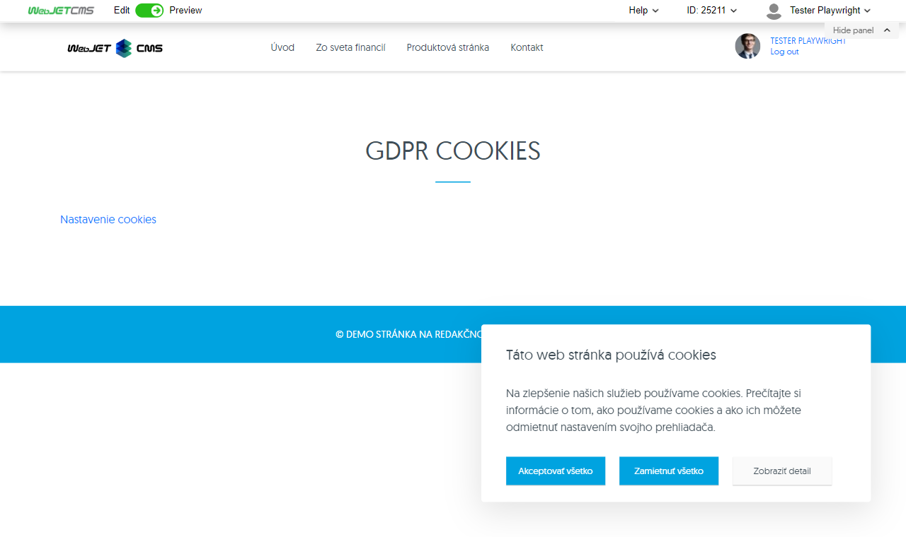

# Cookies consent

Inserts the visitor's cookie settings into the site with a choice of categories that the visitor can allow or deny. For correct insertion of marketing scripts, it is necessary to use the Scripts application, which is linked to the enabled cookies.

GDPR Cookies provide detailed control over what types of cookies can be stored. The user can specifically set which categories of cookies they agree to (e.g. necessary, marketing cookies).

## Application settings

- **Insert link to edit cookies allowed**: Allows you to add a link to give users the option to modify their preferences for cookies allowed.

## View application

