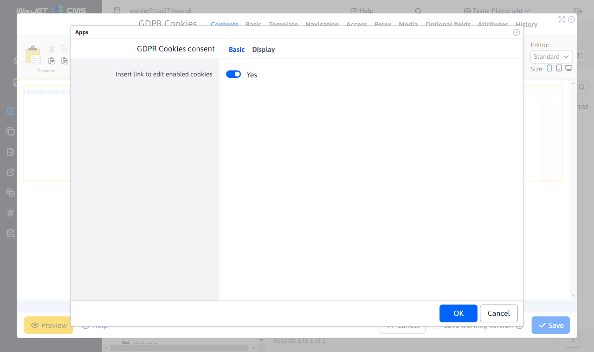
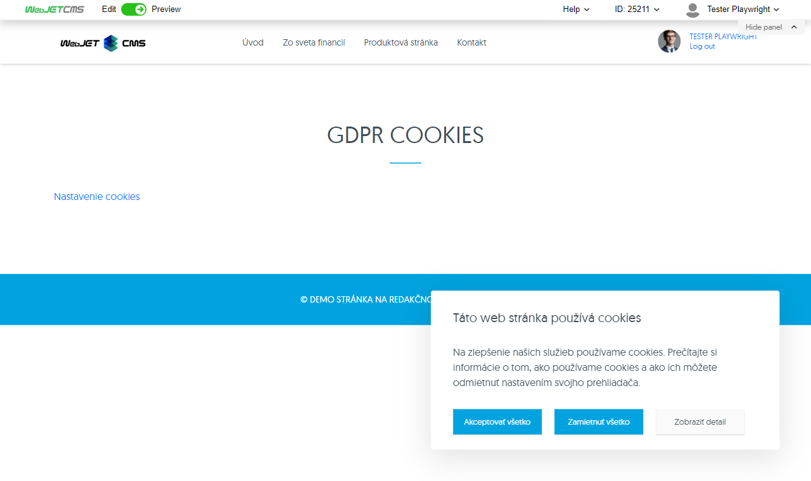

# Cookie consent

It inserts cookie settings for the visitor into the page with the option to select categories that the visitor can allow or deny. To correctly insert marketing scripts, it is necessary to use the Scripts application, which is connected to the allowed cookies.

GDPR Cookies provide detailed control over what types of cookies can be stored. The user can specifically set which categories of cookies they consent to (e.g. necessary, marketing cookies).

## Application settings

- **Insert link to edit allowed cookies**: Allows you to add a link that will give users the ability to edit their preferences for allowed cookies.
  

## View the application

