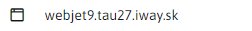

# Cookies manager

The GDPR module allows you to manage cookies and their classifications, which are displayed to site visitors in the cookie bar. This means that the cookie bar will display information about what cookies are being collected on the website and allow visitors the option to turn off the collection of certain cookie classifications.

At the top left of the page there are buttons to add/edit/duplicate/delete cookies, export cookies to an excel file and import cookies from an excel file.

## Defining cookies in different languages

When creating and editing cookies, it is possible to define the value of the "Purpose" text field in different languages SK/CZ/EN/DE etc. If a cookie is created in Slovak language, the value of the "Purpose" field is transferred to other languages by default. But if the value of the "Purpose" field changes after switching to Czech, this value will remain defined only for that language and the value of the "Purpose" field in other languages will not be affected. In this way, a different value of the "Purpose" text field can be defined for each language separately. The language can be changed with the selector at the top left of the page next to the page title.

## Defining cookies in different domains

The created cookie will only be displayed for the domain in which it was created. To create the same cookie or the same cookie with different values in multiple domains, it will be necessary to define them for each domain separately. The domain can be changed using the domain selector located in the top left corner of the page.

## Confirmation of cookie collection by the website visitor

The website visitor's choice of collecting/not collecting certain cookie classifications will be further stored and managed by the Scripts module.

