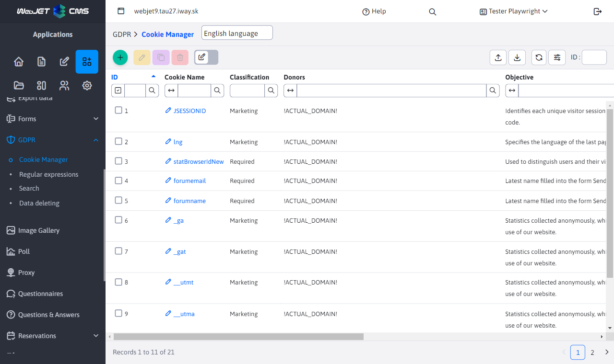

# Cookie manager

The GDPR module allows you to manage cookies and their classifications that are displayed to website visitors in the cookie bar. This means that the cookie bar will contain information about what cookies are collected on websites and allow visitors to disable the collection of certain cookie classifications.

In the upper part of the page there are buttons for adding/editing/duplicateing/deleting cookies, exporting cookies to an Excel file and importing cookies from an Excel file.

## Defining cookies in different languages

When creating and editing cookies, it is possible to define the value of the "Purpose" text field in different language mutations SK/CZ/EN/DE etc. If a cookie is created in the Slovak language, the value of the "Purpose" field will be transferred to other languages ​​by default. However, if the value of the "Purpose" field is changed after switching to the Czech language, this value will remain defined only for the given language and the value of the "Purpose" field in other languages ​​will not be affected. This way, a different value of the "Purpose" text field can be defined for each language separately. The language can be changed using the selector in the upper left part of the page next to the page name.

## Defining cookies in different domains

The created cookie will only be displayed for the domain in which it was created. To create the same cookie or the same cookie with different values ​​in multiple domains, it will be necessary to define them for each domain separately. The domain can be changed using the domain selector, which is located in the upper left corner of the page.

## Confirmation of cookie collection by website visitors

The website visitor's choice of whether to collect/not collect certain cookie classifications will be further stored and managed using the Scripts module.

