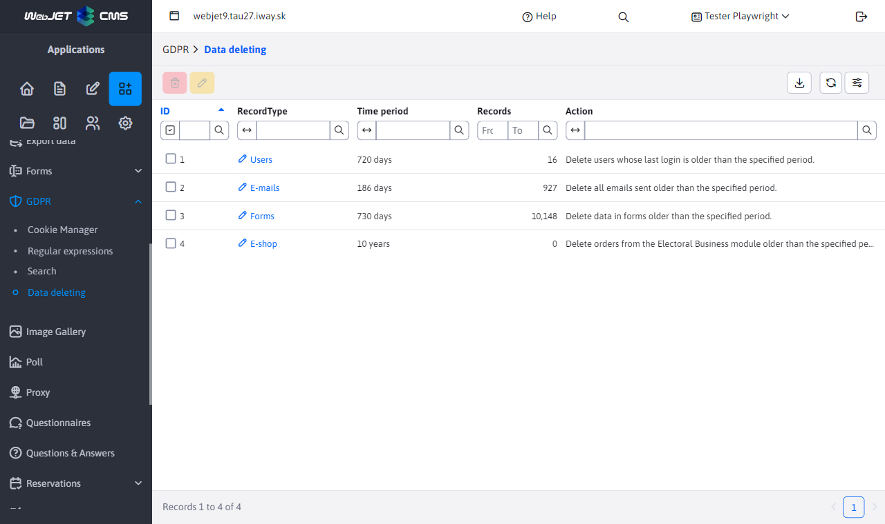
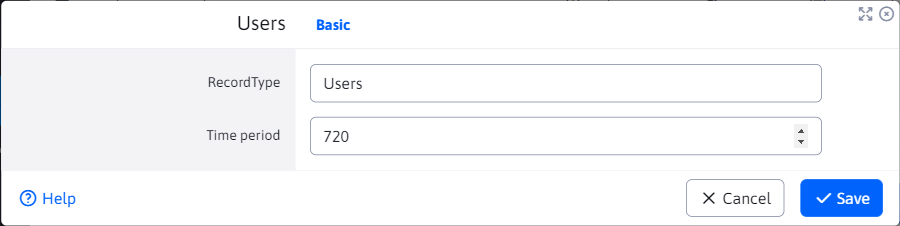

# Data deletion

The GDPR application includes a "Data Deletion" node, which is used to remove old data from the database.

Allows you to delete:

- **inactive user** accounts (those who have not logged in for the last X days, default set to 730 days = 2 years)
- **forms** (records older than X days, default set to 730 days = 2 years)
- **e-commerce orders** (records older than X days, base set to 10 years)
- **emails** (deletion of data from mass e-mailing, default set to 186 days)



It is not possible to create new records in the data table, their number is fixed by the functionality of WebJET CMS. When editing, it is possible to change only the numerical value **Period**, which indicates the period for which the given values ​​will be deleted when the **Delete data** action is performed.



All WebJET user activities when deleting data are audited (type ```GDPR_DELETE_*```) and it is possible to obtain information about what the operation ID was, who deleted it, when, and how much data.