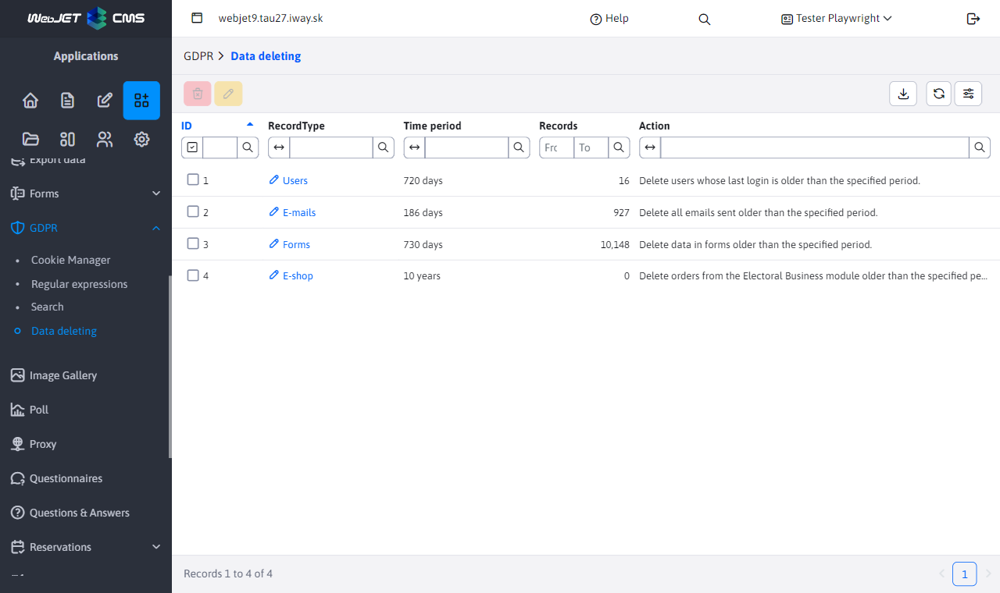
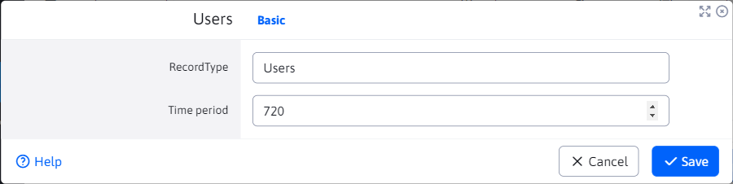

# Data deletion

The GDPR application contains a **Data Deletion** node, which is used to remove old data from the database according to the set retention periods.

Allows you to permanently delete:

- **inactive user accounts** - users who have not logged in for the last X days, by default `730` days,
- **forms** - records older than X days, by default `730` days,
- **e-commerce orders** - records older than X years, by default `10` years,
- **emails** - sent emails from mass mailings, by default older than `186` days,
- **websites and folders in the Trash** - web pages and folders located in the Trash, by default older than `186` days according to the configuration variable `gdprDeleteDocAndGroupsAfterDays`.

It is not possible to create new records in the data table, their number is fixed by the functionality of WebJET CMS. When editing, it is possible to change only the numerical value **Period**, which indicates the period for which the given values ​​will be deleted when the deletion is started. The columns **Record type** and **Action** are for information only.

To start the deletion, select one or more rows and click the **Start** button. A confirmation dialog will display a list of the selected record types.

**Websites and folders in Recycle Bin** will permanently delete the item from the Recycle Bin. This includes old pages, old folders including their subfolders and pages, and folders that are left empty after the old items are deleted. Deleted pages and folders will no longer be recoverable from the Recycle Bin.

!> **Warning:** Deleting pages and folders from the Recycle Bin is irreversible. Please verify that the selected period is correct before proceeding.

## Automated task

The automated task `sk.iway.iwcm.components.gdpr.GdprDataDeleting` without parameters will run all types of deletions, including pages and folders in the Recycle Bin.

If the task should process only selected types, a comma-separated list of values ​​can be specified:

| Parameter value | Record type |
| --- | --- |
| `sentEmails` | Emails |
| `oldFormData` | Forms |
| `oldBasketOrders` | E-commerce orders |
| `unusedUsers` | Inactive user accounts |
| `oldDocAndGroups` | Websites and folders in the Recycle Bin |

## Configuration variables

| Variable | Default value | Description |
| --- | --- | --- |
| `gdprDeleteUserAfterDays` | `730` | Number of days of user inactivity before account deletion |
| `gdprDeleteFormDataAfterDays` | `730` | Number of days to delete old form data |
| `gdprDeleteUserBasketOrdersAfterYears` | `10` | Number of years for deleting old orders |
| `gdprDeleteEmailsAfterDays` | `186` | Number of days for deleting sent emails |
| `gdprDeleteDocAndGroupsAfterDays` | `186` | Number of days for deleting pages and folders in the Trash |

Pages and folders in the Trash are deleted based on their creation date - those created more than the set number of days ago are deleted.

Deleting pages and folders from the Trash is also available in the [Database Cleanup](../../../sysadmin/data-deleting/README.md#database-records) application in the Settings section.

## Auditing

All WebJET user activities when deleting data are audited (type `GDPR_DELETE_*`) and it is possible to obtain information about what the operation ID was, who deleted it, when, and how much data.
