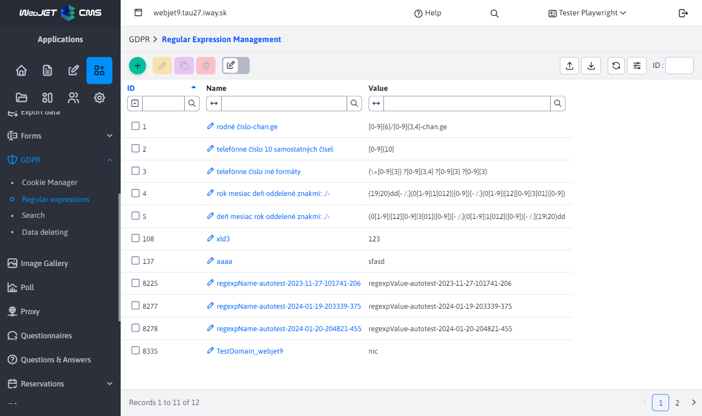
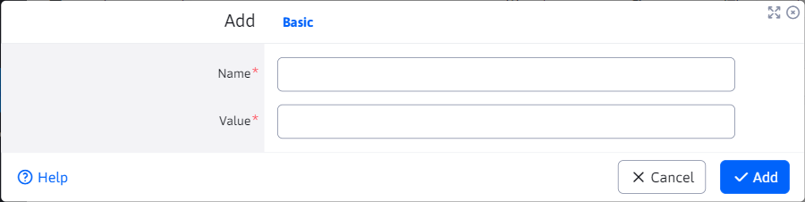

# Managing regular expressions

The GDPR module includes a "Manage Regular Expressions" node, which is used to create and edit regular expressions for particular types of search data.

In the upper left corner there is a series of buttons for creating/editing/duplicating/deleting regular expressions, exporting regular expressions to excel and importing them from excel.

When creating,editing,duplicating a regular expression, the name and value of the regular expression are entered in the editor.

