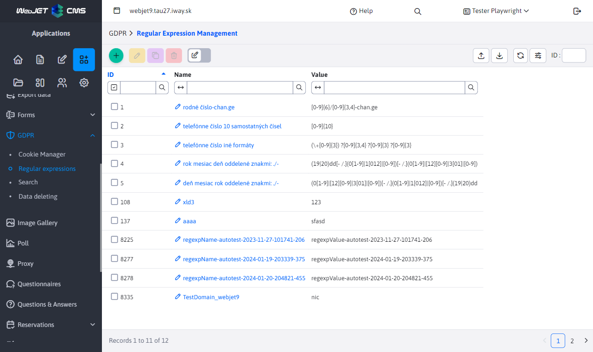
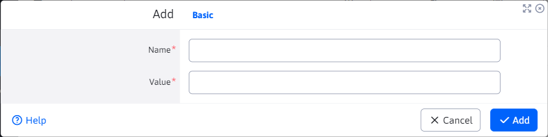

# Managing regular expressions

The GDPR module contains a "Regular Expression Management" node, which is used to create and edit regular expressions for individual types of searched data.

In the upper left corner there is a series of buttons for creating/editing/duplicating/deleting regular expressions, exporting regular expressions to Excel, and importing them from Excel.

When creating, editing, or duplicating a regular expression, the name and value of the regular expression are entered in the editor.

