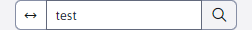

# Search

The GDPR application contains a "Search" node which is used to search for data in the "Forms", "Websites", "Questions \&amp; Answers" and "Forum/Discussion" sections/applications.

In the upper left corner, there is a field for entering the search text. Once entered, records will be displayed from among the mentioned applications that contain the entered term in the name or value.

