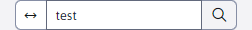

# Search

The GDPR application contains a "Search" node, which is used to search for data in the "Forms", "Websites", "Questions and Answers" and "Forum / Discussion" sections/applications.

In the upper left corner, there is a field for entering the search text. After entering it, records from the mentioned applications that contain the entered term in the name or value will be displayed.

