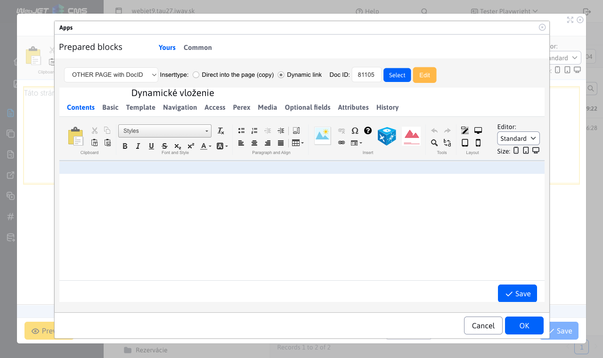
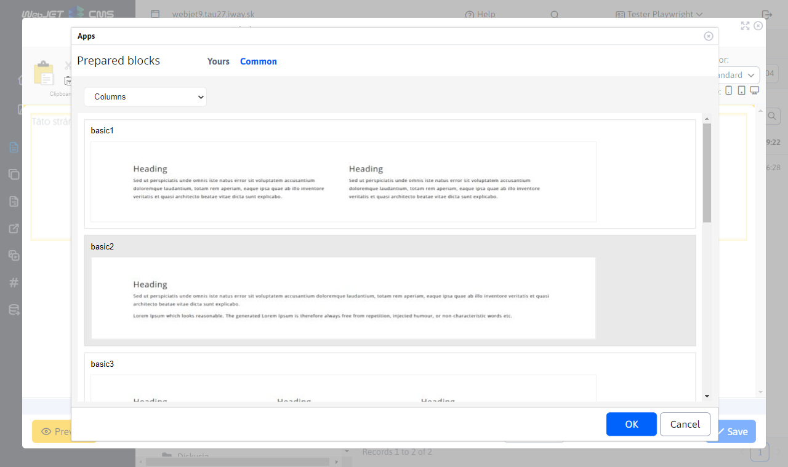
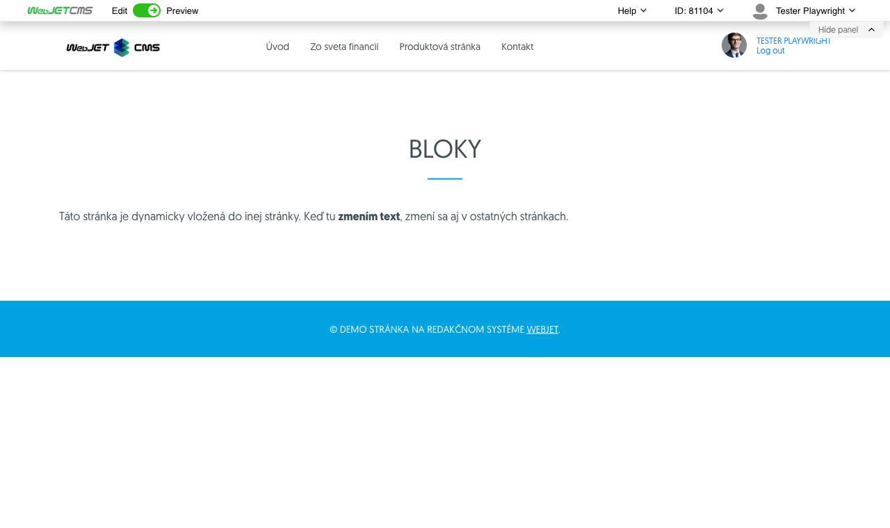

# Prepared blocks

Allows you to insert predefined blocks (HTML objects) into the page. E.g. table and text, contact form, three-column text. You can also insert the content of another page into the current page (e.g. a repeating form).

## Application settings

### Yours

In this section you can set:

- OTHER:
	- Dynamic block / Static block
	- Normal page / Page with title and 2 columns

- ANOTHER PAGE with DocID:
	- Insertion method (Directly into the page / Dynamic link)
	- Doc ID

### General

In this section you can select:
- Columns
- Contact
- Content
- Download
- Header
You can also select a subcategory for each option.

## View application

