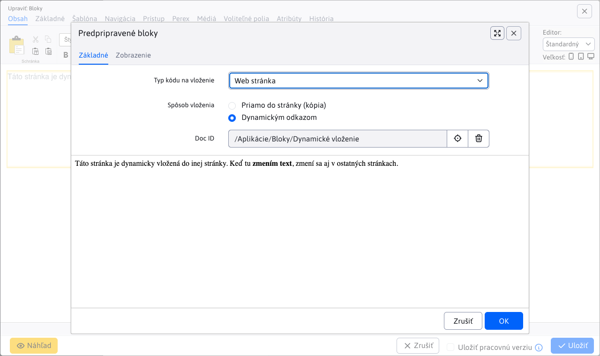
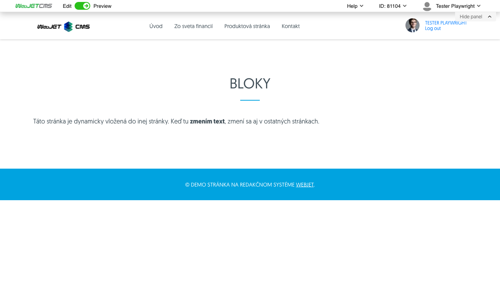

# Pre-prepared blocks

The page editor offers the ability to insert predefined blocks (```HTML``` objects) into a page. For example, a table, text, contact form, etc. You can also insert content from another page into the current page (e.g. a repeating form).

You can view available blocks by clicking the  icon in the page editor to open the block categories dialog, or by adding the **Pre-built Blocks** application.

Types of blocks (HTML objects) that you can insert via **Embedding code type**:

- **Pre-prepared block**
- **Website**
- **Templates**

## Pre-prepared block

Blocks prepared by the web designer will be displayed. These blocks are loaded from files in the `/components/INSTALL_NAME/htmlbox/objects` folder, where `INSTALL_NAME` is the name of your installation (set in the `installName` variable). If this folder does not exist, the standard blocks from `/components/htmlbox/objects` will be used.

There may also be subfolders in the folder. Each block is stored in a `.html` file and for correct display it is necessary to also create a `.jpg` file with a block preview of the same name.

The following block groups/categories are available by default:

- `Columns`
- `Contact`
- `Content`
- `Download`
- `Header`


## Website

This option allows you to insert the content of any web page by selecting it in the `Doc ID` field.

**Insert method:**

- **Directly to page (copy):** A copy of the text of the selected web page will be inserted.
- **Dynamic link:** The HTML code of the block is inserted as a dynamic link. If the content of the block is modified, the change is automatically reflected in all inserted parts.

The content of the currently selected web page is displayed in a preview at the bottom of the window.



## Template

This option contains pages generated from the **System/Templates** folder and its first-level subfolders. Either the folder with the ID defined in the `tempGroupId` configuration variable is used, or if a local System folder exists, it is searched for a folder named Templates (the name can be changed in the `config.templates_dir` translation key).

**Insert method:**

- **Directly to page (copy):** A copy of the text of the selected web page will be inserted.
- **Dynamic link:** The HTML code of the block is inserted as a dynamic link. If the content of the block is modified, the change is automatically reflected in all inserted parts.


## Static vs dynamic insertion

**Dynamic insertion:**

A link to the content is inserted. When you later edit the content (e.g. a single page), the change will be reflected in all places where the content was inserted dynamically.

**Static insertion:**

The content is duplicated and pasted as a copy. The edits then only apply to a specific location on the web page.

## View the application

