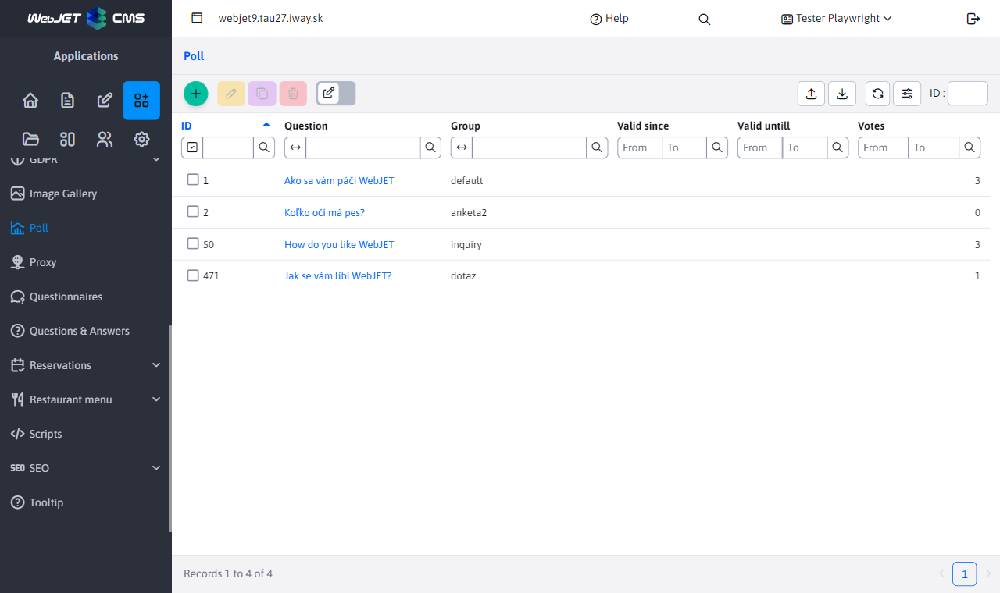
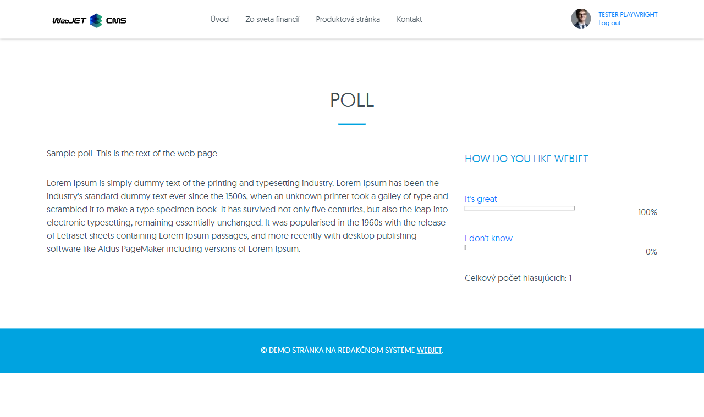
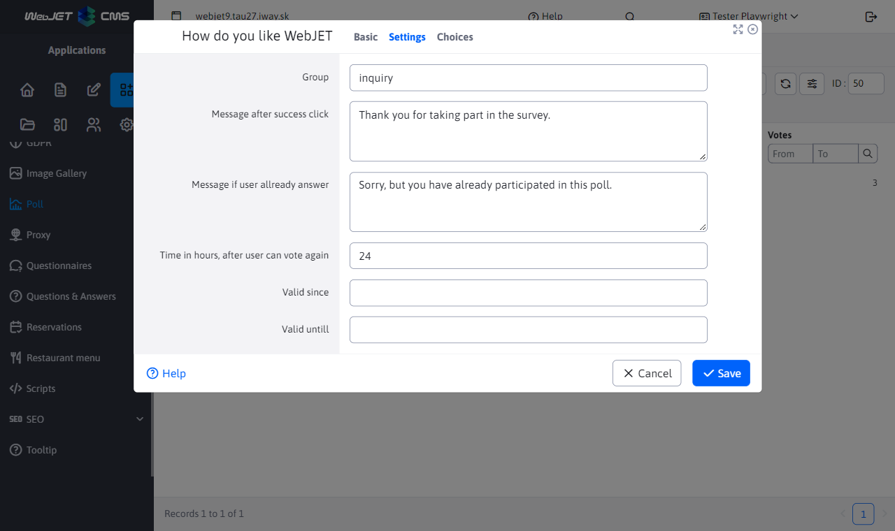
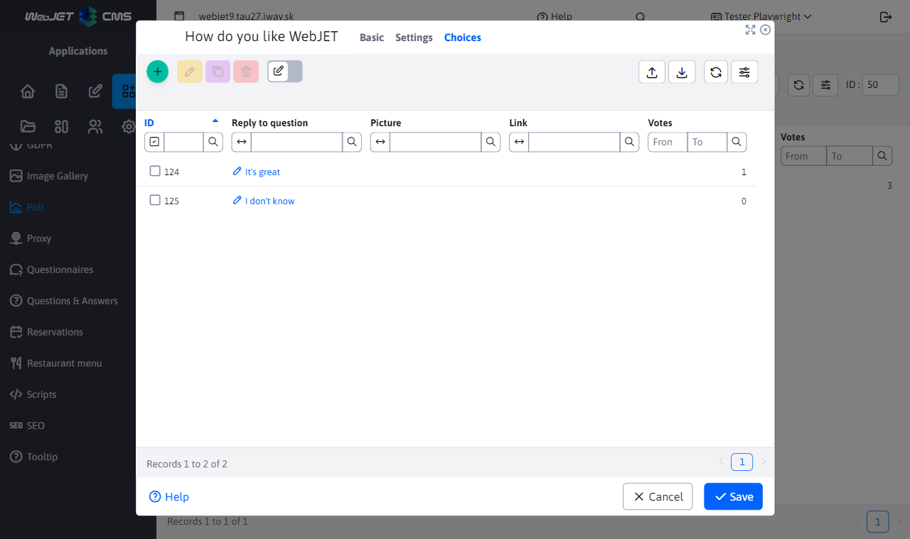
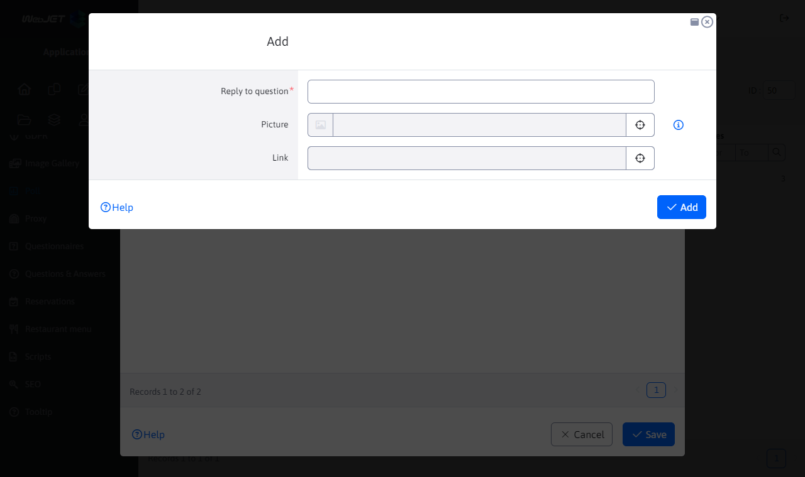
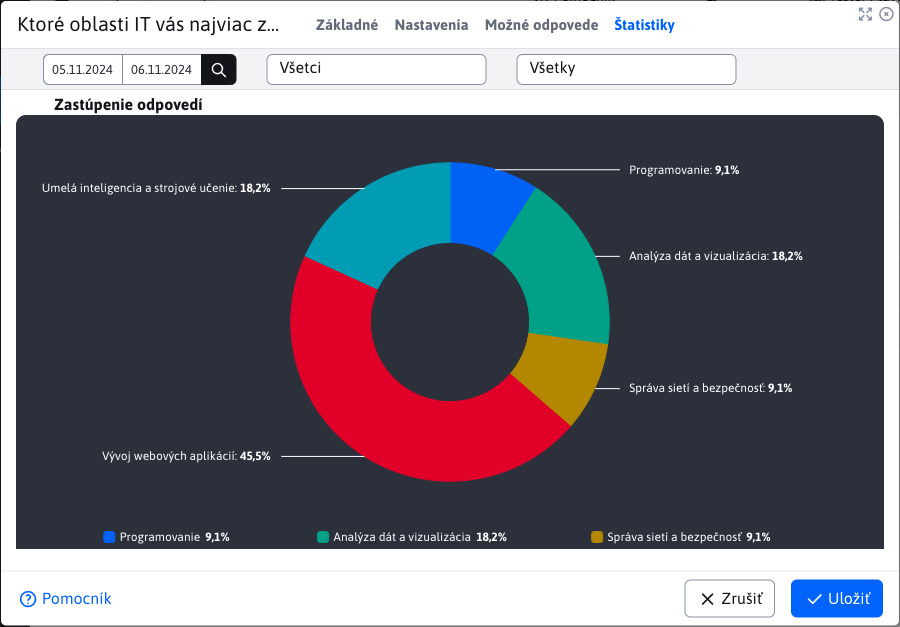
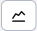

# Poll

The Survey application allows you to create/edit/duplicate and delete surveys.



We recommend displaying it on the website in a narrower column, e.g. in the right column:



The poll editor contains 4 tabs, which we will now describe.

## Basic

The **Basic** tab contains the following fields:

- Question - represents the survey question.
- Active - turns on/off the display of the survey on the website.
- Allow voting for multiple options - if enabled, a visitor to the site can vote for multiple options at once (mark the options with a checkbox and then submit the vote).
- Number of votes - the field displays the current total number of voters, it is editable in case you want to manipulate the poll.


## Settings

The **Settings** tab contains the following fields:

- Group - you can sort surveys into groups (e.g. home page, products, etc.) and then display a survey from the selected group on the page. Enter the character ```*``` to display existing groups.
- Text after voting - text that will be displayed to the visitor after successfully voting in the poll.
- Text if already voted - text that will be displayed to the visitor if there is a voting error (e.g. if the visitor has already voted in the poll).
- Number of hours after which it is possible to vote again - the specified number of hours the visitor will not be able to vote repeatedly. For an unlogged visitor, voting information is kept in cookies. Technically, this means that he can vote repeatedly when using the incognito mode of the browser, or using multiple browsers.
- Valid from, Valid to - date restriction for displaying the survey on the website.



## Possible answers

The **Possible Answers** tab contains a nested data table in which we can add/edit/duplicate and delete possible answers for the currently open survey (question).



The response definition contains the following fields:

- Answer to the question - a possible answer to the question from which the visitor chooses when voting.
- Image - if you set a link to an image, it will appear in the survey on the website next to the text with the answer options.
- Link - if you set the answer option to appear as a link, clicking on the answer text will display the specified website to the visitor.
- Number of votes - the field displays the current number of voters for a given answer, it is editable in case you want to manipulate the poll.



If you create responses immediately when creating a survey but do not save the survey, all responses to this unsaved survey will be lost.

## Statistics

The **Statistics** tab offers quick access to the statistics of the given survey. In addition to a table with the responses of individual users, it also offers graphs.



However, this is only a nested version of the separate page [Survey Statistics](./inquiry-stat.md). If you want to view the survey statistics on a separate page, just select the desired survey and press the .