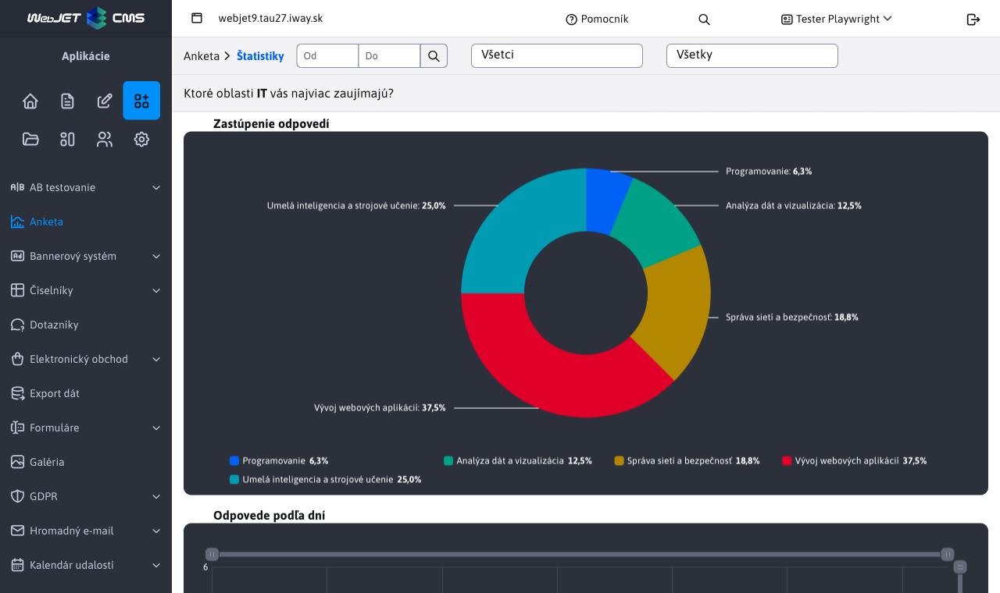
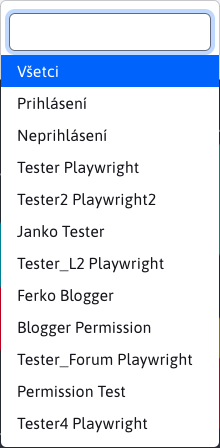
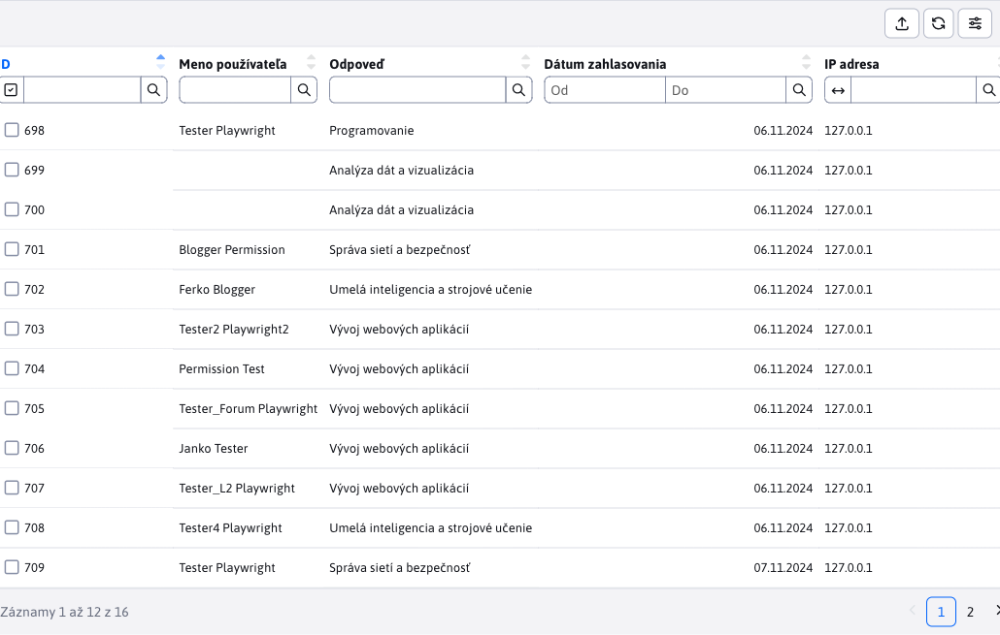
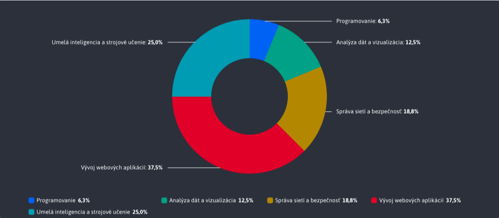
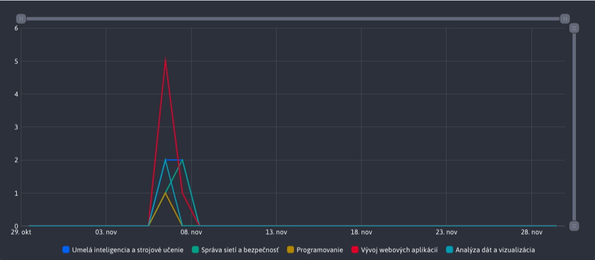

# Poll statistics

Section **Poll statistics** offers a full overview of how each user voted in a given poll. In addition to the data table, it also provides graphs as a quick and easy way to analyze the data.

The page header also contains a section with the question itself, which retains the same structure as when it was created.

## Data filtering

To filter all the data (user's answers in the survey), an external filter in the header of the page is primarily used.

### Date filtering

Allows you to filter by the date the user voted in a given poll. If no date is specified, the default range is 1 month.

### Filtering by user

Allows you to filter by who voted in the poll. The list of options includes every user who voted in the poll and 3 preset options :
- All
- Logged in
- Not logged in

### Filter by answer

Allows you to filter by the poll answer you voted on. So you can filter the data for a specific answer only and see. The list of options contains all possible answers that have been created for a given poll.

## Table

The table contains all filtered user voting records. This data can be further filtered (sorted) in the table as needed, **But** these actions above the table do not affect the data used in the charts.

## Chart Representation of responses

Chart **Representation of responses** provides a quick overview of which answers users voted for the most in the selected time range.

## Chart Responses by day

Chart **Answers by day** provides a quick overview of which days users voted the most in a given poll, for a selected time range.

