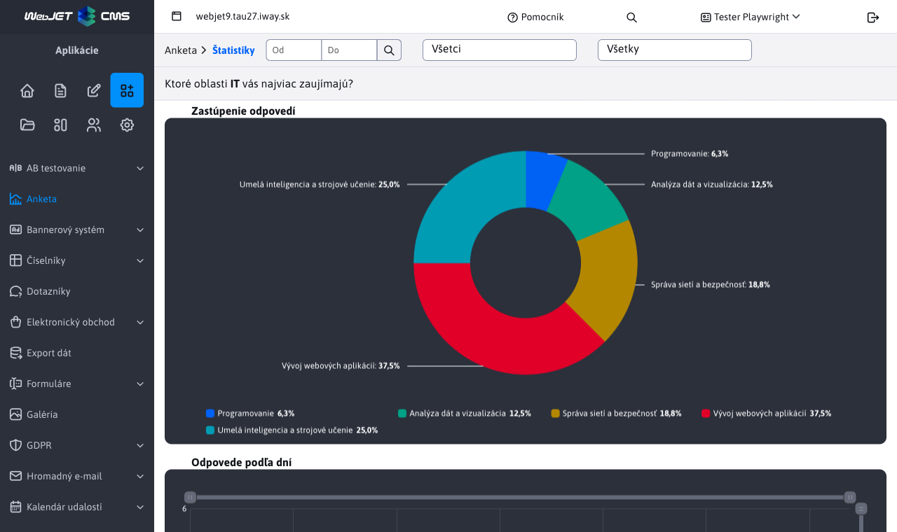
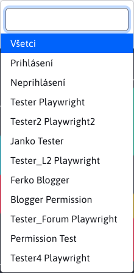
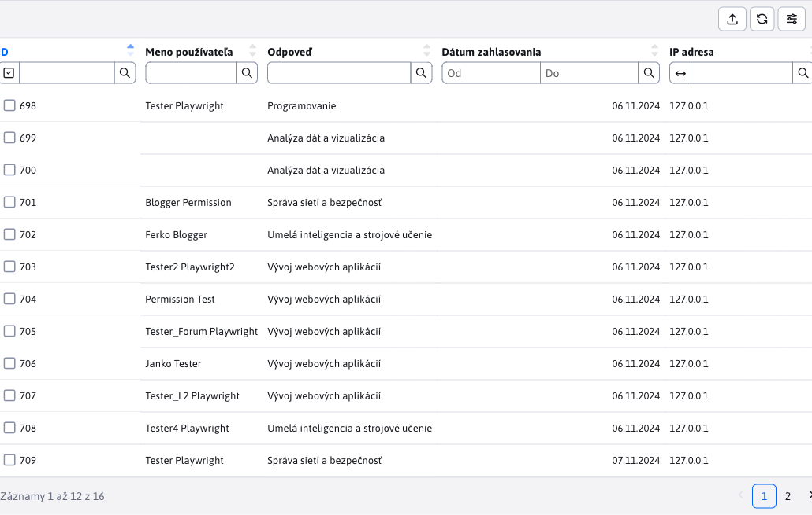
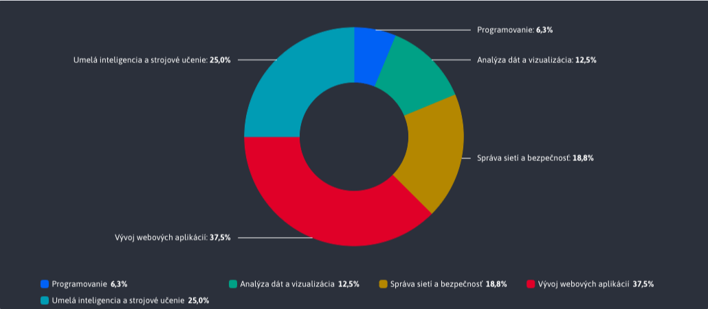
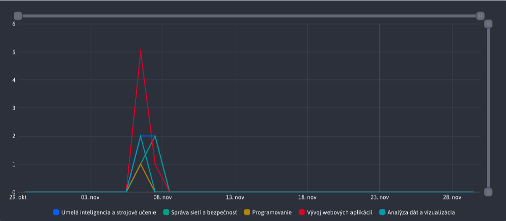

# Survey statistics

The **Poll Statistics** section offers a full overview of individual users' voting in a given poll. In addition to a data table, it also provides graphs as a quick and clear way to analyze the data.

The page header also contains a section with the question itself, which maintains the same structure as it was created.

## Data filtering

An external filter in the page header is primarily used to filter all data (user responses in the survey).

### Date filtering

Allows you to filter by the date the user voted in the poll. If no date is specified, the default range is 1 month.

### Filtering by user

Allows you to filter by who voted in the poll. The list of options includes every user who voted in the poll and 3 preset options:
- Everyone
- Logged in
- Not logged in

### Filter by response

Allows filtering by poll answer. This allows you to filter data for only a specific answer and view it. The list of options contains all possible answers that have been created for the given poll.

## Table

The table contains all filtered user vote records. This data can be further filtered (sorted) in the table as needed, **but** these actions on the table do not affect the data used in the graphs.

## Graph Representation of responses

The **Answer Representation** chart provides a quick overview of which answers users voted for the most in the selected time range.

## Chart Responses by day

The **Responses by Day** chart provides a quick overview of which days users voted the most in a given poll, for the selected time range.

