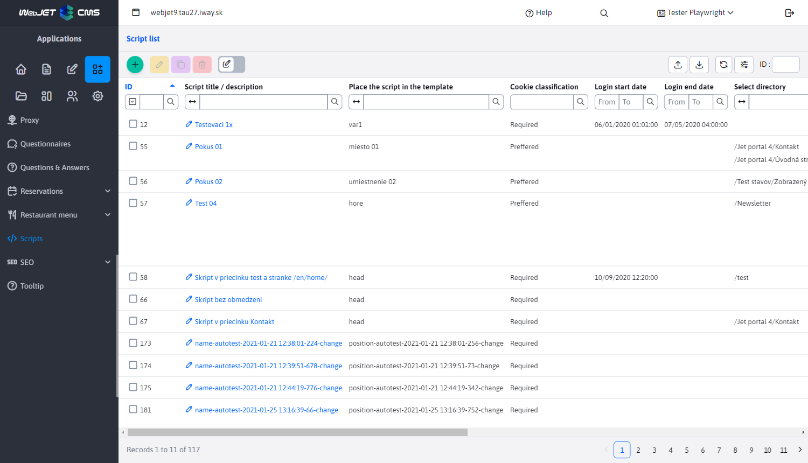
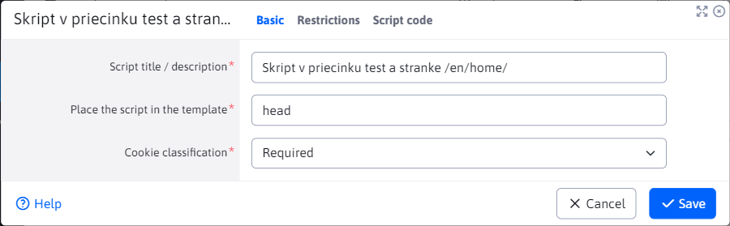
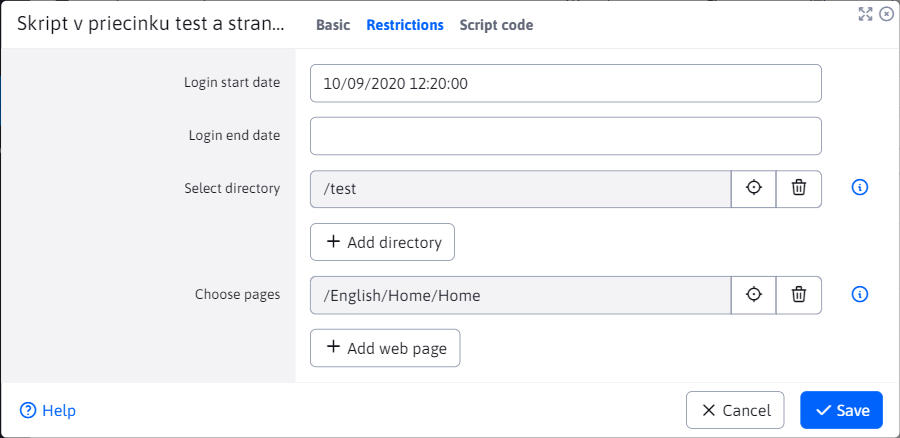
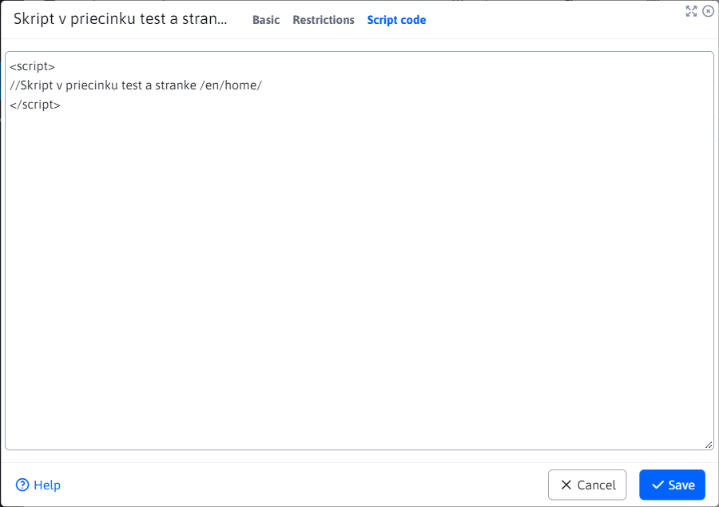

# Scripts

The "Scripts" application allows you to create scripts that you can then add to any page or group of pages. Scripts can be inserted by permission [visitor with cookies/GDPR classification](../gdpr/cookiesmanger.md).



The editor consists of 3 tabs **Basic**, **Restrictions** a **Script code**.

## Basic

The "Basic" tab contains the basic settings which are all mandatory.

- **Script name / description** - your script naming/identification.
- **Script placement in the template** - selection field type `autocomplete` with a list of already specified script positions in the HTML code. If the value (e.g. `after_body`) is not displayed, you can enter it.
- **Cookie classification** - selection box with cookie types according to which script insertion into the page is allowed
  - **Insert always** - the script is always inserted into the page regardless of the cookies/GDPR permission
  - **Required** - script is inserted if Necessary cookies are enabled
  - **Preferred** - script is inserted if Preference cookies are enabled, e.g. language settings.
  - **Marketing** - script is inserted if Marketing cookies are enabled - tracking users to display personalised ads.
  - **Statistical** - script is inserted if Statistical cookies are enabled - they collect data for traffic analysis.
  - **Unclassified** - The script is inserted if Uncategorized cookies are enabled, i.e. those that have not been assigned to a category.



## Restrictions

Script Restrictions tab.

- **Start of validity** - the date and time from which the script is valid.
- **Expiry** - the date and time until which the script is valid.
- **Select a directory** - the script will be inserted into the pages in the selected folders and their sub-folders.
- **Select the site** - the script will be embedded in selected web pages.

If you do not specify a start or end time for the script, the script will still be valid.



## Script code

Field for entering the script code itself (HTML entry).

```html
<script>
// Sem vložte váš kód skriptu
</script>
```



When you open the page where the script was to be inserted, you can check in the source code of the page whether the script was inserted successfully.

## Integration in the template

The technical insertion of the script into the HTML code is provided by [template code](../../../frontend/thymeleaf/tags.md#inserting-scripts). For the Thymeleaf template this is the code:

```html
<div data-iwcm-script="head"/>
```

and for legacy JSP template code:

```jsp
<iwcm:insertScript position="head"/>
```

where the expression `head` defines the field **Script placement in the template**. That is, all scripts that have the Script location in template field set to `head`.
