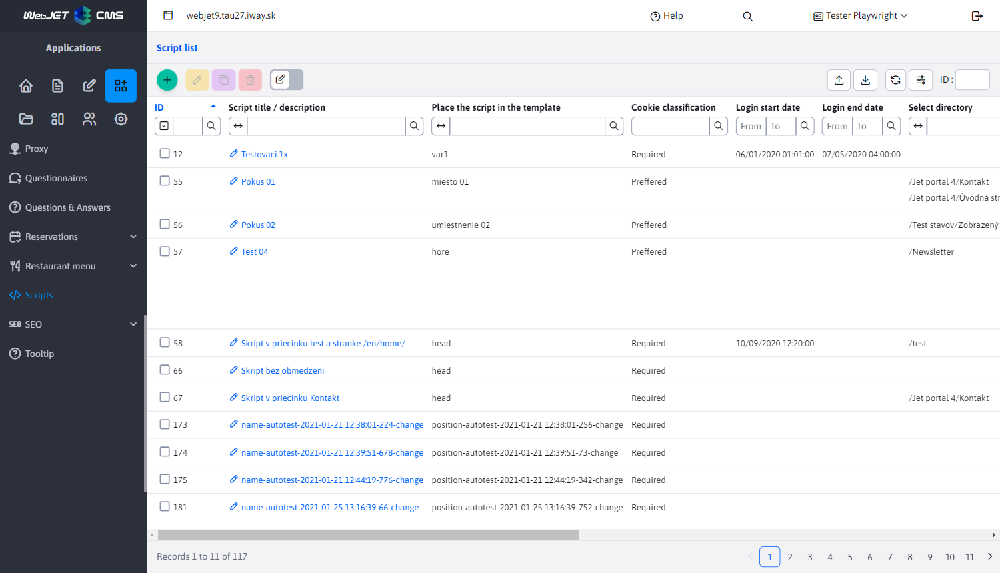
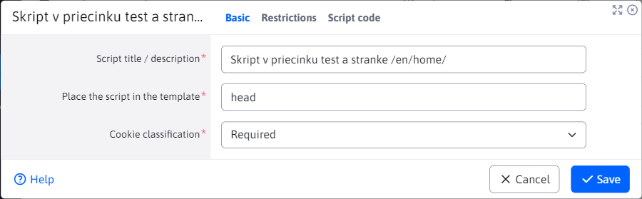
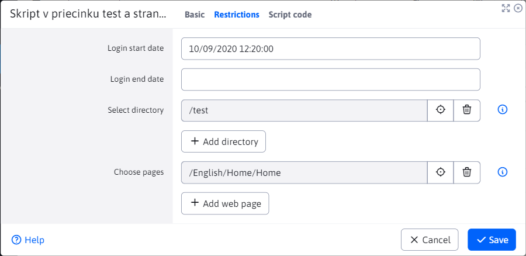
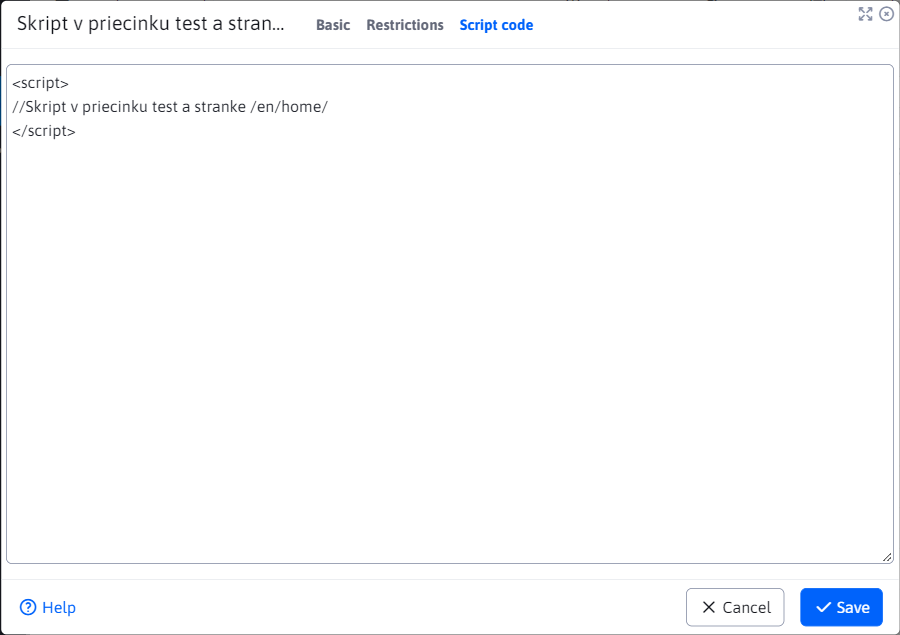

# Scripts

The "Scripts" application allows you to create scripts that you can then add to any page or group of pages. Scripts can be inserted according to the consent of the [visitor with cookies/GDPR classification](../gdpr/cookiesmanger.md).



The editor consists of 3 tabs: **Basic**, **Constraints**, and **Script Code**.

## Basic

The "Basic" tab contains basic settings, all of which are mandatory.

- **Script name / description** – your script name/identification.
- **Script location in template** – selection field of type ```autocomplete``` with a list of already entered script positions in HTML code. If the value (e.g. `after_body`) is not displayed, you can enter it.
- **Insertion order** – a numeric value that determines the order in which scripts are inserted within the same position. The script with a lower value is inserted first. The default value for existing scripts is `10`. When creating a new script or entering an empty value, it is automatically set to the highest existing value in the given position + 10 (e.g. if the highest existing priority is `20`, the new script will be given the value `30`). The value can be edited at any time.
- **Cookie classification** – selection field with types of cookies according to which script insertion into the page is allowed
  - **Always insert** - the script will always be inserted into the page regardless of cookies/GDPR consent allowed
  - **Required** – script is inserted if Required cookies are enabled
  - **Preference** – the script is inserted if preference cookies are enabled, e.g. language settings.
  - **Marketing** – the script is inserted if Marketing cookies are enabled - tracking users to display personalized ads.
  - **Statistical** – the script is inserted if Statistical cookies are enabled - they collect data for traffic analysis.
  - **Unclassified** – the script is inserted if Unclassified cookies are allowed, i.e. those that have not been assigned to a category.



## Restrictions

Script restrictions tab.

- **Validity start** – date and time from which the script is valid.
- **Expiry** – date and time until which the script is valid.
- **Insert script in page editor** - determines whether the script should be inserted in the page editor in PageBuilder mode. Most scripts do not need to be inserted in edit mode to avoid conflicting with the page editor.
- **Select a directory** – the script will be inserted into pages in the selected folders and their subfolders.
- **Select sites** – the script will be inserted into the selected web pages.

If you do not specify a start or end date for the script, the script will always be valid.



## Script code

Field for entering the script code itself (HTML notation).

```html
<script>
// Sem vložte váš kód skriptu
</script>
```



When you open the page where the script was supposed to be inserted, you can check in the page source code whether the script was successfully inserted.

## Integration in the template

The technical insertion of the script into the HTML code is provided by [template code](../../../frontend/thymeleaf/tags.md#inserting-scripts). For Thymeleaf templates, this is the code:

```html
<div data-iwcm-script="head"/>
```

and for older JSP templates the code:

```jsp
<iwcm:insertScript position="head"/>
```

where the expression `head` defines the field **Script location in template**. This means that all scripts that have the Script location in template field set to the value `head` will be inserted at the specified location. Scripts are inserted in order according to the value of the field **Insertion order** (ascending), with the same priority they will be sorted by record ID.