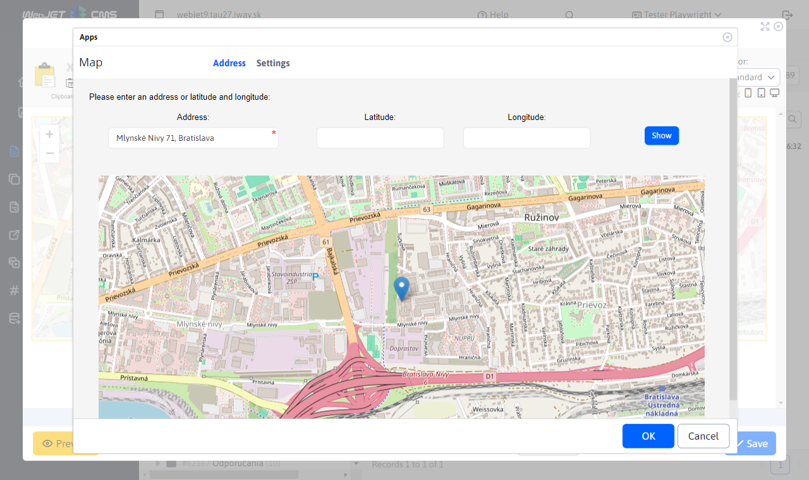
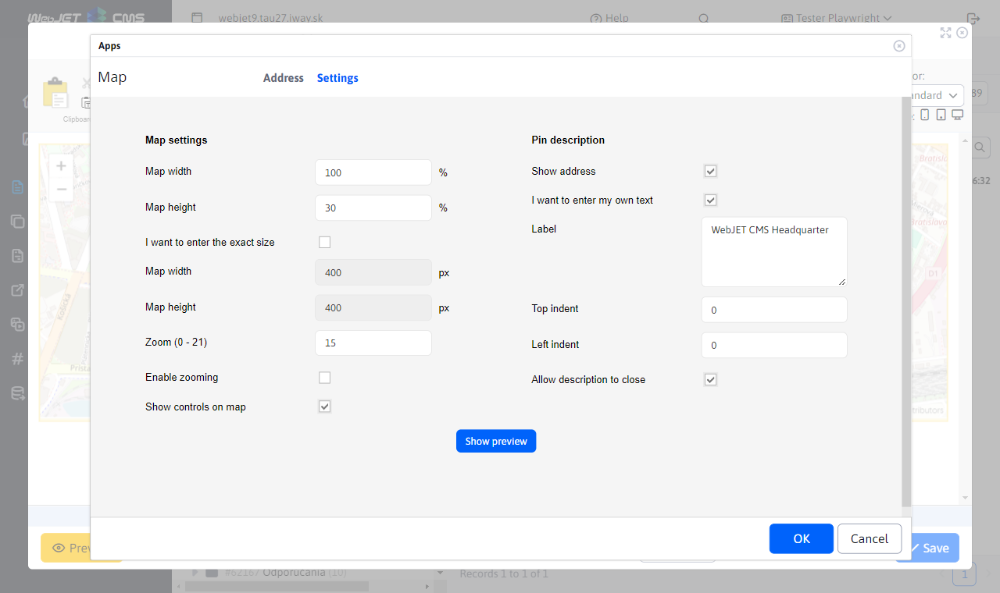
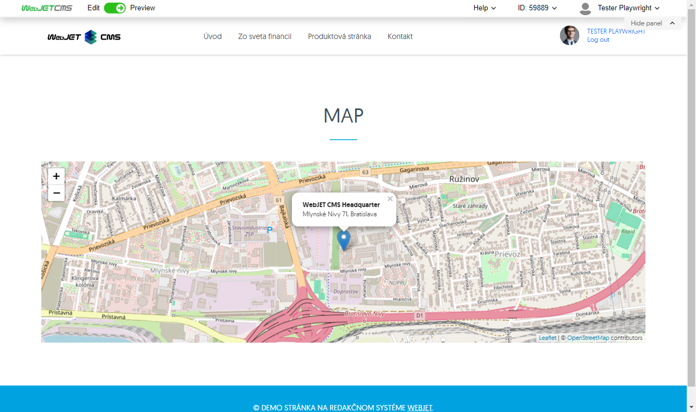

# Map

Inserts an interactive map (Google maps or Open Street Map) into the page according to the specified GPS coordinates or address. To use Google maps, you need to have a purchased API key from Google set in the googleMapsApiKey conf. variable.

## Application settings

### Address

In this section you can set the positional attributes:
- Address
- Latitude, Longitude

It is mandatory to set either the address or the latitude and longitude. The location can be set by clicking on the map and specifying the point. This step displays a pin on the map and overwrites the Latitude and Longitude values.

### Settings

In this section you can set dimensional and visual attributes:
- Map width (percentage)
- Map height (percentage)

After checking the box I want to enter the exact size:
- Map width (in pixels)
- Map height (in pixels)
- Zoom (range 0 - 21)
- Enable approach
- View controls on the map
- Show address
- Description
- Offset from above
- Offset left
- Enable close description

After changing the attributes it is possible to preview using the button

## View application

