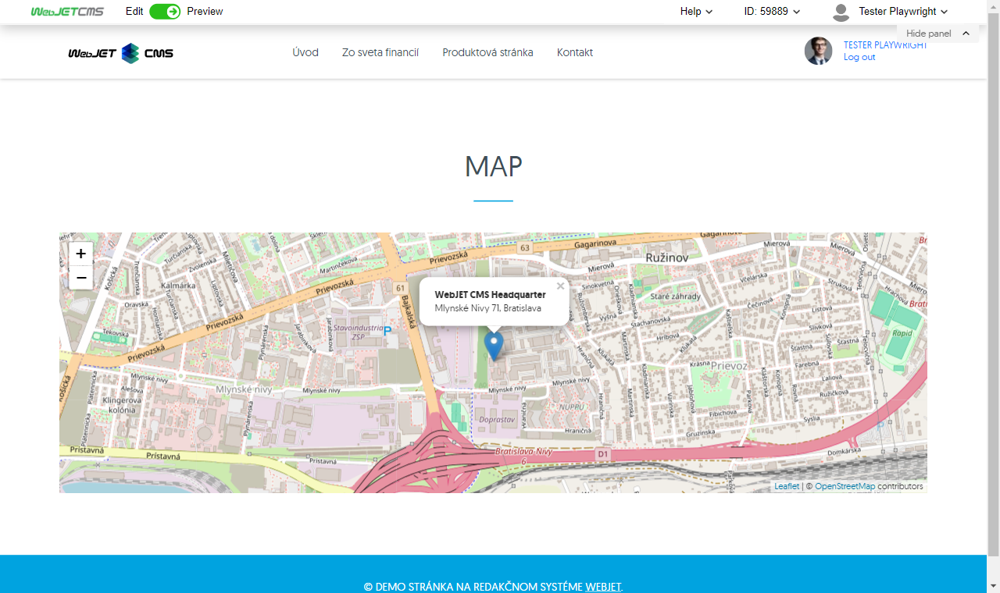
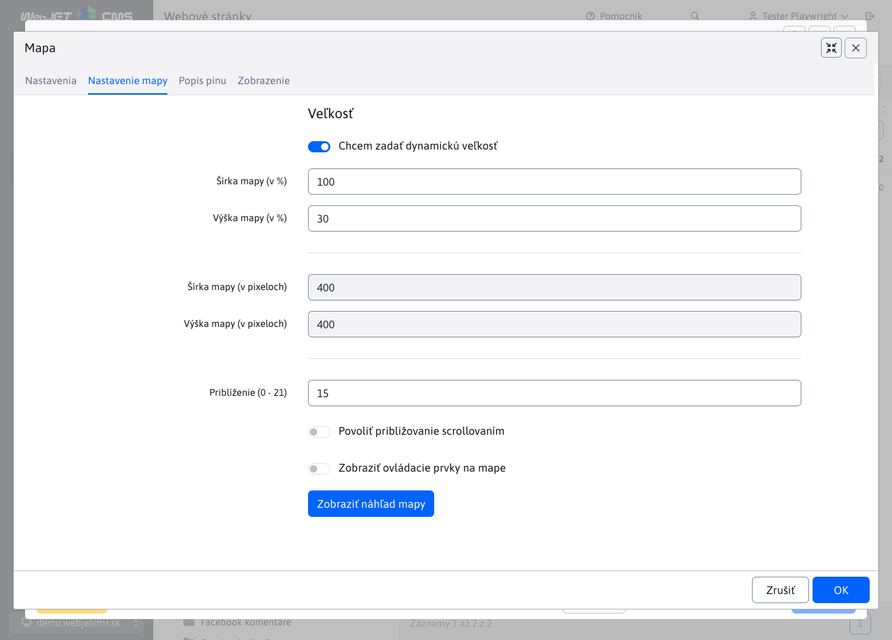

# Map

Inserts an interactive map (`Google maps` or `Open Street Map`) into the page according to the specified GPS coordinates or address. To use `Google maps`, you must have purchased an API key from `Google` set in the config variable `googleMapsApiKey`.

## Application settings

### Tab - Settings

In this section, you can set topographic attributes:

- **Address**
- **Latitude**, **Longitude**

It is mandatory to set either an address or latitude and longitude. The location can be set by clicking on the map to specify a point. This will display `pin` on the map and overwrite the Latitude and Longitude values.

The tab also contains a map preview where you can see the entered data and settings.

!>**Note:** the map preview does not update automatically when you change the address or coordinates, you must click the **Show map preview** button to see the changes in the preview.

### Tab - Map Settings

The tab is used to set the map size and other parameters.

By switching the parameter **I want to specify a dynamic size**, we decide whether to specify the map size in percentages (the map will dynamically adjust to the screen size) or in pixels (the map will have a fixed size).

Other settings:

- **Zoom (0 - 21)**, the larger the number in the range you enter, the greater the zoom of the map will be
- **Enable scrolling zoom**, enabling this option will allow you to zoom in on the map using the mouse wheel
- **Show map controls**, enabling this option will display controls for zooming and panning the map

!>**Note:** clicking the **Show map preview** button will take you to the **Settings** tab, where you will see an updated map preview.

### Card - Pin Description

The tab is used to set the description of the pin that will appear when clicked on the map.

Available settings:

- **Show address**, enabling the option will display the address that was entered in the **Settings** tab (if no address is entered, coordinates will be displayed)
- **I want to enter custom text**, enabling the option will display a field for entering custom text that will appear in the pin description
- **Offset from top**, setting the value in pixels sets the offset of the pin description from the top edge of the map
- **Left Offset**, setting the value in pixels sets the offset of the pin description from the left edge of the map
- **Allow closing description**, enabling this option will allow you to close the pin description by clicking the cross in the upper right corner of the description

!>**Note:** clicking the **Show map preview** button will take you to the **Settings** tab, where you will see an updated map preview.

