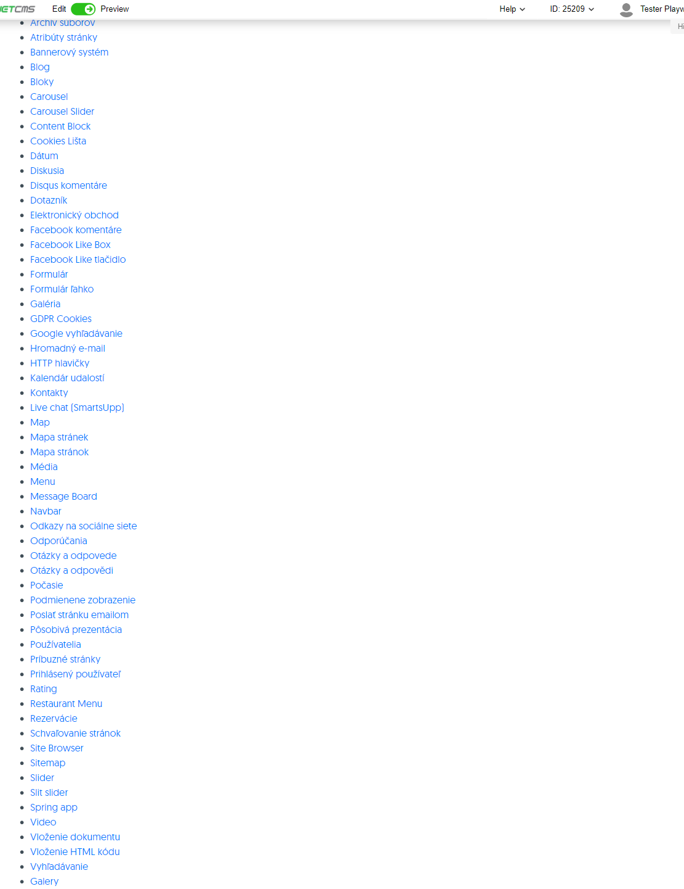
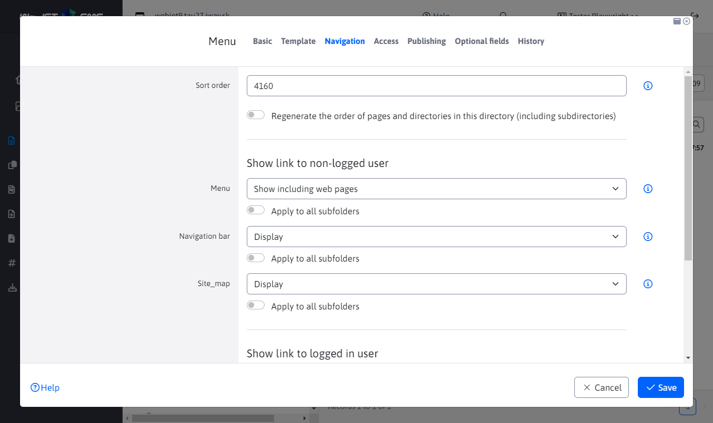

# Menu

The menu application generates a navigation menu for the entire website (the so-called top menu or left menu). The graphical form of the menu is defined using cascading style sheets (CSS). Examples of the top and left menus:

Top menu:

Left menu:

The display of the menu item depends on the setting of the Menu field in the Navigation tab of the Web Site Directory. It has the following options:
- Show - the item will be displayed in the navigation menu.
- Don't show - the item will not appear in the navigation menu (including sub-folders).
- Show without subfolders - the item will be displayed in the navigation menu, but its other subfolders will not be displayed (the advantage is that the subfolders do not need to set the display method).
- Show including web pages - in the navigation menu, the folder will be displayed and the web pages from the folder will be displayed as separate items. By default, the View option does not display web pages from the folder as separate menu items.

When displaying including web pages, you can still set the option to display each web page separately in the menu. The option is also in the Navigation tab and contains the options:
- View - the web page will be displayed in the menu.
- Do not show - the web page will not appear in the menu.

## Application settings

In the application properties you can set:
- Root directory - selecting the root directory
- Offset from Root Directory - the number of directory levels from the root directory by which the listing should be offset. This is used when you have a top menu with main items and a left menu with subitems - the subitems menu is set to shift by 2 so that the menu does not list the main items but only the subitems.
- Maximum menu depth - -1 menu with no limitation on generation depth.
- Generated CSS styles
	- None (pure XHTML)
	- Basic - generates an open class on an open item
	- All - generates a series of classes: the displayed level, whether the item contains subitems, the directory id, whether the item is open or closed
- Generate empty span - generates an empty html span tag in the link
- Expand all items - all menu levels will be expanded
- Set Variables - this functionality is used when we want to generate a specific level title to the mapr. menu via !WRITE(!ROOT\_GROUP\_NAME!)!
- Style ID of the main UL element - Element ID
- Directory name for MenuInfo
- Insert perex - wraps the title title and the prize for that perex text
- Insert perex from level - inserts perex only from the defined level

## MenuInfo

It is used to insert section descriptions or advertising banners into the menu (megamenu).

In the MenuInfo field you enter the name of the directory, which if found is not generated in the menu as a standard link, but the content of the main page of this directory is generated in the menu. The header and the contents of the page are generated.

**Example:**
When editing a component menu, you enter a directory name in the MenuInfo field, e.g. Information. In the web site structure that is generated in the menu, you create the directory Information. You add the necessary data to the page and publish the page. The title and content of the Information page will be displayed in the generated menu instead of the standard link.
