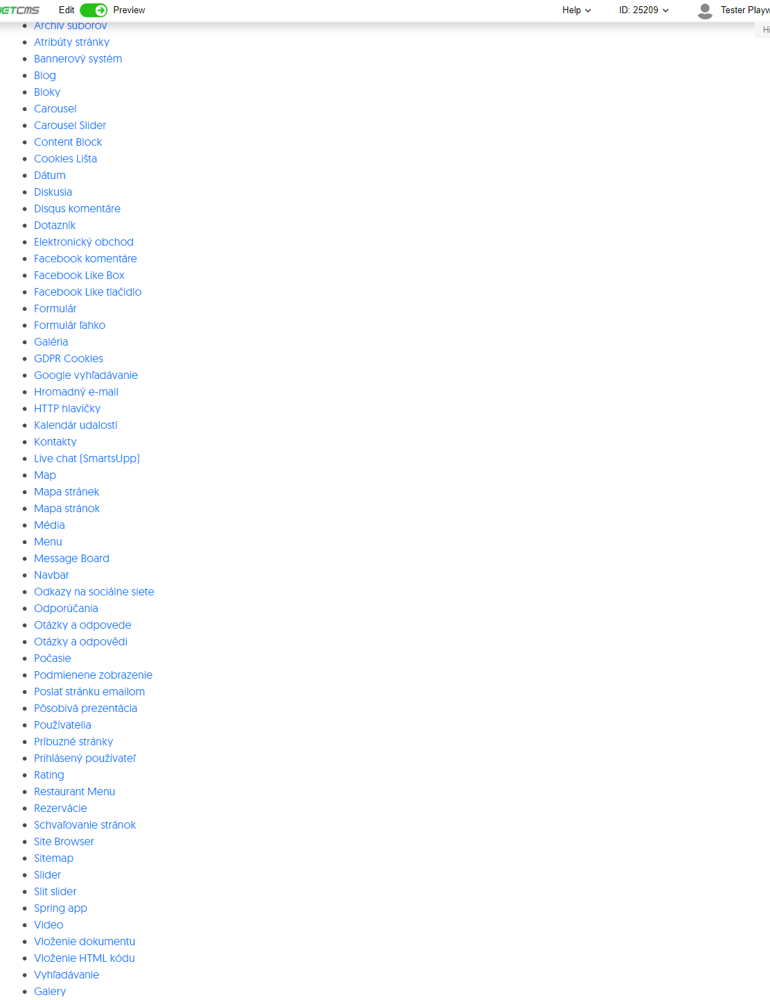
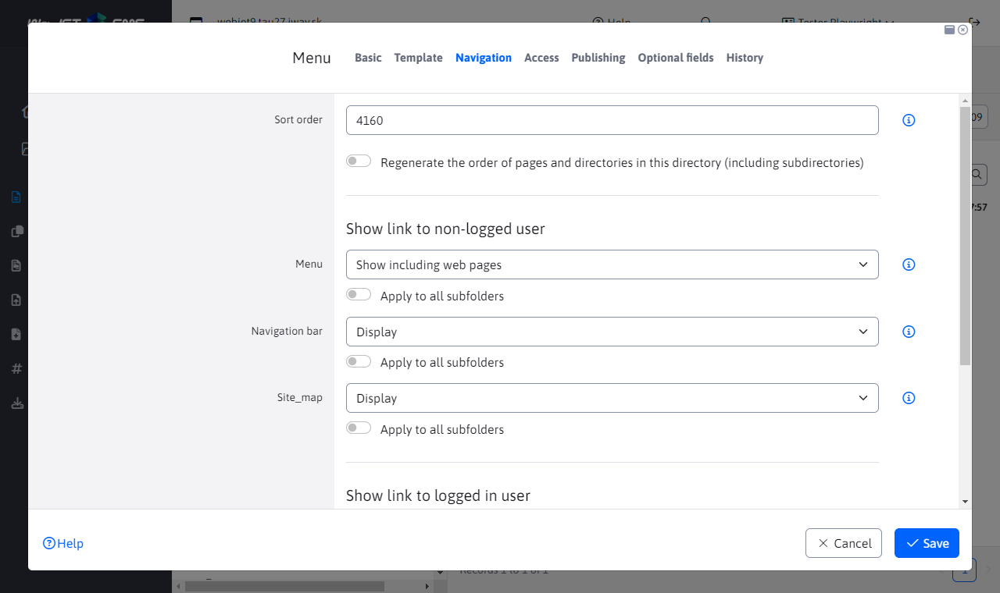

# Menu (navigation)

The menu application generates a navigation menu for the entire website (so-called top menu or left menu). The graphical appearance of the menu is defined using cascading style sheets (CSS). Examples of displaying the top and left menus:

Top menu:

Left menu:

The display of an item in the menu depends on the setting of the Menu field in the Navigation tab of the website directory. It has the following options:

- Show - the item will be displayed in the navigation menu.
- Do not display - the item will not be displayed in the navigation menu (including subfolders).
- Show without subfolders - the item will be displayed in the navigation menu, but its other subfolders will not be displayed (the advantage is that it is not necessary to set the display method for subfolders).
- Show including web pages - the folder will be displayed in the navigation menu and the web pages from the folder will also be displayed as separate items. By default, the Show option does not display web pages from the directory as separate menu items.

When viewing including web pages, you can also set the display option in the menu for each web page separately. The option is also in the Navigation tab and includes the following options:

- Show - the website will be displayed in the menu.
- Do not display - the website will not appear in the menu.

## Application settings

In the application properties you can set:

  - Root directory - select root directory
  - Offset from root directory - the number of directory levels from the root directory by which the list should be shifted. It is used when you have a top menu with main items and a left menu with sub-items - the sub-items menu has an offset of 2 so that the main items are not listed in the menu, but only the sub-items.
  - Maximum menu depth - -1 menu with no limit on generation depth.
  - Generated CSS styles
    - None (pure XHTML)
    - Basic - generates an open class for an open item
    - All - generates a series of classes: displayed level, whether the item contains subitems, directory id, whether the item is open or closed
  - Generate empty span - generates an empty html span tag into the link
  - Expand all items - all menu levels will be expanded
  - Set variables - this functionality is used when we want to generate a specific level title in the mapr. menu via !WRITE(!ROOT_GROUP_NAME!)!
  - Style ID of the main UL element - Element ID
  - Directory name for MenuInfo
  - Insert perex - wraps the name and adds perex text instead
  - Insert perex from level - inserts perex up to the defined level

## MenuInfo

It is used to insert section descriptions or advertising banners into the menu (megamenu).

In the MenuInfo field, you enter the name of the directory, which if found will not be generated in the menu as a standard link, but the content of the main page of this directory will be generated in the menu. The title and content of the page are generated.

**Example:**

When editing the menu component, enter the name of the directory in the MenuInfo field, e.g. Information. In the website structure that is generated for the menu, create the Information directory. Add the necessary data to the page and publish the page. The title and content of the Information page will be displayed in the generated menu instead of the standard link.