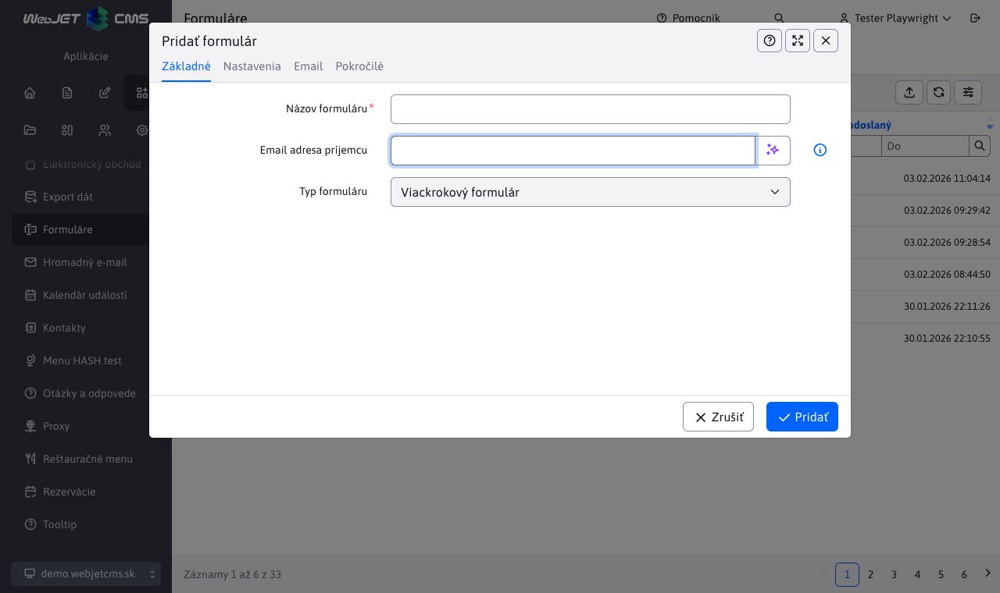
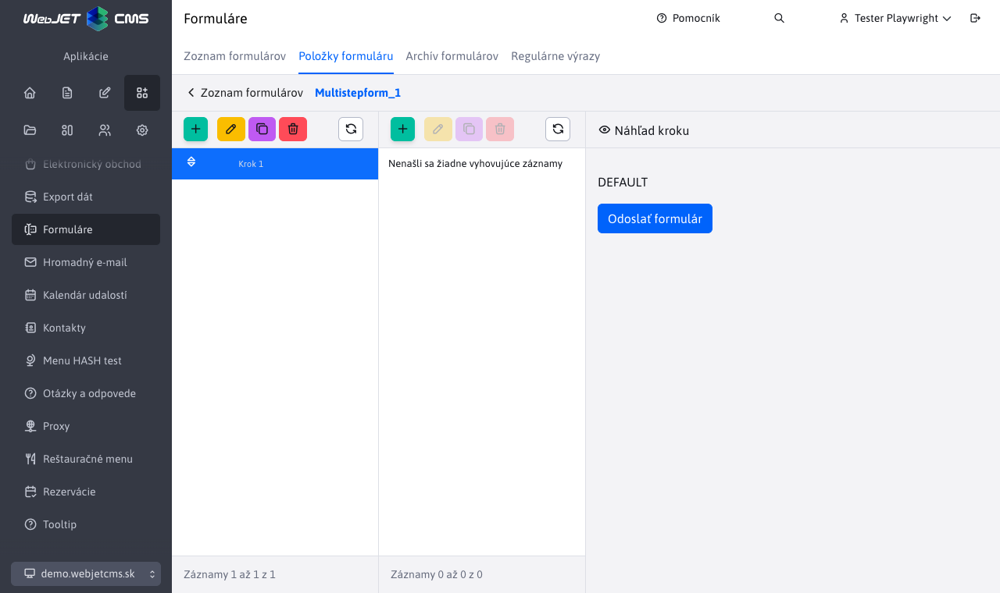
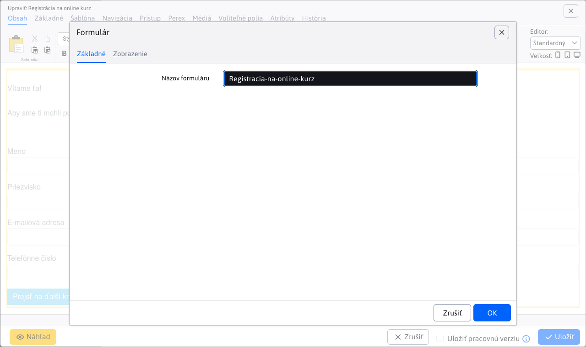

# Items on the form

You can create multi-step forms via the Form Items tab. These forms allow you to split forms into multiple steps, which improves user experience and increases clarity. Of course, you can also create simple forms with only one step.

## Creating a form

You can create a form in the **Applications > Forms**, more precisely in the tab [List of forms](../form/README.md). The list contains forms of all types, including multi-step forms, but a multi-step form is always created when a new one is created.

Click on add to display the dialog for [creating a new form](../form/README.md#creation-of-the-form).

You must enter a unique form name and, if you want to send email responses, your email address. For more information on the form fields, see [Creating a form](../form/README.md#creation-of-the-form).

## Items on the form

In the list of submitted forms, a tab is displayed for the multi-step form type **Items on the form**.

Clicking on this tab will bring up a section where we can add items and steps to the form.

Card **Items on the form** is divided into three columns:
- **Form steps** - a table listing the steps of the form.
- **Items on the form** - A table containing a list of form items (individual form fields) belonging to the currently selected step.
- **Preview of the form** - preview the currently selected form step.

## Form steps

The first column shows a list of form steps. In this list, we can add, duplicate, delete, edit, and reorder the form steps. Thus, each step created represents a real step in the form that will be displayed to the user. You can add form items to each step that will be displayed in that step.

You can fill in the Introduction text that appears at the beginning of the step. In the Advanced tab, you can change the text of the button to go to the next step (or submit the form if it is the last step). In the Script Code tab, you can insert custom HTML/JavaScript code that will be inserted and executed when the step is displayed.

### Duplicating

When duplicating a step, all items that are in that step are copied to the new step. This way we can quickly create similar steps without having to add all the items from scratch.

### Lubrication

Deleting a step deletes all items that are in that step. Before deleting, it is a good idea to check if there are any important items in the step that you would like to keep.

## Items on the form

The second column contains the form entries (or form step entries) that are displayed after the step in the first column is selected. In this table, you can add, duplicate, edit, delete, and reorder form items. Items are added to the currently selected step (so the form steps will not interact with each other).

### Adding and editing items

The editor for adding and editing items is special because it changes its content according to the selected field (item) type. This means that for each type of item (e.g. First Name, Last Name, etc.) different settings and configuration options are displayed. Depending on the selected item type, you can set parameters such as:
- **Field type** - specifies what kind of input the item will represent (e.g. text box, drop-down list selection, check box, etc.). Individual fields [web designer prepares the web site](../formsimple/README.md#information-for-web-designer) and are the same as for the application form easily.
- **Required field** - whether the item is mandatory to complete.
- **Allowed value** - for advanced validation of user input, you can select any number of regular expressions that must be satisfied for the input to be valid. You can learn more about them in [Regular expressions](../form/regexps.md).
- **Field name** - the name that will be displayed to the user. If not specified, a name matching the field type is used.

In the Advanced tab, you can set other optional parameters such as:
- **Step of the form** - step to which the item belongs, you can easily move the item to another step.
- **Order** - determines the order of the item within the step.
- **Prefilled value** - the value that appears filled in the field, so the user does not have to set the value if it is common knowledge. For fields of type selection field, enter a comma-separated list of values here, for example `začiatočník,pokročilý,expert`.
- **Representative text** - the text that will be displayed in the field as a hint for the user if the field is not filled (is empty).
- **Tooltip** - if you enter a tooltip value, an information bubble appears next to the field name.

If you want to define custom form items, or want to change existing ones, or change what settings are available for each item type, see the documentation in the [Form entries](../formsimple/README.md#information-for-web-designer).

!>**Warning:** when editing a form entry, we do not recommend changing the entry type, but rather replacing the original entry with a new one.

### Line view

You may encounter a situation where the editor does not allow you to add the selected item. This can happen if it is a special item designed for line view of the form (generally these items have "line view" in their name). While the form is not in line view mode, you will see these items in the selection but you will not be able to use them.

Switch the form to line view mode in [form settings](../form/README.md#creation-of-the-form).

### Tags

If you want to use information about the current logged-in user (e.g. their name, email, etc.) in a form entry, you can use special tags. These tags are automatically replaced with the appropriate values when the form is displayed to the user. For non-logged-in users, these tags will be replaced with a blank value. Enter the value in the field **Prefilled value** form entries.

Available brands are:
- `!LOGGED_USER_NAME!` - first and last name (if conf. variable `fullNameIncludeTitle` set to true includes the title)
- `!LOGGED_USER_FIRSTNAME!` - name
- `!LOGGED_USER_LASTNAME!` - surname
- `!LOGGED_USER_TITLE!` - title
- `!LOGGED_USER_LOGIN!` - login name
- `!LOGGED_USER_EMAIL!` - email address
- `!LOGGED_USER_COMPANY!` - firm
- `!LOGGED_USER_CITY!` - city
- `!LOGGED_USER_ADDRESS!` - address (street)
- `!LOGGED_USER_COUNTRY!` - state
- `!LOGGED_USER_PHONE!` - telephone
- `!LOGGED_USER_ZIP!` - POSTCODE
- `!LOGGED_USER_ID!` - User ID
- `!LOGGED_USER_BIRTH_DATE!` - date of birth
- `!LOGGED_USER_FIELDA!` - free field A
- `!LOGGED_USER_FIELDB!` - free field B
- `!LOGGED_USER_FIELDC!` - free field C
- `!LOGGED_USER_FIELDD!` - free field D
- `!LOGGED_USER_FIELDE!` - free field E
- `!LOGGED_USER_GROUPS!` - list of user groups

## Preview of the form

Third column of the section **Content of the form** is a preview of the form. This preview shows the current step of the form as the user will see it. The preview is updated whenever there is any change in the steps table or form items. This way, you can get a rough idea of what the form will look like after changes are made.

At the end of each step, a button is automatically generated whose text changes depending on whether the step is the last step or not. If it is not the last, the button will have the text **Go to the next step**, or else **Send form**. You can change the button text in the step settings, for example to **Continue** or **Register now**.

!>**Warning:** The preview of the form in the result may differ graphically from the actual display in the web application, as it depends on the used template and styles of the page in which the form will be embedded. The preview is mainly used to give an idea of the layout and content of the form.

## Inserting the form into the page

You can insert the created form into the web page using the Form application where you select the name of the created form.

## Configuration variables

Available configuration variables for multi-step forms:
- `multistepform_nameFields` - a list of field names that will be treated as fields for the name. Among these fields, the name that would be used as the salutation in emails will be searched. Only **First** non-empty name found.
- `multistepform_emailFields` - a list of field names that will be treated as fields for the email address. These fields will be searched for the email address to which the form receipt will be sent. The following will be used **All** found and valid email addresses.
- `multistepform_attachmentDefaultName` - the preset attachment name in emails, to be used if the actual attachment file name cannot be retrieved.
- `multistepform_subjectDefaultValue` - preset translation key for the email subject, which is used if the subject is not specified in the form settings/attributes.
