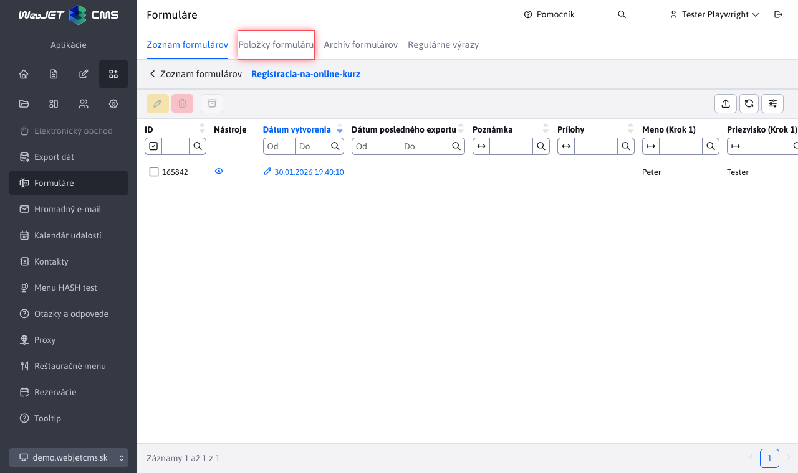
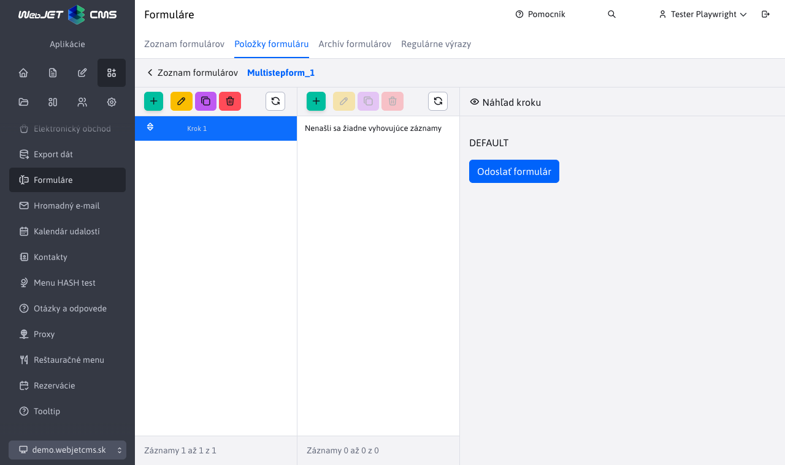
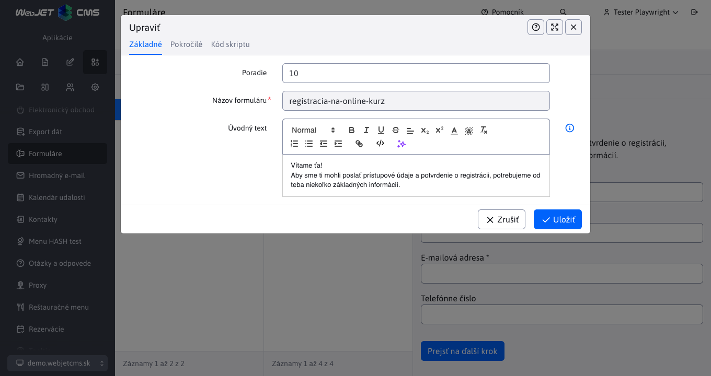
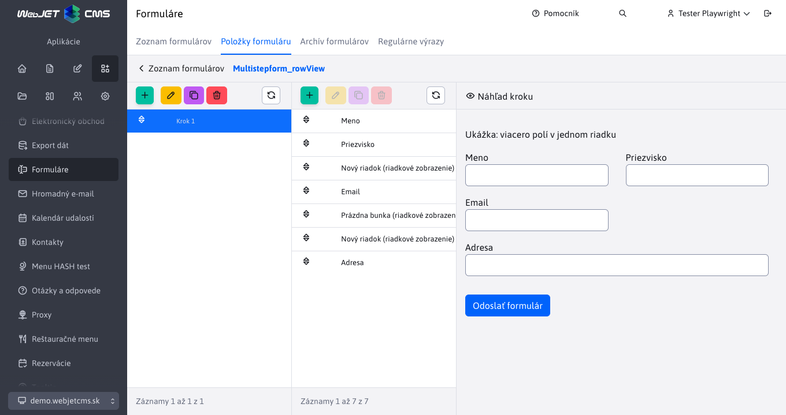
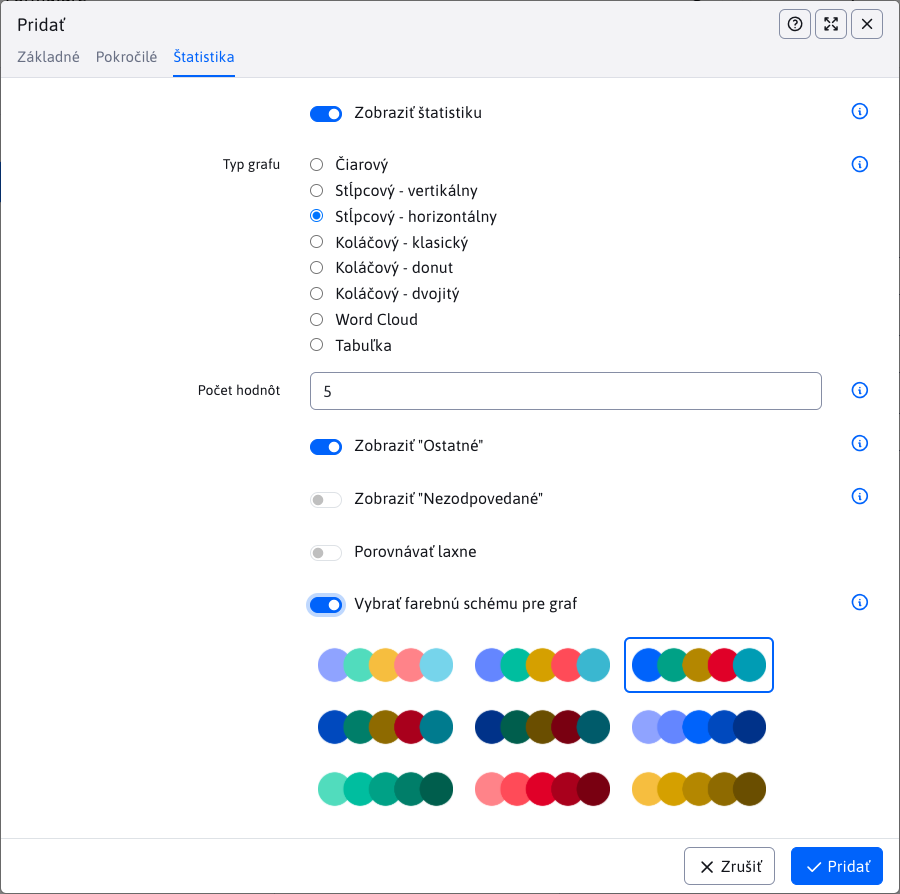

# Form items

You can create multi-step forms via the form items tab. These forms allow you to divide forms into multiple steps, which improves the user experience and increases clarity. Of course, you can also create simple forms with just one step.

## Create a form

You can create a form in the **Applications > Forms** section, more precisely in the [Forms List](../form/README.md) tab. The list contains forms of all types, including multi-step forms, but when you create a new one, a multi-step form is always created.


Clicking add will display the dialog for [creating a new form](../form/README.md#creating-a-form).


You must enter a unique form name and, if you want to send responses to email, your email address. For more information about form fields, see the [Creating a Form](../form/README.md#creating-a-form) section.

## Form items

In the list of submitted forms, the **Form Items** tab is displayed for a multi-step form.



Clicking this tab will display a section where we can add items and steps to the form.



The **Form Items** tab is divided into three columns:

- **Form Steps** - table containing a list of form steps.
- **Form Items** - a table containing a list of form items (individual form fields) belonging to the currently selected step.
- **Form preview** - display a preview of the currently selected form step.


## Form steps

The first column shows a list of form steps. In this list, we can add, duplicate, delete, edit, and reorder form steps. Each step we create represents a real step in the form that will be displayed to the user. You can add form items to each step that will be displayed in that step.



You can fill in the Introduction text that will appear at the beginning of the step. In the Advanced tab, you can change the text of the button to go to the next step (or submit the form if it is the last step). In the Script Code tab, you can insert custom HTML/JavaScript code that will be inserted and executed when the step is displayed.

### Duplication

Duplicating a step copies all the items in that step to the new step. This way, we can quickly create similar steps without having to add all the items from scratch.

### Lubrication

Deleting a step will remove all items in that step. Before deleting, it is a good idea to check if there are any important items in that step that you would like to keep.

## Form items

The second column contains form items (or form step items) that are only visible after you select a step in the first column. You can add, duplicate, edit, delete, and reorder form items in this table. Items are added to the currently selected step (so that form steps do not affect each other).


### Adding and editing items

The editor for adding and editing items is special in that it changes its content according to the selected field type (item). This means that for each item type (e.g. First Name, Last Name, etc.) different settings and configuration options will be displayed. Depending on the selected item type, you can set parameters such as:

- **Field type** - determines what kind of input the item will represent (e.g. text field, drop-down list selection, checkbox, etc.). Individual fields [are prepared by the website designer](../formsimple/README.md#information-for-web-designer) and are the same as for the Easy Form application.
- **Required field** - whether the item is required to be filled out.
- **Allowed value** - for advanced validation of user input, you can choose any number of regular expressions that must be met for the input to be valid. You can learn more about them in the [Regular expressions](../form/regexps.md) section.
- **Field name** - the name that will be displayed to the user. If not specified, the name matching the field type will be used.

In the Advanced tab, you can set other optional parameters such as:

- **Form Step** - the step the item belongs to, so you can easily move the item to another step.
- **Order** - determines the order of the item within the step.
- **Prefilled value** - the value that will be displayed filled in the field, so the user does not have to set the value if it is generally known. For select fields, enter a comma-separated list of values ​​here, for example `začiatočník,pokročilý,expert`.
- **Placeholder text** - text that will be displayed in the field as a hint for the user if the field is not filled in (empty).
- **Tooltip** - if you enter a tooltip value, an information bubble will appear next to the field name.

If you want to define your own form items, or want to change existing ones, or change what settings are available for individual item types, see the documentation in the [Form Items] section(../formsimple/README.md#information-for-web-designers).

!>**Warning:** When editing a form item, we do not recommend changing the item type, but rather replacing the original item with a new one.

### Line display

You may encounter a situation where the editor will not allow you to add a selected item. This can happen if it is a special item intended for the inline view of the form (generally these items have "inline view" in the name). While the form is not in inline view mode, you will see these items in the selection but will not be able to use them.



You can switch the form to row view mode in [form settings](../form/README.md#creating-form).

### Brands

If you want to use information about the currently logged in user (e.g., their name, email, etc.) in a form item, you can use special tags. These tags will be automatically replaced with the appropriate values ​​when the form is displayed to the user. For non-logged in users, these tags will be replaced with an empty value. Enter the value in the **Prefilled value** field of the form item.

Available brands are:

- ```!LOGGED_USER_NAME!``` - ​​first and last name (if config variable ```fullNameIncludeTitle``` is set to true it also contains title)
- ```!LOGGED_USER_FIRSTNAME!``` - ​​name
- ```!LOGGED_USER_LASTNAME!``` - ​​last name
- ```!LOGGED_USER_TITLE!``` - ​​title
- ```!LOGGED_USER_LOGIN!``` - ​​login name
- ```!LOGGED_USER_EMAIL!``` - ​​email address
- ```!LOGGED_USER_COMPANY!``` - ​​company
- ```!LOGGED_USER_CITY!``` - ​​city
- ```!LOGGED_USER_ADDRESS!``` - ​​address (street)
- ```!LOGGED_USER_COUNTRY!``` - ​​state
- ```!LOGGED_USER_PHONE!``` - ​​phone
- ```!LOGGED_USER_ZIP!``` - ​​Postal code
- ```!LOGGED_USER_ID!``` - ​​User ID
- ```!LOGGED_USER_BIRTH_DATE!``` - ​​date of birth
- ```!LOGGED_USER_FIELDA!``` - ​​free field A
- ```!LOGGED_USER_FIELDB!``` - ​​free field B
- ```!LOGGED_USER_FIELDC!``` - ​​free field C
- ```!LOGGED_USER_FIELDD!``` - ​​free field D
- ```!LOGGED_USER_FIELDE!``` - ​​free field E
- `!LOGGED_USER_GROUPS!` - ​​list of user groups

### Statistics

The **Statistics** tab allows you to enable response statistics for a given form item. To enable statistics, select the **Show statistics** option. Once enabled, all available statistics settings for the given item will be displayed.

!>**Warning:** Enabling/disabling the **Show statistics** option will only affect the statistics for this one form item, not the other items.

Available settings:

- **Show statistics** – when selected, a graph representing the responses to this field will be displayed in the **Form statistics** section.
- **Chart type** – determines what type of chart you want to use to represent the data.
- **Number of values** – the number of most common values ​​that will be displayed in the graph.
- **Show "Other"** – when selected, the remaining values ​​(those that do not belong to the top X according to the **Number of values** setting) will be displayed in the graph as a single item named "Other".
- **Show "Unanswered"** – when selected, unanswered responses will also be displayed in the graph as an "Unanswered" item. Especially useful if the field is not mandatory and the user may have left the field blank.
- **Compare loosely** – when selected, case and diacritics are ignored when grouping answers (e.g. `Áno` and `ano` are counted together as the same answer).
- **Select color scheme for graph** – after selecting, the color scheme selection for the graph becomes available. Each color scheme contains 5 colors. If the graph contains more than 5 values, the colors will start repeating. If there are a large number of values, we recommend not setting the scheme – the default scheme will be used, which is created by combining three 5-color schemes with different shades.



## Form preview

The third column in the **Form Content** section is the form preview. This preview shows the current form step as it will be seen by the user. The preview is updated whenever there is a change in the form steps or items table. This way, you can see an approximate idea of ​​what the form will look like after making changes.

At the end of each step, a button is automatically generated, the text of which changes depending on whether the step is the last or not. If it is not the last, the button will have the text **Go to next step**, otherwise **Submit form**. You can change the button text in the step settings, for example to **Continue** or **Register**.


!>**Warning:** The preview of the form may differ graphically from the actual display in the web application, as it depends on the template used and the styles of the page in which the form will be inserted. The preview is mainly used to give an idea of ​​the layout and content of the form.

## Inserting a form into a page

You can insert the created form into a web page using the Form application, where you select the name of the created form.


## Configuration variables

Available configuration variables for multi-step forms:

- `multistepform_nameFields` - ​​list of field names that will be considered as name fields. These fields will be searched for a name that would be used as a greeting in emails. Only the **first** non-empty name found will be used.
- `multistepform_emailFields` - ​​list of field names that will be considered as email address fields. These fields will be searched for an email address to which a confirmation of receipt of the form will be sent. **all** found and valid email addresses will be used.
- `multistepform_attachmentDefaultName` - ​​default attachment name in emails, which will be used if the actual attachment file name cannot be obtained.
- `multistepform_subjectDefaultValue` - ​​default translation key for the email subject, which will be used if no subject is specified in the form settings/attributes.