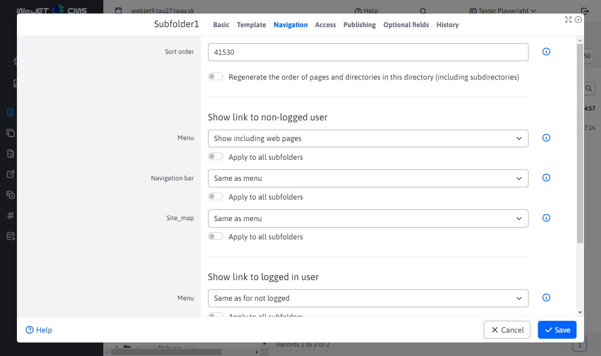
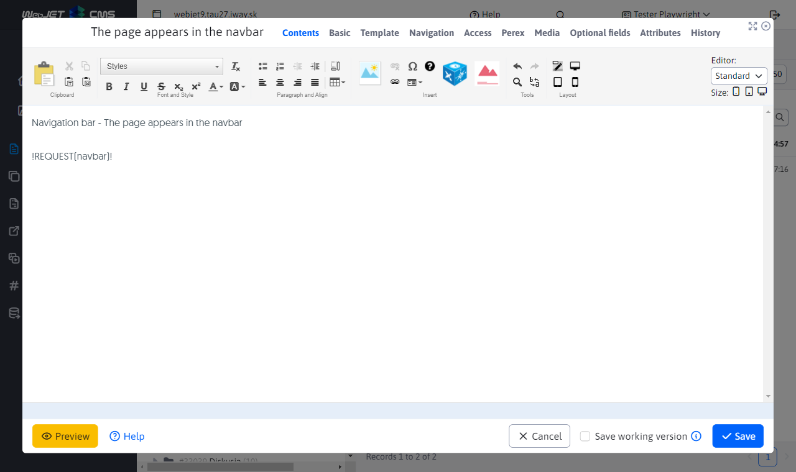

# Navigation bar

The navigation bar (navbar / breadcrumb / breadcrumb navigation) displays a clickable path in the web page to the currently displayed web page. The directory names can be clicked on to easily get to the next level down. Example:


The display of an item in the navigation bar depends on the setting of the Navigation Bar field in the Navigation tab of the Web Site Directory. It has the following options:
- Just like the menu - the display in the navigation bar behaves the same way as the display field is set in the menu.
- Show - the item will be displayed in the navigation bar.
- Don't show - the item will not appear in the navigation bar (including sub-folders).

For the display option, you can set the display option for the web page that is still displayed (typically this is the last item in the navigation bar). This is also in the Navigation tab and contains the options:
- View - the web page will be displayed in the navigation bar.
- Do not show - the web page will not be displayed in the navigation bar.



## Use

The navigation bar is inserted directly into the JSP template as a tag:

```html
<iwcm:write name="navbar"/>
```

or it can be inserted directly into the web page as an expression:

```html
!REQUEST(navbar)!
```



## Custom Navigation Bar Implementation

For some projects, it may be necessary to create a custom navigation bar implementation with different formatting or structure. WebJET allows you to define a custom class for generating the navigation bar.

### Creating a Custom Implementation

A custom implementation must implement the `sk.iway.iwcm.doc.NavbarInterface` interface:

```java
package com.example.custom;

import javax.servlet.http.HttpServletRequest;
import sk.iway.iwcm.doc.NavbarInterface;

public class CustomNavbar implements NavbarInterface {
    
    @Override
    public String getNavbarRDF(int groupId, int docId, HttpServletRequest request) {
        // Custom implementation for RDF format
        return "<div class=\"custom-rdf\">...</div>";
    }

    @Override
    public String getNavbarSchema(int groupId, int docId, HttpServletRequest request) {
        // Custom implementation for Schema.org format
        return "<ol class=\"custom-schema\">...</ol>";
    }

    @Override
    public String getNavbar(int groupId, int docId, HttpServletRequest request) {
        // Custom implementation for standard format
        return "Custom navigation...";
    }
}
```

### Configuration

After creating a custom implementation, you need to set the `navbarDefaultType` configuration variable to the full class name (including package):

```
navbarDefaultType=com.example.custom.CustomNavbar
```

This configuration is set in **Settings > Configuration** in the WebJET administration.

### Notes

- If the `navbarDefaultType` configuration variable contains a class name (not standard values `normal`, `rdf`, `schema.org`), WebJET will attempt to load this class and use it.
- If the class does not exist or does not implement `NavbarInterface`, the standard implementation will be used.
- The custom class must have a public constructor without parameters.

