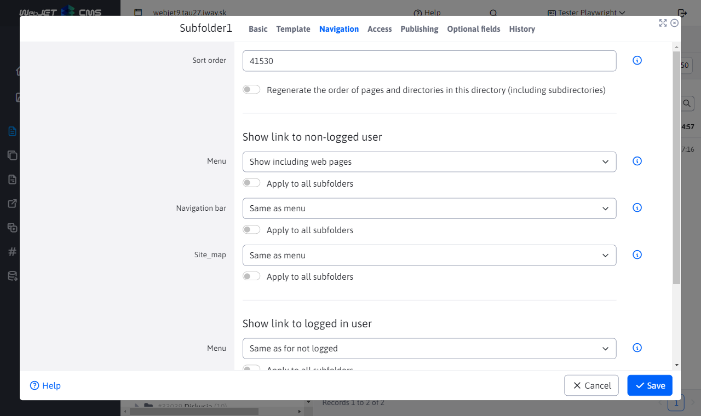
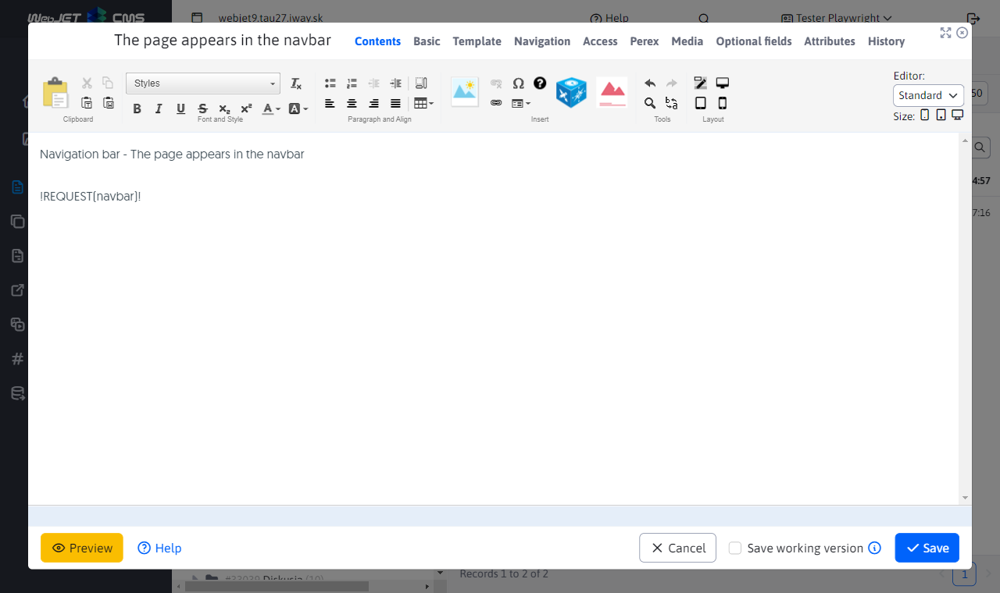

# Navigation bar

The navigation bar (navbar / breadcrumb) displays a clickable path to the currently displayed web page on a web page. You can click on the directory names to easily go down one level. Example:


The display of an item in the navigation bar depends on the setting of the Navigation Bar field in the Navigation tab of the website directory. It has the following options:

- Same as menu - display in the navigation bar behaves the same as the field set for display in the menu.
- Show - the item will be displayed in the navigation bar.
- Do not display - the item will not be displayed in the navigation bar (including subfolders).

With the display option, you can set the display option for the currently displayed web page (typically the last item in the navigation bar). This is also in the Navigation tab and contains the following options:

- Show - the website will be displayed in the navigation bar.
- Do not display - the website will not be displayed in the navigation bar.



## Use

The navigation bar is inserted directly into the JSP template as a tag:

```html
<iwcm:write name="navbar"/>
```

or it can be inserted directly into a web page as an expression:

```html
!REQUEST(navbar)!
```



## Custom navigation bar implementation

For some projects it may be necessary to create a custom navigation bar implementation with different formatting or structure. WebJET allows you to define a custom class for generating a navigation bar.

### Creating your own implementation

Your own implementation must implement the `sk.iway.iwcm.doc.NavbarInterface` interface:

```java
package com.example.custom;

import jakarta.servlet.http.HttpServletRequest;
import sk.iway.iwcm.doc.NavbarInterface;

public class CustomNavbar implements NavbarInterface {

    @Override
    public String getNavbar(int groupId, int docId, HttpServletRequest request) {
        return "Custom navbar for group " + groupId + " doc " + docId;
    }

    @Override
    public String getNavbarForNonDefaultDoc(sk.iway.iwcm.doc.DocDetails docDetails, String navbar, HttpServletRequest request) {
        return navbar + ", Custom navbar for non-default doc " + docDetails.getDocId();
    }

}
```

### Setting

After creating your own implementation, you need to set the configuration variable `navbarDefaultType` to the full class name (including package):

```txt
navbarDefaultType=com.example.custom.CustomNavbar
```

This configuration is set in **Settings > Configuration** in the WebJET administration.

### Standard implementations

WebJET includes three standard implementations:

- [NavbarStandard](../../../../../src/main/java/sk/iway/iwcm/doc/NavbarStandard.java) - standard text navigation (value `normal` or empty)
- [NavbarRDF](../../../../../src/main/java/sk/iway/iwcm/doc/NavbarRDF.java) - navigation in `RDF` format (value `rdf`)
- [NavbarSchemaOrg](../../../../../src/main/java/sk/iway/iwcm/doc/NavbarSchemaOrg.java) - navigation in format `Schema.org` (value `schema.org`)

### Notes

- If the configuration variable `navbarDefaultType` contains a class name (not the default values ​​`normal`, `rdf`, `schema.org`), WebJET will attempt to load that class and use it.
- If the class does not exist or does not implement `NavbarInterface`, the default implementation is used.
- The custom class must have a public constructor with no parameters.