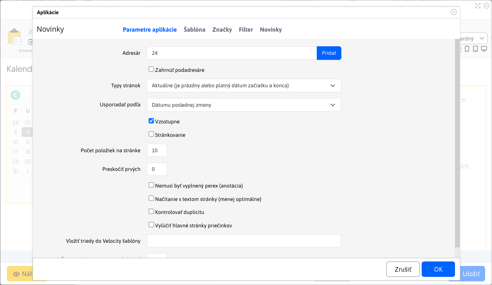

# News calendar

Applications **News calendar** a **News** are interconnected - after selecting a date in the calendar, a list of news filtered by the selected date will be displayed. News items with a matching date in the Start Date field will be displayed.

## Setting up applications

### Shared folder for News and News Calendar:

Both applications must be set to the same news folder. If these settings do not match, **News calendar** will not be able to properly filter the news for the selected date. The way the link between the apps works is that the first app **News** inserted for **News calendar** in the editor will be automatically linked to it.

So put the News Calendar app and then the News app into the page.

