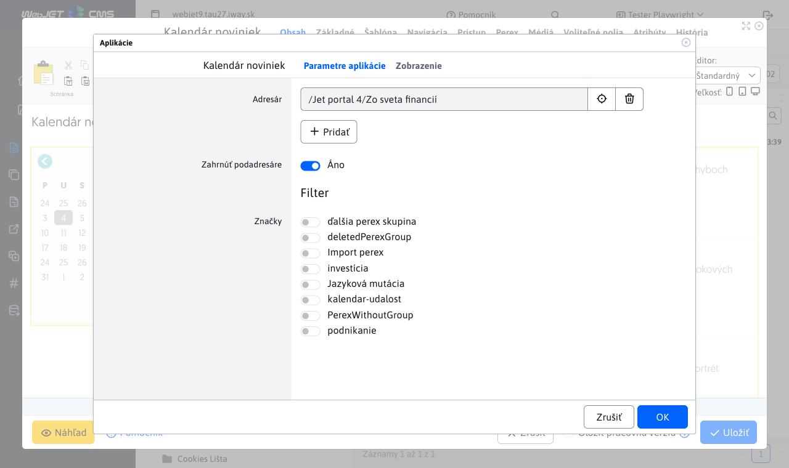
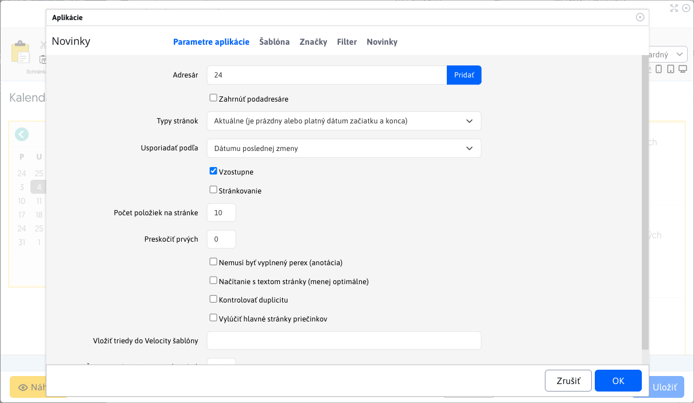

# News calendar

The **News Calendar** and **News** applications are linked to each other - after selecting a date in the calendar, a list of news items filtered by the selected date will be displayed. News items with the same date will be displayed in the Start Date field.

## Application settings

### Shared folder for News and News Calendar:

Both applications must be set to the same news folder. If these settings do not match, **News Calendar** will not be able to properly filter news for the selected date. The link between the applications works in such a way that the first **News** application inserted after **News Calendar** in the editor will be automatically linked to it.

So, insert the News Calendar application into the page and then the News application.

