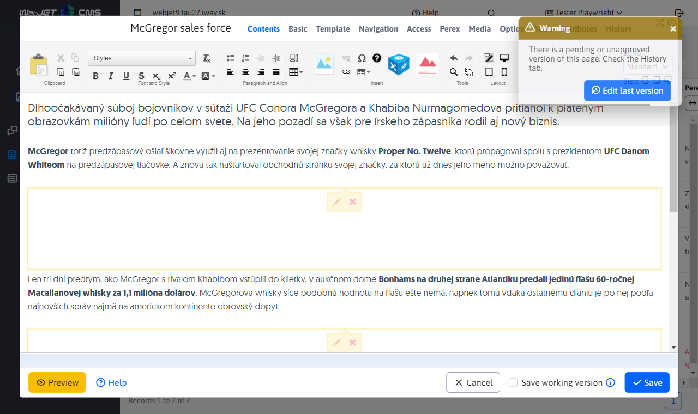
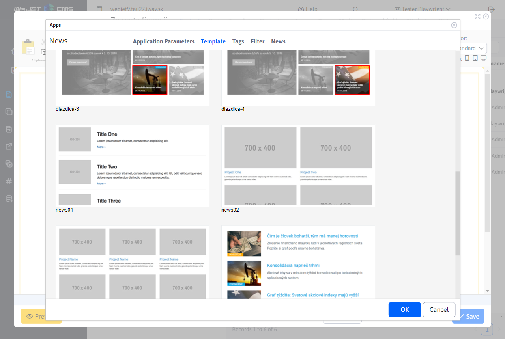
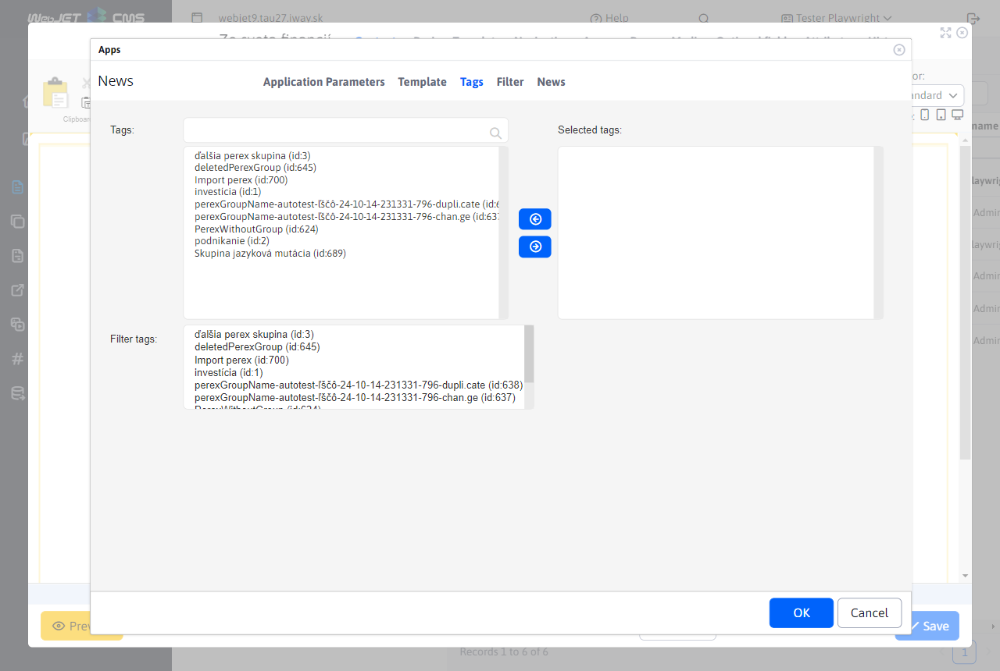
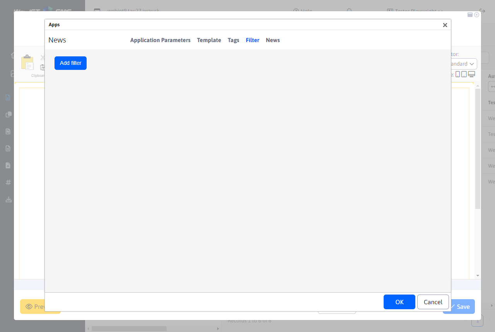
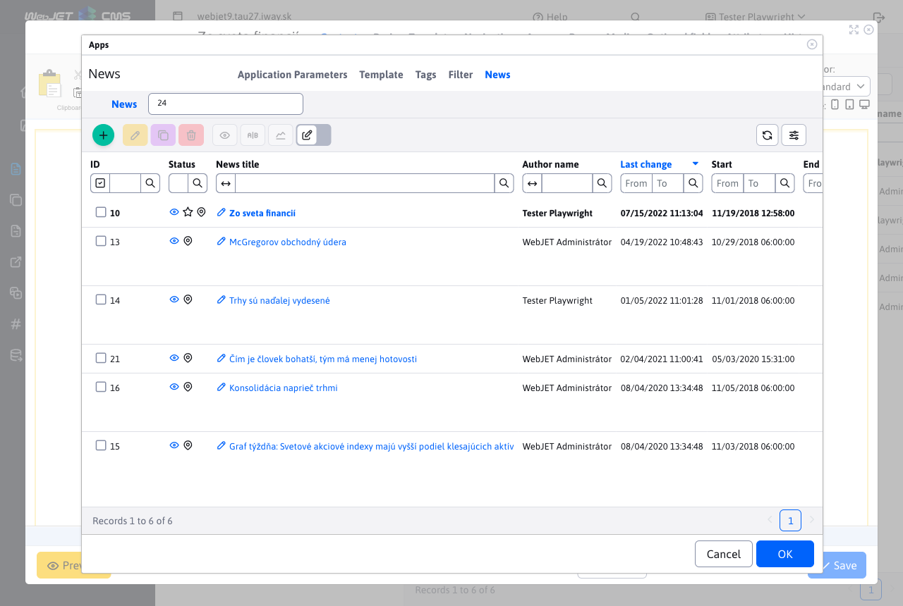

# News

The News application inserts a list of web pages in a specified folder into a page. It is used to insert a list of news, press releases, but also other similar listings (list of contact points, personal contacts, products, etc.).


## News list

The news list in the administration is similar to the website list, but does not have a tree structure. It is located in the Posts/News menu. At the top, you can select a folder to display in the table.


The values ​​in the section selection field in the header are generated:

- automatically - if the config variable `newsAdminGroupIds` is set to an empty value, a list of news folder IDs is obtained by searching for the expression `!INCLUDE(/components/news/` in the body of the pages and finding the set folder ID `groupIds`.
- according to the conf. variable `newsAdminGroupIds`, where it is possible to enter a comma-separated list of folder IDs, e.g. `17,23*,72`, and if the folder ID ends with the character `*`, news (web pages) from subfolders will also be loaded when selected.

Clicking on the news title will open an editor identical to the [page editor](../../webpages/editor/README.md).



## Setting up an application on a website

The application embedded in the website has the following tabs:

### Application parameters

In the application parameters tab, you set the basic behavior of the application and its settings.


- **Directory** - Selection of directories (website folders) from which news (sites) will be selected.
- **Include subdirectories** - selecting this option will also load news from subdirectories of the directories selected from the Directory field.
- **Subfolder depth** - when displaying news from subfolders, you can set the maximum depth of subfolder search. A value less than 1 sets the search to unlimited.
- **Page types** - selection of pages by date validity
  - Current – ​​the start and end date are valid - only news items whose validity date (start and end of publication) is within the current date range will be displayed.
  - Old – news that has an end date in the past (archive) will be displayed.
  - All – news will be displayed regardless of the start and end date of their publication.
  - Upcoming – only news items with a publication start date in the future will be displayed.
  - Currently valid - only news with a filled-in start date (the end does not have to be filled in) and whose end range is valid on the current date and time will be displayed.
- **Main page display mode** - sets the display of main pages of subfolders. Often you have a News structure and in it the years 2025, 2026 and so on. You do not want to display the main pages of these folders in the news list, since it is typically a list page. Or vice versa, you need to display only the main pages of subfolders.
- **Sort by** - determines how the news list is sorted
  - Priorities
  - Publication start date
  - Date of the event
  - Last modified date
  - Page name
  - Places
  - Page ID
  - Rating - site evaluation (e.g. when using an e-shop) - the rating is set using the site evaluation application.
- **Ascending** - by default, the list is sorted in descending order (e.g. from the newest news to the oldest), checking this box will sort it the other way around - from the oldest to the newest
- **Pagination** - if you check this box, the news list will also be paginated (if the number of news items is greater than the value in the Number of items per page field)
- **Number of items per page** - the number of news items displayed on one page, if pagination is unchecked, the number of news items will be loaded from the database according to this value, suitable for example for the home page where you want to display, for example, 3 news items and a link to a list of all news items, but you do not want to display pagination.
- **Skip first** - the number of records you want to skip when loading the list (e.g. if you have two applications on the page one below the other with a different design and in the second you want to skip the number of records from the first application)
- **Perex (annotation) does not have to be filled in** - by default, only news items with a filled in annotation (perex) will be displayed, if you check this box, those that do not have a filled in annotation (perex) will also be loaded
- **Load with page text (less optimal)** - by default, the page text is not loaded from the database, if you need it for display, check this box. However, loading will be slower and more demanding on database and server performance.
- **Check for duplicates** - if a page contains multiple news applications on one page, a list of already displayed news items is kept. Existing ones are removed from the list. However, the number of displayed records may not be the same, but it will not happen that the same news item is displayed on one page more than once.
- **Exclude folder main pages** - if selected, folder main pages will be excluded (if Include subdirectories is selected). Subdirectories are assumed to contain a main page listing news in this folder. Such pages will be excluded and will not be used in the news list.
- **Insert classes into `Velocity` template** - a special field for the programmer, which allows you to define a Java class (program), which can then be used in the template. If you do not have precise instructions on what to insert into this field, leave it empty.

### Template

In the template tab, you choose the visual way to display the news list.



If you have the [News - edit templates](../../../frontend/templates/news/README.md) right, you can create a new news design template and edit existing ones.

### Perex groups

In the Perex Groups tab, you can create conditions for displaying news only from selected perex groups. They are used to mark, for example, Top News on the home page and the like.

At the same time, if you need to exclude a specific group from the list, set it in the Do not display selected specific groups field.



This is used if you have a TOP News section at the top of the homepage where you display news marked with the TOP flag and then below that you have a list of other news. By excluding the TOP group from the second list of news, you will avoid duplication.

### Filter

In the filter tab, you can define advanced options for displaying news according to database attributes and conditions. `A/AND` is used between individual conditions, so all specified filter conditions must be met.



### News

The news tab displays a list of news items that are loaded according to the selected directories from the Application Parameters tab. This way, you can see a list of news items and easily edit existing news items (edit the headline, photo, or text of the news item). You can also create a new news item.



## Search

The application also supports dynamic search/filtering of news directly on the website using URL parameters. This allows you to add filtering of displayed news to the website according to the visitor's wishes (e.g. by category, dates, etc.). Search/filtering is entered into the URL parameters in the format:

```txt
search[fieldName_searchType]=value
search[title_co]=test
```

while the value `searchType` can have the following options:

- `eq` - ​​exact match
- `gt` - ​​more than
- `ge` - ​​more than including
- `le` - ​​less than including
- `lt` - ​​less than
- `sw` - ​​starts with
- `ew` - ​​ends with
- `co` - ​​contains
- `swciai` - ​​starts with regardless of case and diacritics
- `ewciai` - ​​ends in regardless of case and diacritics
- `cociai` - ​​contains regardless of case and diacritics

When entering URL parameters, a problem may occur with the value `[]` being rejected and the error `400 - Bad Request` being displayed, in which case use the replacement `[=%5B, ]=%5D`, example call:

```txt
/zo-sveta-financii/?search%5Btitle_co%5D=konsolidacia
```

The URL parameter `search` can occur multiple times, the `AND` connection is used for multiple parameters.

## Possible configuration variables

- ```newsAdminGroupIds``` - ​​List of news folder IDs. IDs are separated by commas.