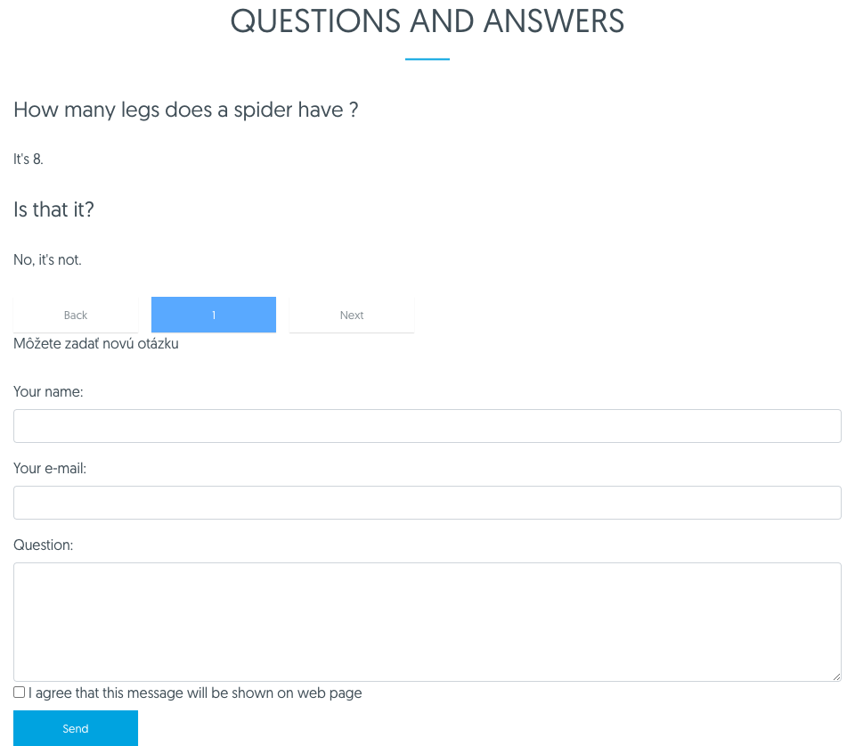
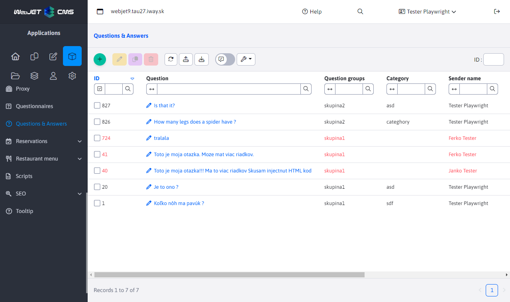
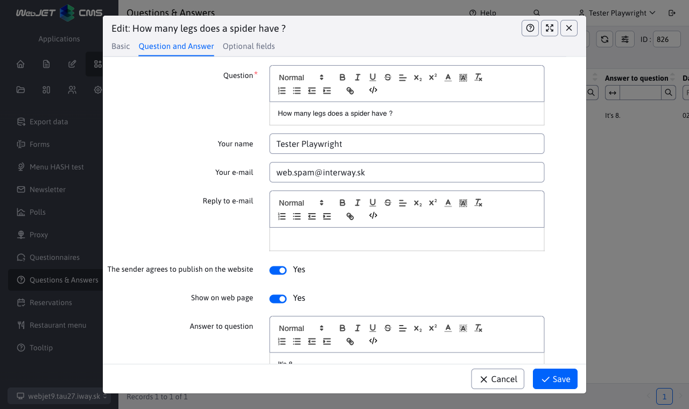

# Questions and answers

The Questions and Answers app, allows you to insert frequently asked questions and answers into the page. It is possible to categorize them by group. A new question will arrive on the specified email.

## Application parameters

- Embed
	- Questions with answers
	- Form to ask a question
- Issue Group - enter the name of the group from which posts will be selected for display on the site
- Number of questions on the page (displayed if: Questions with answers is selected)
- Email for sending questions (will be displayed if: Inquiry form is selected)
The questions are sorted into groups, which you enter when you upload your application. If you need to make more subgroups, you can modify the file `/components/qa/qa-ask.jsp`where you replace the hidden field `categoryName` for a selection menu, which will allow visitors to select a subgroup.

## Administration

****

[optional fields](../../../frontend/webpages/customfields/README.md).
