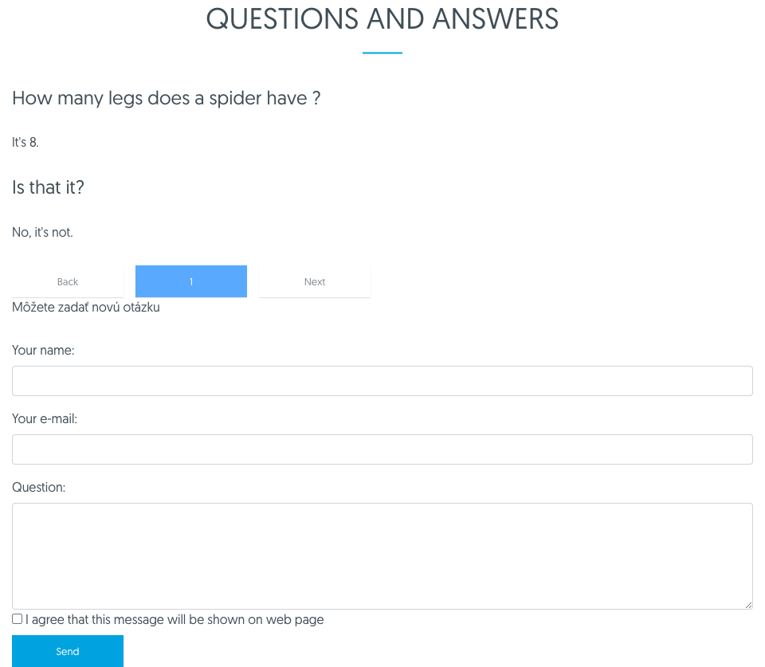
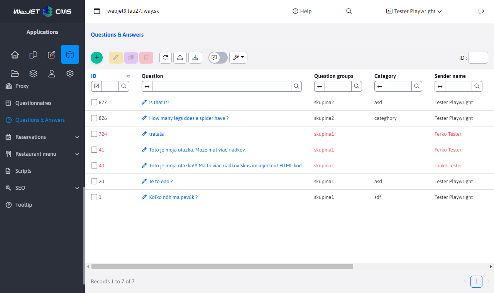
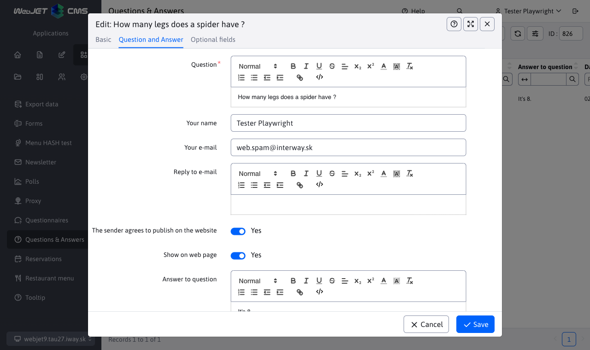

# Questions and answers

The Questions and Answers application allows you to insert frequently asked questions and answers into your website. They can be categorized by group. New questions will be sent to the email address you provide.

## Application parameters

- Insert
  - Questions with answers
  - Question form
- Question group - enter the name of the group from which posts will be selected for display on the page
- Number of questions per page (displayed if: Questions with answers is selected)
- Email for sending questions (displayed if: Question form is selected)

Questions are sorted into groups that you specify when you upload the application. If you need to create more subgroups, you can modify the ```/components/qa/qa-ask.jsp``` file, where you replace the hidden field ```categoryName``` with a drop-down menu that visitors can use to select a subgroup.



## Administration

You can view an overview of all posts to the Questions and Answers section by selecting the Questions and Answers item in the Applications section. Questions that do not have an answer are displayed in red.



By clicking on the question, you will see a form with the parameters of the question and answer. In addition to displaying it on the page, the question and answer can also be sent by email to the address of the person who submitted the question. If the person who submitted the question did not select the **I agree to the publication of the question on the website** option, the answer can only be sent to their email (leave the Display on the website option unselected). Confirm the changes made by clicking Save.



If you enter "Reply to email" and select the **Display on web page** option, the text from "Reply to email" will automatically be copied to "Reply to page".

The application supports setting [optional fields](../../../frontend/webpages/customfields/README.md).