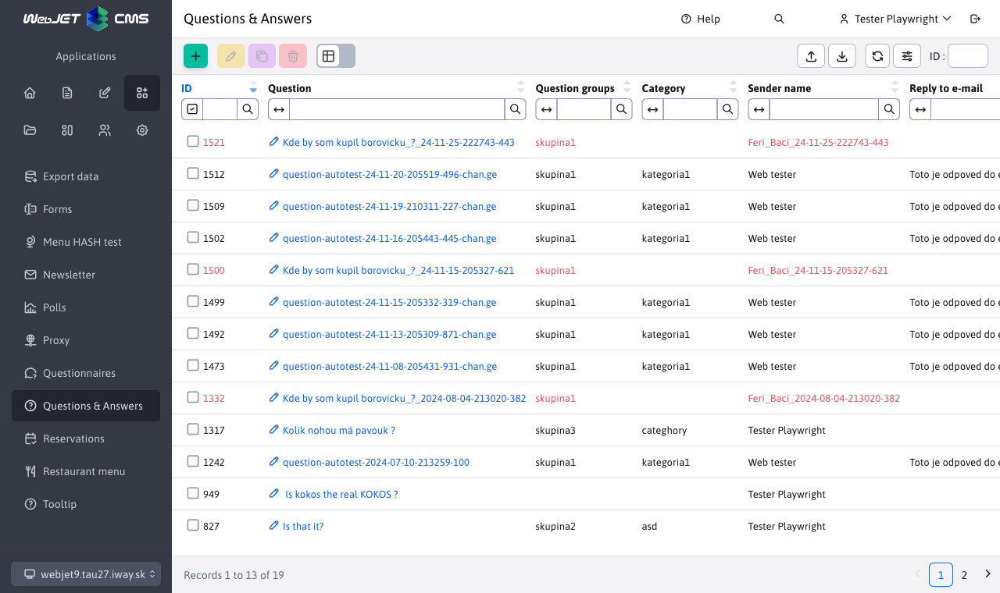

# Questions and answers

The Questions and Answers app, allows you to insert frequently asked questions and answers into the page. It is possible to categorize them by group. A new question will arrive on the specified email.

## Application parameters

- Embed
	- Questions with answers
	- Form to ask a question
- Issue Group - enter the name of the group from which posts will be selected for display on the site
- Number of questions on the page (displayed if: Questions with answers is selected)
- Email for sending questions (will be displayed if: Inquiry form is selected)
The questions are sorted into groups, which you enter when you upload your application. If you need to make more subgroups, you can modify the file `/components/qa/qa-ask.jsp`where you replace the hidden field `categoryName` for a selection menu, which will allow visitors to select a subgroup.

## Administration

You can view an overview of all the Q\&amp;A contributions by selecting Q\&amp;A in the Applications section. Questions that do not have an answer are shown in red.

By clicking on the question, you will see a form with the parameters of the question and the answer. In addition to being displayed on the page, the question and answer can also be emailed to the questioner's address. If the questioner has not marked the option **I agree to the publication of the question on the website**, the reply can only be sent to his/her email (leave the Display on website option unselected). Click Save to confirm your changes.

If you enter "Reply to email" and select the option **Display on web page**, the text from "Reply to email" is automatically copied to "Reply to page".

The app supports setting [optional fields](../../../frontend/webpages/customfields/README.md).
