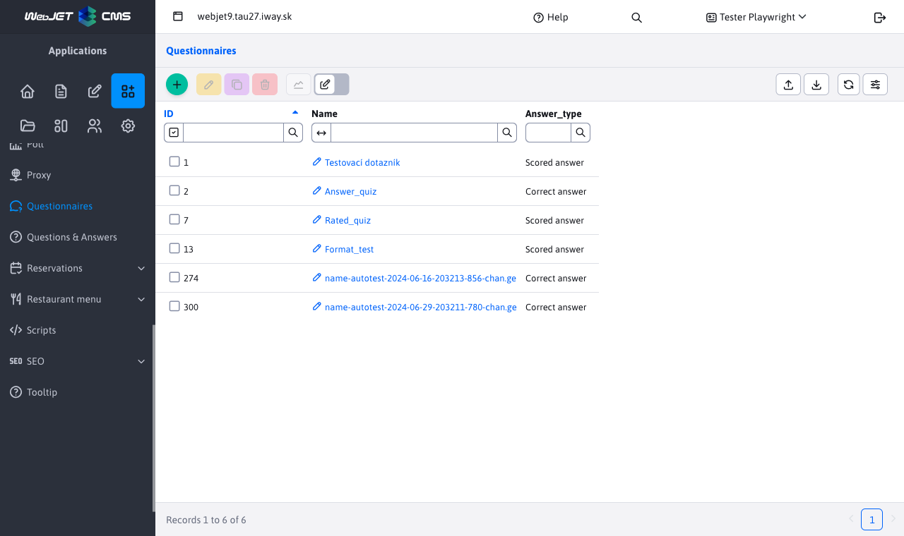
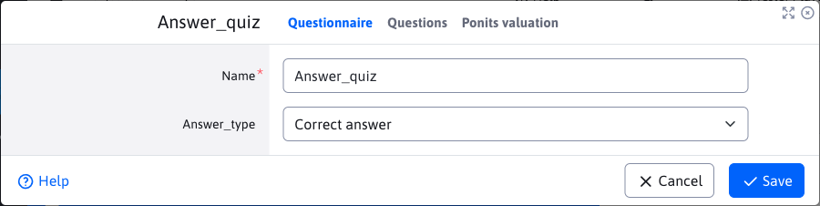
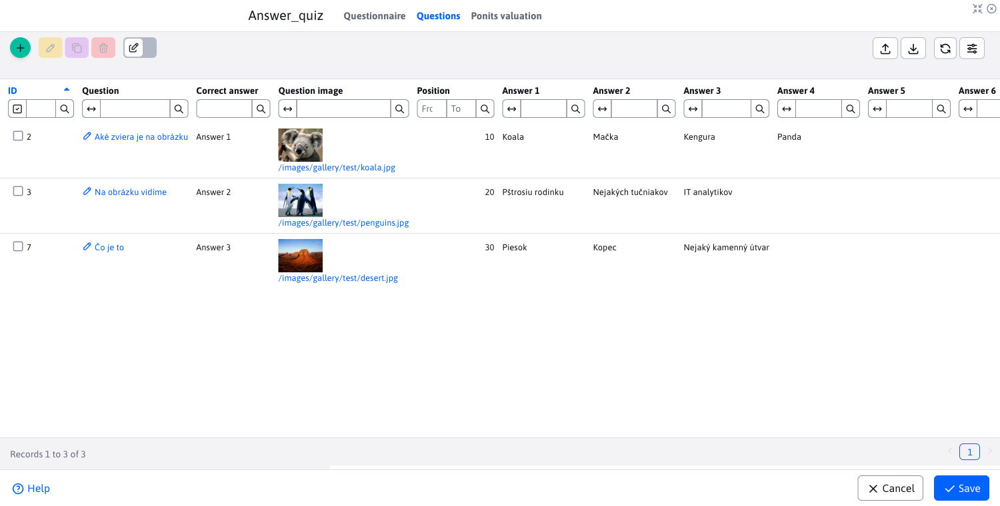
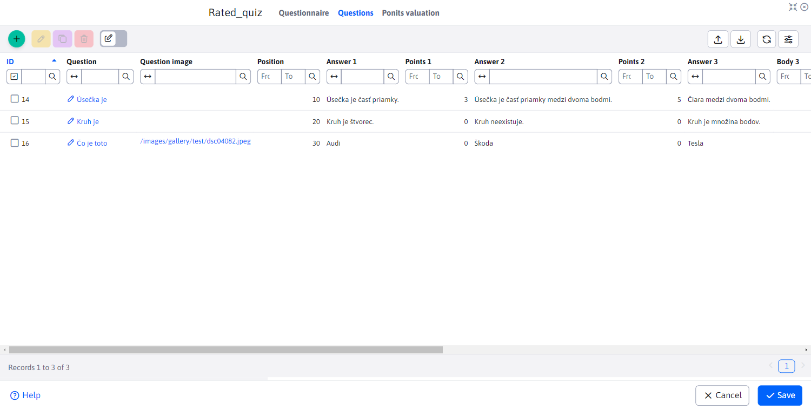
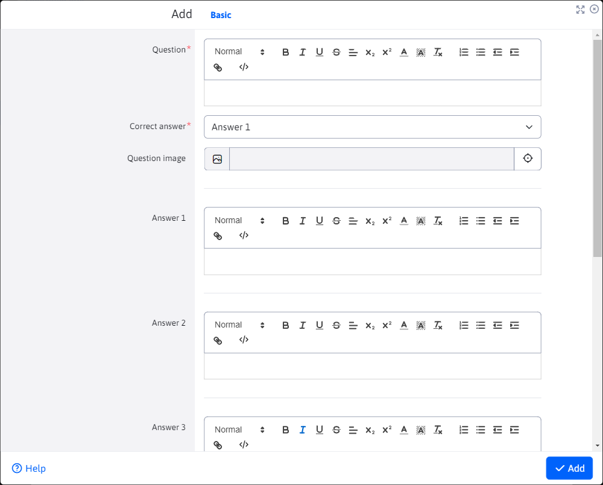
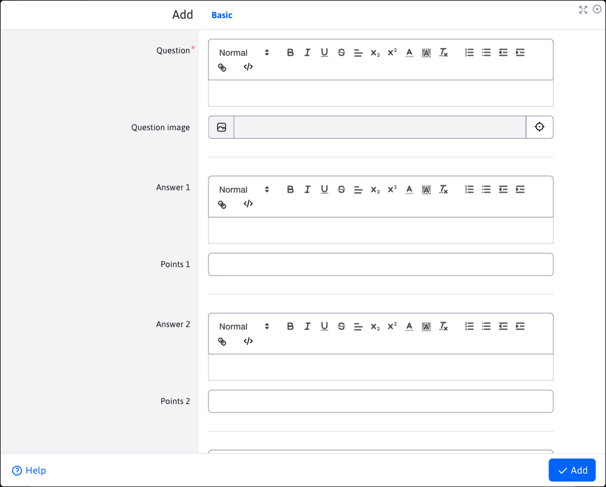
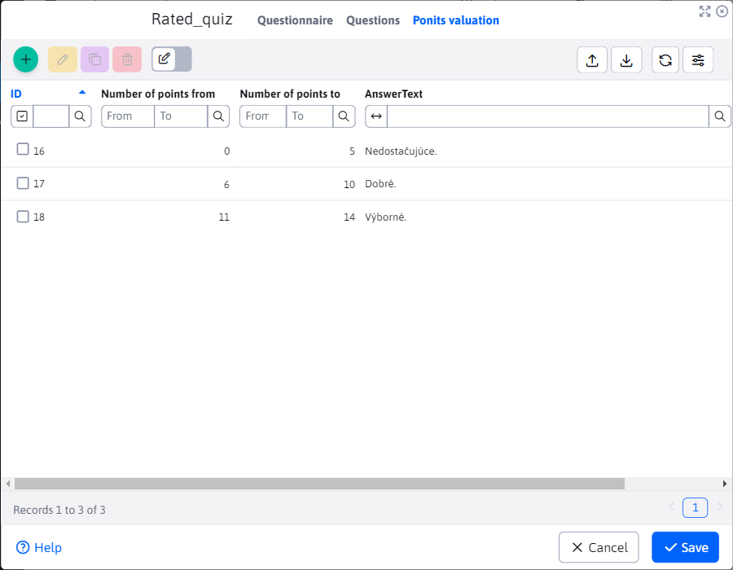
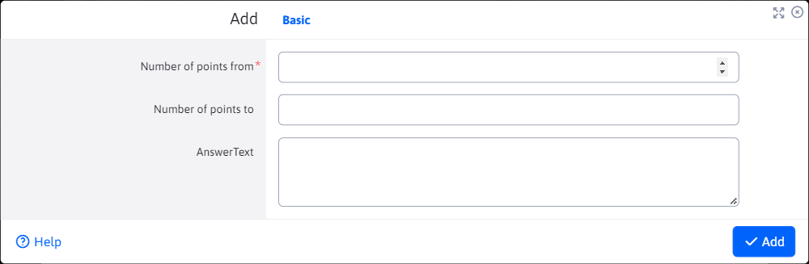
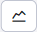
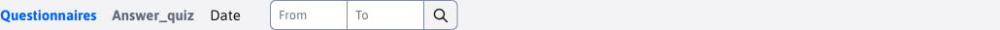

# Questionnaires

The Questionnaires application is used to prepare and manage questionnaires. In addition to managing the questionnaires themselves, it also allows you to manage the questions and answers for the questionnaire. There is also a statistical section available, where an overview of the individual questionnaire results can be found.

To create it, 2 parameters are needed:
- Name
- Type of answer

The Response Type parameter has a big influence on the final appearance and setting of the questionnaire. It supports 2 types:
- Correct answer - only one answer out of several is always correct and this correct answer is worth 1 point
- Point answer - there may be more than one correct answer, and each correct answer may have a different point value

## Questions

Query management is done via a nested datatable, directly in the tab **Questions** questionnaire editor. The appearance of this table and the editor itself is influenced by the selected questionnaire parameter **Type of answer**.

In the following figure we can see the nested datatable in the query tab for the option **Correct answer**. The Correct Answer column also gives us a hint, as these types of questions can only have one correct answer.

In the following figure we can see the nested datatable in the query tab for the option **Point answer**. Compared to the previous version, we can see that the Correct answer column is not present in this table, as there can be multiple correct answers. However, we have added the Points column, representing the number of points scored for a given answer. An answer is considered to be **correct** only if it is awarded **more than 0 points**.

### Creating questions and answers

When creating a question, we will ALWAYS see the option to enter 1-6 answers. If an answer is not filled in, it will not appear in the questionnaire. Only the question and at least one answer is required. Answers as well as the question itself can be graphically edited by the editor, so they can contain more complex texts. You can also enter an image, which will appear above the question in the questionnaire.

In the following picture we can see the Question editor for the option **Correct answer**. After filling in as many answers as you like, you must select the Correct answer.

In the following picture we can see the Question editor for the option **Point answer**. As with the date table, there is no Correct Answer, but instead you can assign points to each answer. When defining the answers to a question, you can also set 0 as the point value, in which case the answer is considered incorrect (if you do not fill in the point value, it will automatically be set to 0). All numeric point values entered must be positive (including zero).

## Scoring

The management of the evaluation is done through a nested datatable, directly in the tab **Scoring** questionnaire editor. In the table you can define the rating that will be displayed to the user after the test is completed. For example, it can be a scale to a grade.

Enter the new rating by filling in the from-to values (positive point values) and the report text.

## Setting the order

The order in which the questions/assessments will be displayed is determined by the value of the order parameter. This parameter is hidden when creating a question/rating and is already visible when editing. When created, it is set in the background as the largest existing order value in the database (for a particular questionnaire) + 10. If no value exists in the database, it is preset to 10. When editing, you can thus change the value to determine the order (the value must not be negative). The questions/evaluations with the smallest value of the order parameter will be the first.

## Creating questions/assessments before the actual Questionnaire

The Questionnaires application allows you to create and manage the questions/assessments before creating the Questionnaire itself. This is possible due to the fact that the tabs **Questions** a **Scoring** are also visible when creating the questionnaire.

Such created questions/ratings that were created before the actual questionnaire are not temporarily bound from any questionnaire (unbound) until a new questionnaire is saved. Once the new questionnaire is saved, they will be bound to it. If the user chooses not to save the questionnaire, the already created records are not deleted and remain available in the tabs when the questionnaire is created (e.g. if the user reopens the creation window). The unbound questions/ratings are not visible to other users (it is per user), nor are they visible when editing other questionnaires. If you decide not to create a new questionnaire, and you don't want even already created questions/ratings waiting to be bound, you can delete or edit them at will via the questionnaire creation window (directly in the tabs).

## Possible errors

Possible mistakes to watch out for:
- If you do not fill in any answer, the question will not be saved and you will be prompted to fill in at least one answer.
- How the correct answer is chosen (for a questionnaire type **Correct answer**) is entirely up to you. If you choose an undefined (blank) answer as the correct answer, the question will be saved, but you will never be able to answer it correctly, as the blank answer will not be displayed.
- If, when defining the answers for a questionnaire of type **Point answer** you forget to assign points to these answers, they will automatically be set to 0. This means that no points will be earned by selecting such an answer and the answer is considered incorrect.

## Questionnaire statistics

The questionnaires application also offers a statistical part. After selecting a questionnaire record in the table, press the button to be redirected to the statistical part . As with the table of questions, the statistical section varies depending on the type of response to the questionnaire. However, some elements are common.

Common is a page header with an extended filter, for filtering data in a specific date range. The filter works on the principle of:
- if no range is specified, automatic returns data for the last month (+- 30 days)
- if the range is set to OD only, the filter returns data in the range of the set OD to the current date
- if the range is set to DO only, the filter returns data in the monthly range ending in the specified DO

The FIRST 2 charts and the data table are common to both types of responses (the composition of the table columns also changes depending on the type of questionnaire response to fit the data more logically). The common graphs are:
- The percentage of correct answers to each question, over the selected period (rounded), is represented by a bar chart representing the percentage of correct answers (out of all) over the time range. The % values are rounded to whole numbers. From the graph you can easily see which questions were answered with the highest or lowest success rate.
- Number of correct and incorrect answers for the selected period - for all questions, using a line graph to represent how many correct and incorrect answers (in whole numbers) there were on a given day. The answers of all users for all questions combined are counted. This makes it easy to see from the graph on which day the ratio of right and wrong answers to questions was better or worse. The graph also includes a line representing the number of all answers (to better visualize the ratio of right/wrong to all answers).

**Correct answer**

Questionnaire statistics with response type **Correct answer** contains 2 additional charts:
- Number of correct answers for the selected period - for each question, a line graph representing the number of correct answers to each question on a given day. Provides an overview of which questions specifically on which day had the most/least CORRECT answers. From all users combined.
- Number of incorrect answers for the selected period - for each question, a line graph representing the number of incorrect answers to each question on a given day. Provides an overview of which questions specifically on which day had the most/least incorrect answers. From all users combined.

**Point answer**

Questionnaire statistics with response type **Point answer** contains 1 additional chart:
- Number of points scored for the selected period - for each question, a line graph representing the number of points scored for each question on a given day. Since a question may have multiple correct answers in this case, the graph of percentage success is not sufficient. This graph will clearly show which questions were the most/least profitable in terms of points on a given day. So a question with a lower success rate may still be more scoringly successful (for example, when its answers are higher ranked or users voted for higher ranked answers to that question).
