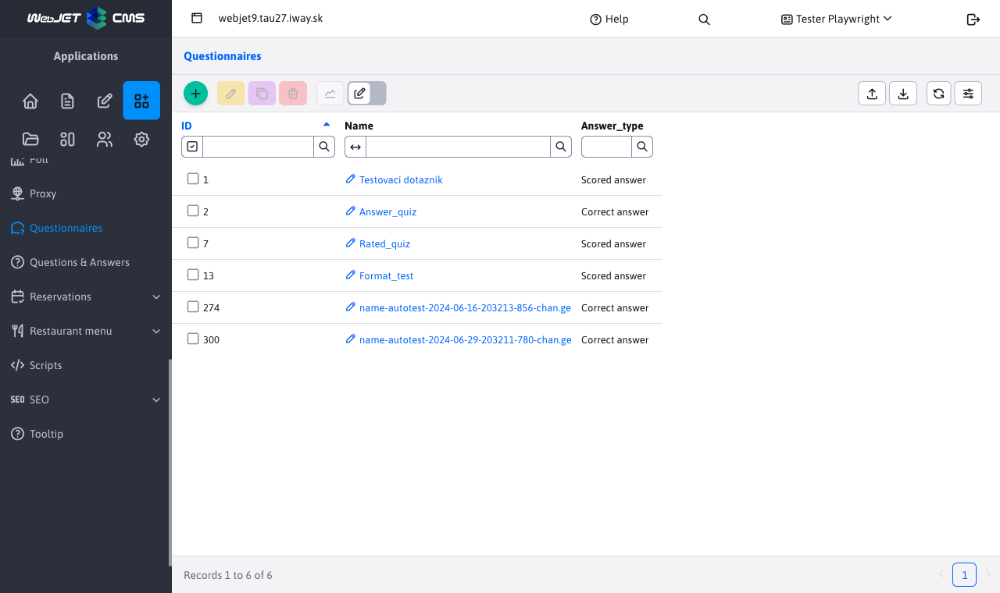
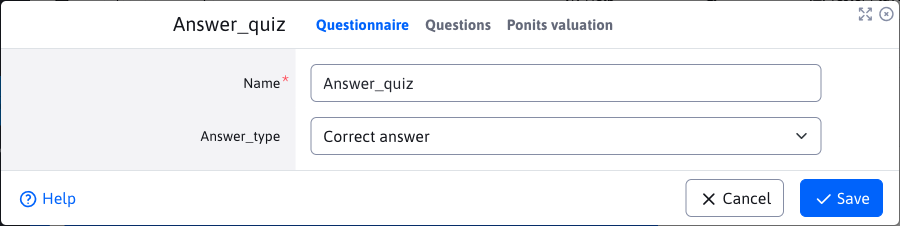
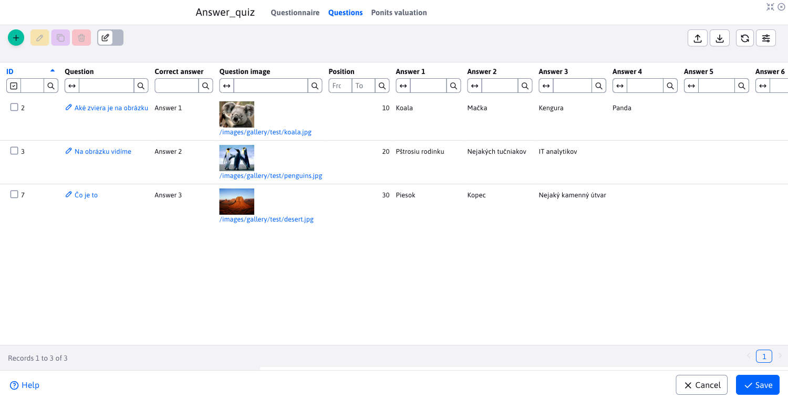
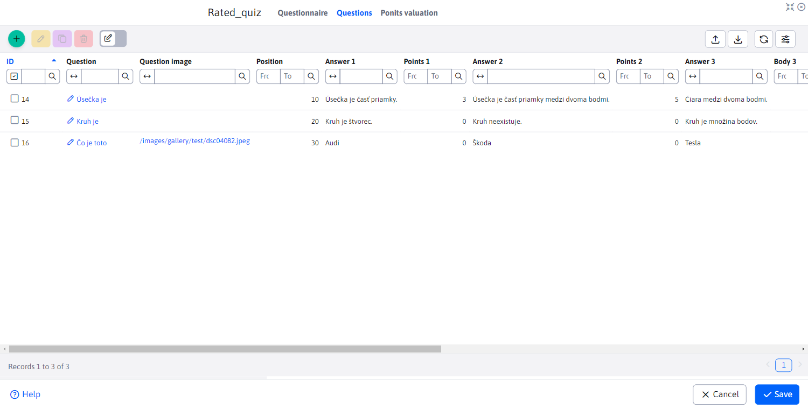
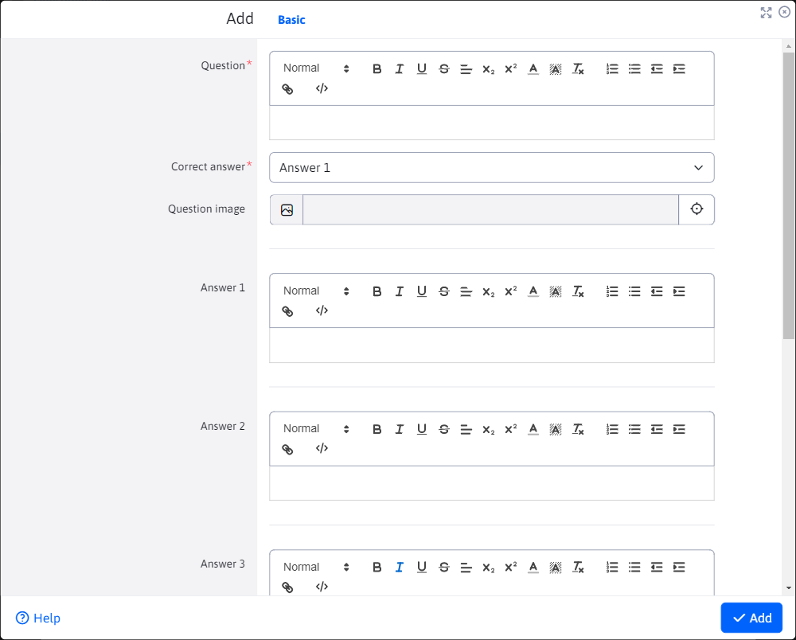
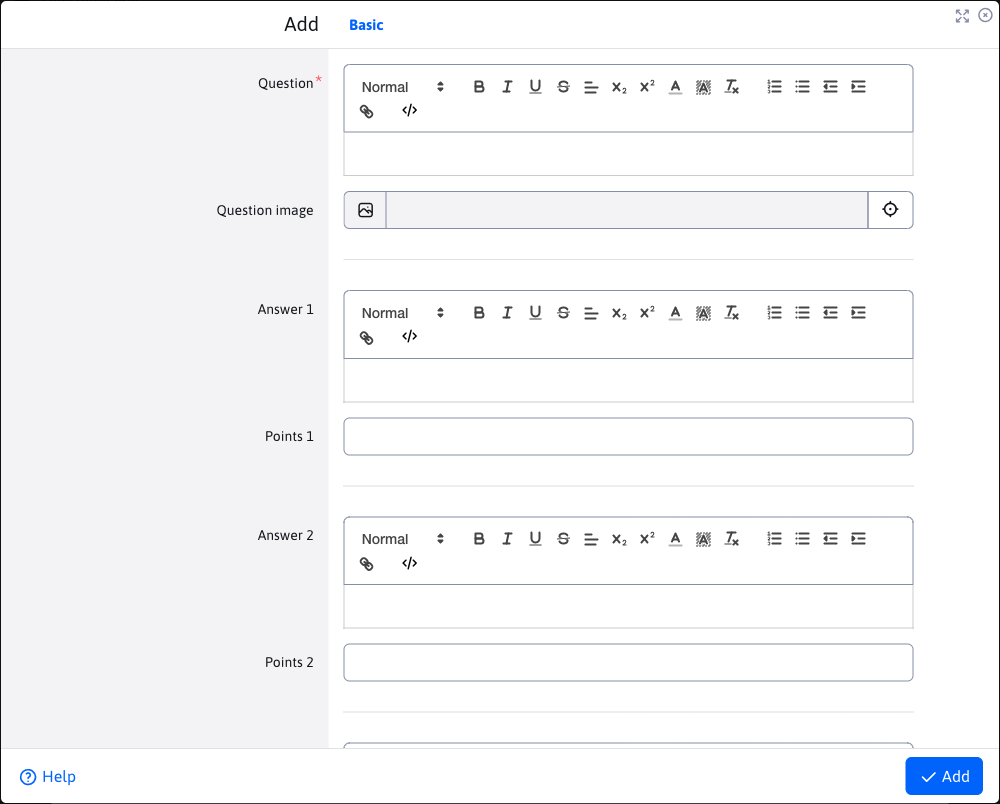
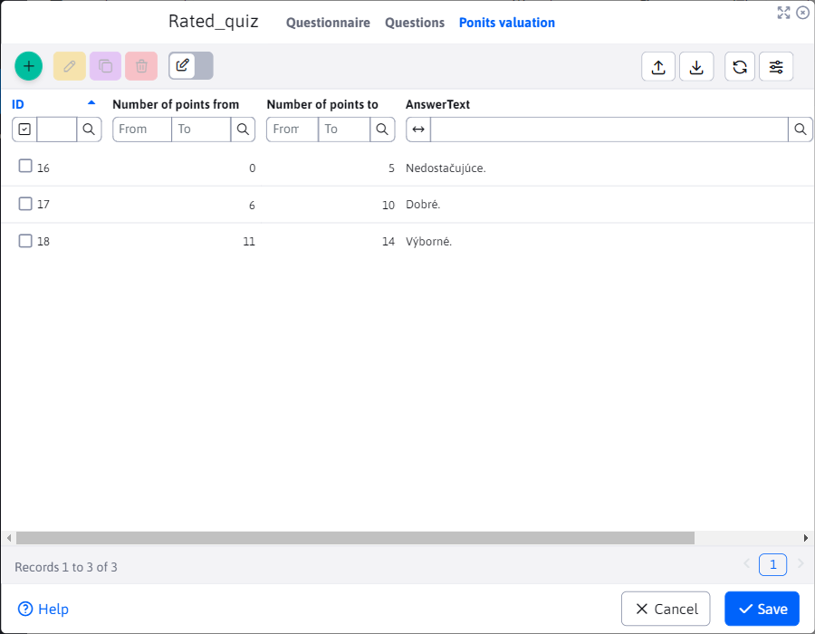
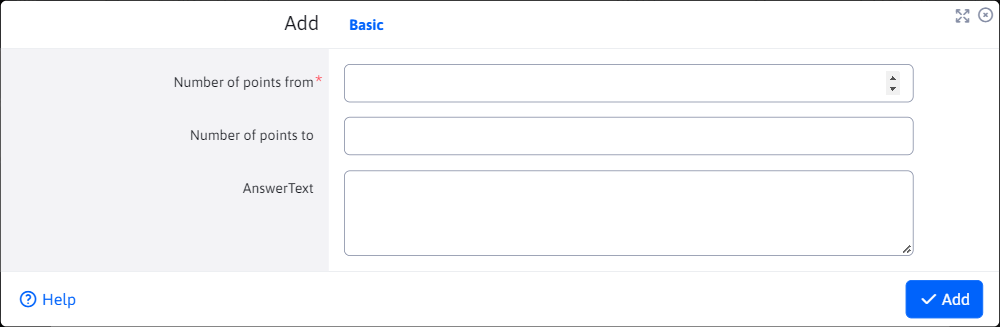
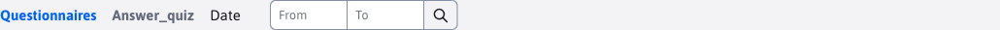
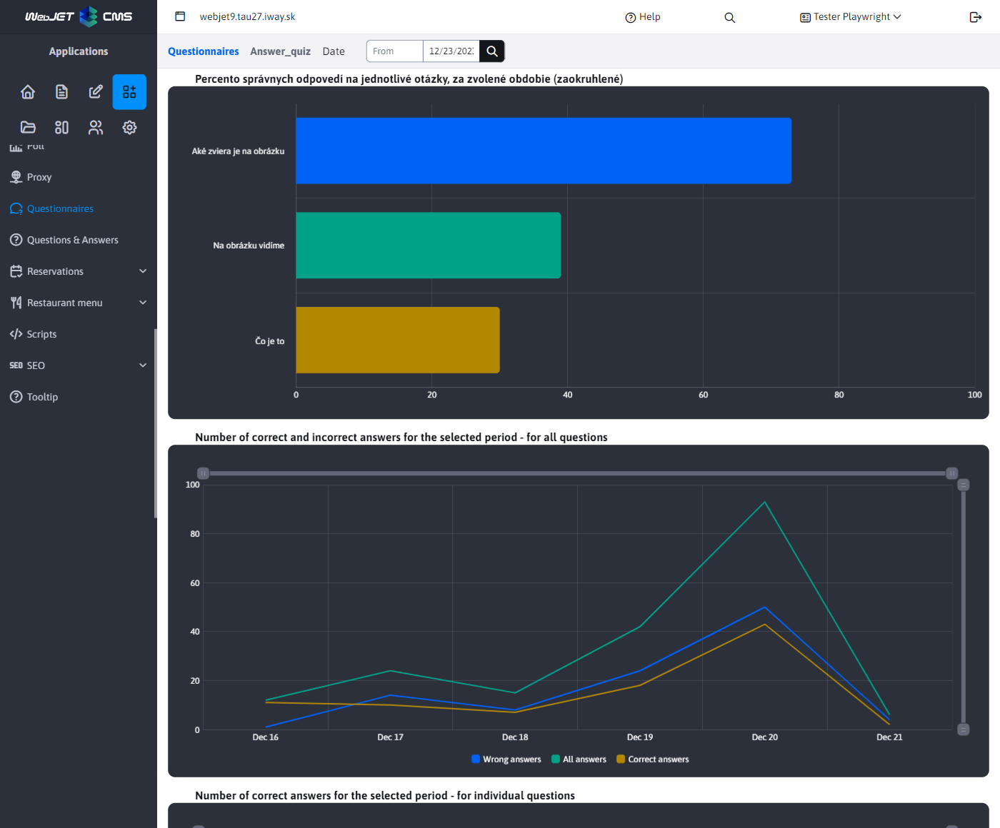

# Questionnaires

The Questionnaires application is used to prepare and manage questionnaires. In addition to managing the questionnaires themselves, it also allows you to manage questions and answers for the questionnaire. There is also a statistics section available, where you can see an overview of the individual questionnaire results.

2 parameters are required to create it:

- Name
- Response type

The Response Type parameter has a major impact on the final appearance and configuration of the questionnaire. It supports 2 types:

- Correct answer - only one answer out of several is always correct and this correct answer is worth 1 point
- Point answer - there can be multiple correct answers, and each correct answer can have a different point value

## Questions

Question management is done via a nested data table, directly in the **Questions** tab of the questionnaire editor. The appearance of both this table and the editor is influenced by the selected questionnaire parameter **Answer type**.

In the following image, we see a nested datatable in the question card for the **Correct Answer** option. The Correct Answer column also tells us that these types of questions can only have one correct answer.

In the following image, we see a nested data table in the question card for the **Point answer** option. Compared to the previous version, we can see that the Correct answer column is not in this table, since there can be multiple correct answers. However, we have added the Points column, representing the number of points obtained when choosing a given answer. An answer is considered **correct** only if it is awarded **more than 0 points**.

### Creating questions and answers

When creating a question, we ALWAYS have the option to enter 1-6 answers. If the answer is not filled in, it will not be displayed in the questionnaire. Only the question and at least one answer are mandatory. The answers, as well as the question itself, can be graphically edited by the editor, so they can contain more complex texts. You can also enter an image, which will be displayed above the relevant question in the questionnaire.

The following image shows the Question editor for the **Correct Answer** option. After filling in any number of answers, you need to select the Correct Answer.

The following image shows the Question editor for the **Point Answer** option. As in the data table, there is no Correct Answer, but instead, you can assign points to individual answers. When defining answers to a question, you can also set the points value to 0, in which case the answer is considered incorrect (if you do not fill in the points value, the value is automatically set to 0). All entered numerical point values ​​must be positive (including zero).

## Scoring

The assessment management is done via a nested data table, directly in the **Scoring** tab of the questionnaire editor. In the table, you can define the assessment that will be displayed to the user after completing the test. For example, it can be a grade scale.

We enter a new rating by filling in the from-to values ​​(positive point values) and the report text.

## Setting the order

The order in which the questions/ratings will be displayed is given by the value of the order parameter. This parameter is hidden when creating a question/rating and is visible when editing. When creating, it is set in the background as the largest existing order value in the database (for a specific questionnaire) + 10. If no value exists in the database, it is preset to the value 10. When editing, you can change the value to determine the order (the value must not be negative). Questions/ratings with the smallest value of the order parameter will be first.

## Creating questions/ratings before the Questionnaire itself

The Surveys application allows you to create and manage questions/ratings before creating the Survey itself. This is possible because the **Questions** and **Rating** tabs are visible even when creating a survey.

Such created questions/ratings that were created before the questionnaire itself are temporarily not bound to any questionnaire (unbound) until the new questionnaire is saved. After saving the new questionnaire, they are bound to it. If the user decides not to save the questionnaire, the already created records are not deleted and remain available to him in the tabs when creating a questionnaire (e.g. if he reopens the creation window). Other users do not see the unbound questions/ratings (it is per user) and they are also not visible when editing other questionnaires. If you decide that a new questionnaire will not be created and you do not want the already created questions/ratings that are waiting to be bound, you can delete or edit them at will through the questionnaire creation window (directly in the tabs).

## Possible errors

Possible mistakes to watch out for:

- If you do not fill in any answer, the question will not be saved and you will be prompted to fill in at least one answer.
- How the Correct Answer is selected (for a **Correct Answer** questionnaire) is entirely up to you. If you select an undefined (blank) answer as the correct answer, the question will be saved, but it will never be possible to answer it correctly, as the blank answer will not be displayed.
- If you forget to assign points to these answers when defining answers for a **Point answer** questionnaire, they will automatically be set to 0. This means that no points will be awarded by selecting such an answer and the answer is considered incorrect.

## Questionnaire statistics

The quizzes application also offers a statistics section. After selecting a quiz record in the table, you are redirected to the statistics section by pressing the  button. As in the case of the question table, the statistics section varies depending on the type of response for the given quiz. However, they have some elements in common.

The common feature is the page header with an advanced filter, for filtering data within a certain date range. The filter works on the principle of:

- if no range is specified, it will automatically return data for the last month (+- 30 days)
- if the range is set to OD only, the filter will return data in the range set to OD to the current date
- if the range is set to only DO, the filter will return data in the monthly range ending in the specified DO

The FIRST 2 graphs and the data table are common for both types of responses (the composition of the table columns also changes depending on the type of questionnaire response to more logically fit the data). The common graphs are:

- Percentage of correct answers to individual questions, for the selected period (rounded), using a bar graph represents the percentage of correct answers (out of all) for the given time range. Values ​​in % are rounded to whole numbers. From the graph you can easily see which questions were answered with the highest or lowest success rate.
- Number of correct and incorrect answers for the selected period - for all questions, using a line graph, it represents how many correct and incorrect answers there were (in whole numbers) for a given day. The answers of all users for all questions are counted together. From the graph, you can easily read on which day the ratio of good and bad answers to questions was better or worse. The graph also contains a line representing the number of all answers (for better visualization of the ratio of correct/incorrect to all).

**Correct answer**

The questionnaire statistics with the answer type **Correct answer** contains 2 additional graphs:

- Number of correct answers for the selected period - for individual questions, a line graph representing the number of correct answers to individual questions on a given day. Provides an overview of which questions had the most/least CORRECT answers on which day. From all users together.
- Number of incorrect answers for the selected period - for individual questions, a line graph representing the number of incorrect answers to individual questions on a given day. Provides an overview of which questions had the most/least INCORRECT answers on which day. From all users together.

**Point answer**

The statistics for the questionnaire with the **Point answer** type of response include 1 additional graph:

- Number of points earned for the selected period - for individual questions, a line graph representing the number of points earned for individual questions on a given day. Since a question can have multiple correct answers in this case, a percentage success graph is not enough. This graph will clearly show which questions were the most/least profitable in terms of points on a given day. So a question with a lower success rate can still be more successful in terms of points (for example, when its answers are higher rated or users voted for higher rated answers to this question).