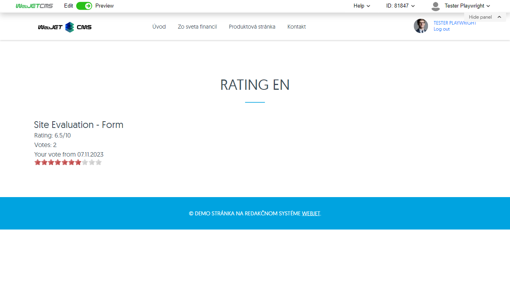
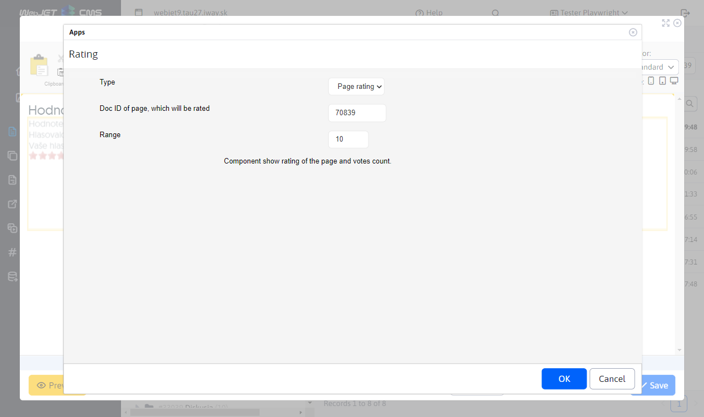
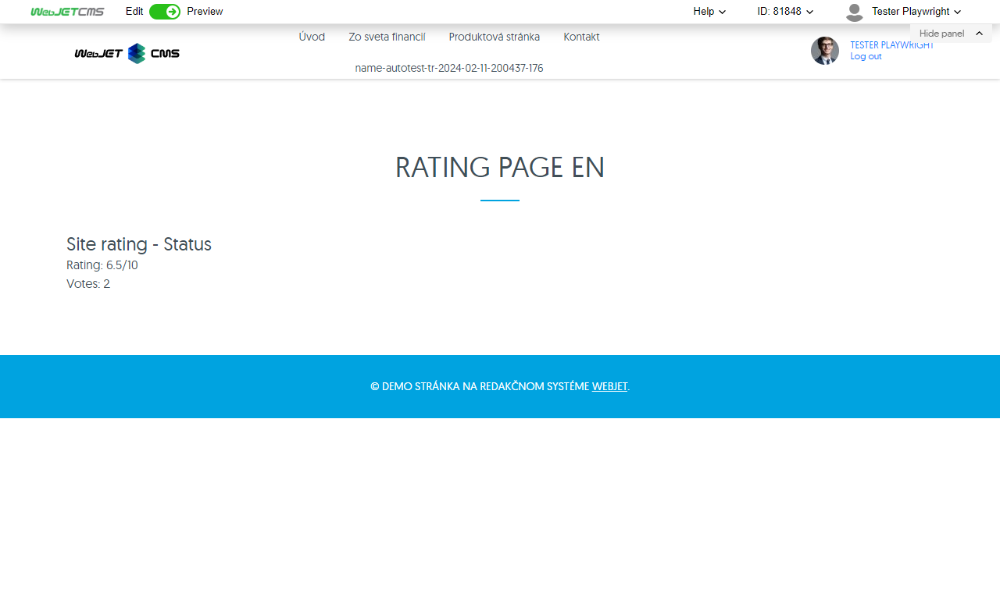
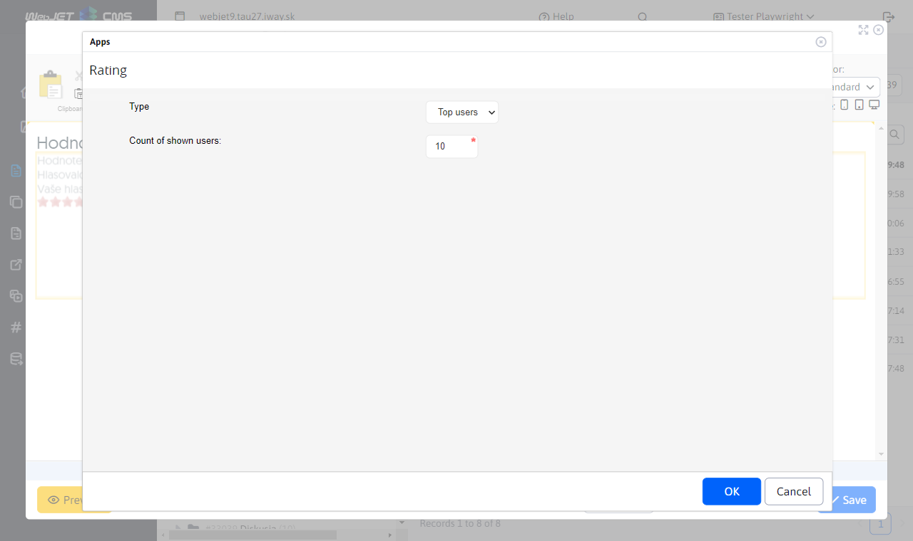
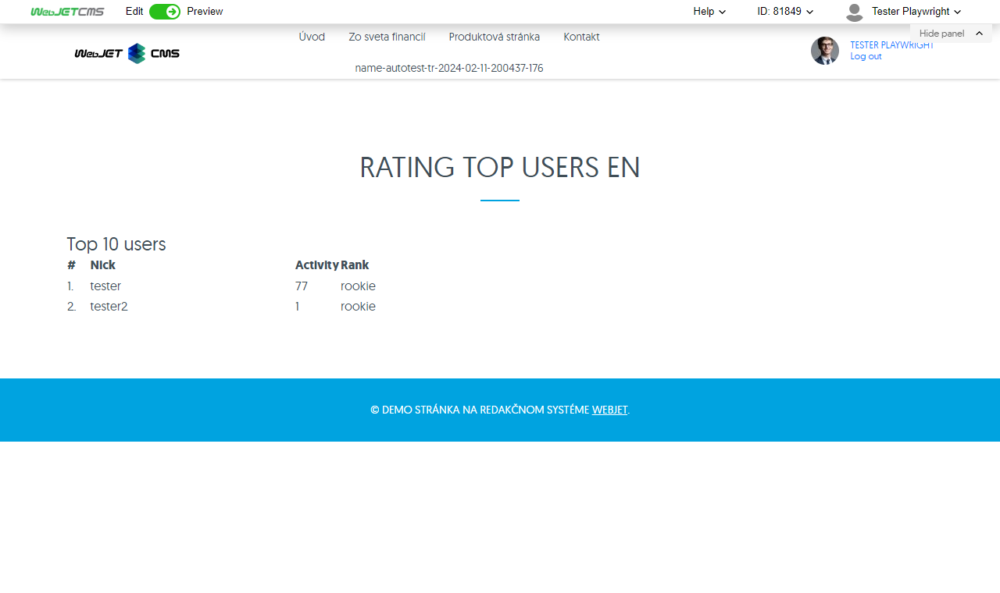
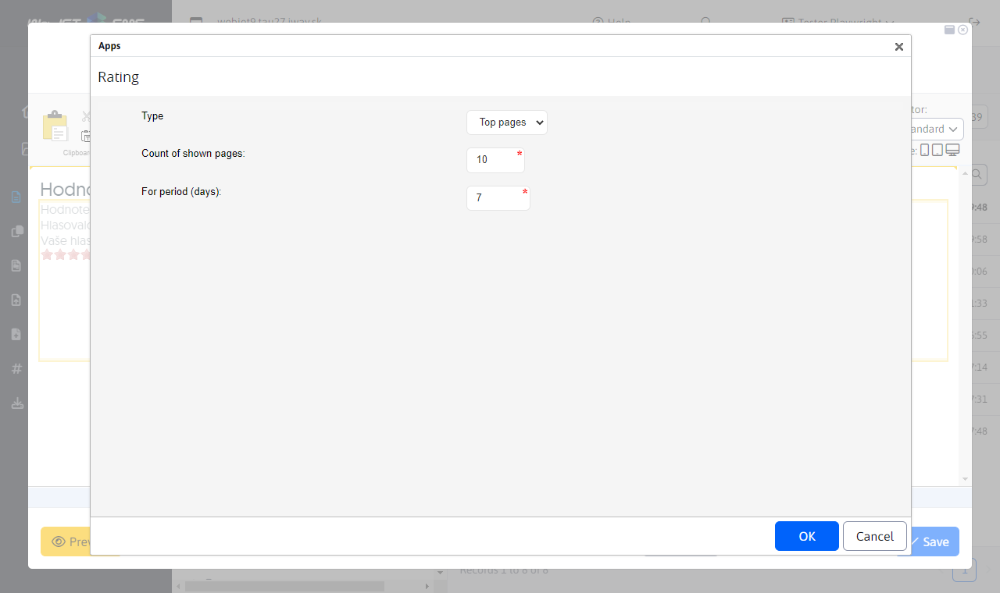
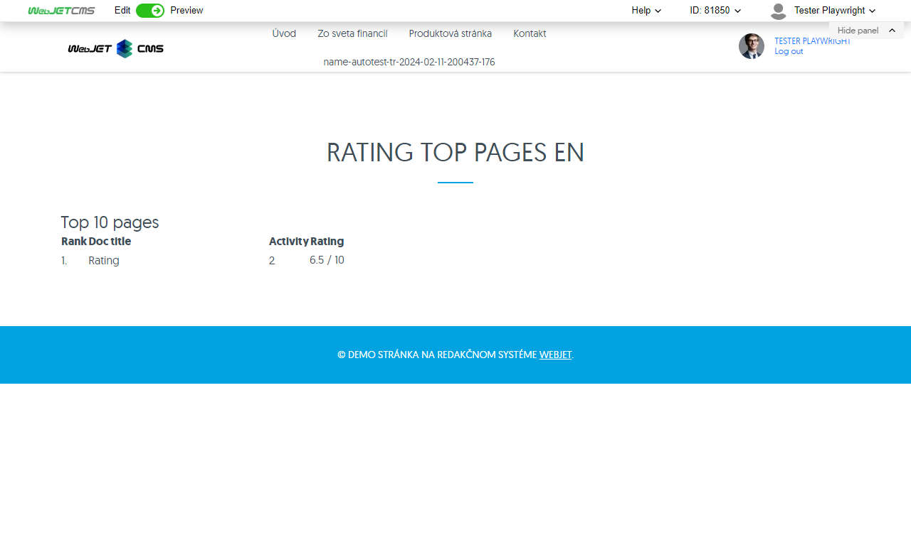

# Rating/Rating

The Rating application allows you to rate a page (its quality). It then offers a view of the rating on the page, statistics on the number of voters, a list of the most frequently voting users, as well as a list of the pages with the highest rating.

The form for inserting the application into the page is available in the page editor. It provides the option to select the type of evaluation:
- Rating form
- Site rating
- Top users
- Top pages

## Rating form

You can add a form to rate a page as an app or directly using code `!INCLUDE(/components/rating/rating_form.jsp, checkLogon=false, ratingDocId=70839, range=10)!`.

The form contains parameters:
- `checkLogon` - Enable logged in user check, if selected, only logged in users can rate the page.
- `ratingDocId`
- `range` - The range of the rating scale.

The generated form in the page itself works by clicking on the stars. The range of asterisks is given by the parameter `Rozsah stupnice hodnotenia`. Once you click on a particular star, the page is rated and you cannot rate it again.

## Site rating

You can add a rating page (or sta rating page) as an application or directly using code `!INCLUDE(/components/rating/rating_page.jsp, ratingDocId=70839, range=10)!`. Displays the rating of the web page without the form.

Contains parameters:
- `ratingDocId` - Doc ID of the page to be evaluated.
- `range` - The range of the rating scale.
Displays the statistics of the current page rank.

## Top users

Top users (who have rated) can be added as an app or directly using code `!INCLUDE(/components/rating/rating_top_users.jsp, usersLength=10)!`.

Contains the parameter:
- `usersLength` - Number of users viewed.

Displays the users with the most ratings.

## Top pages

Top pages can be added as an app or directly using code `!INCLUDE(/components/rating/rating_top_pages.jsp, range=10, docsLength=10, period=7)!`.

Contains the parameter:
- `range` - The range of the rating scale.
- `docsLength` - Number of pages viewed.
- `period` - For the period (number of previous days).

Displays the pages with the best ratings.

