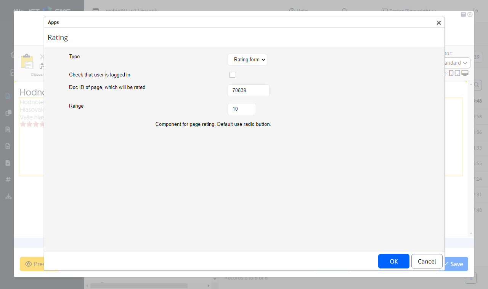
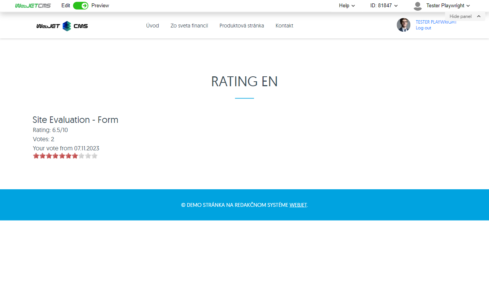
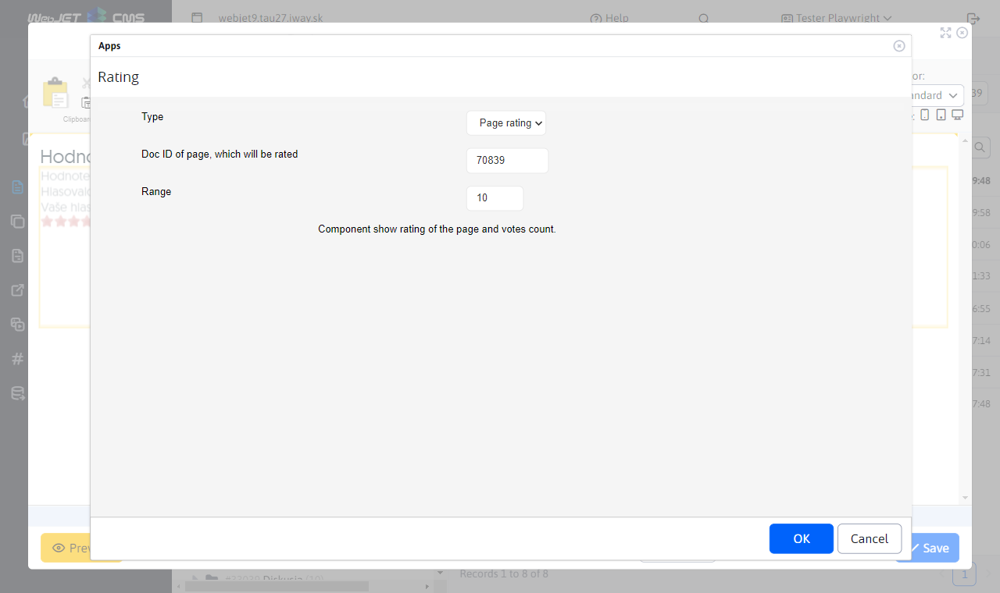
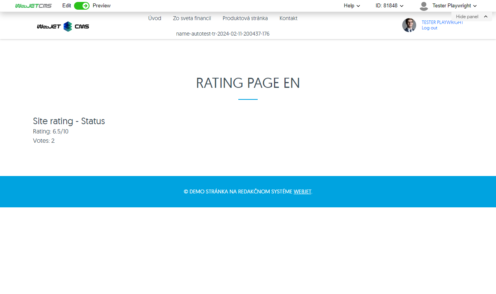
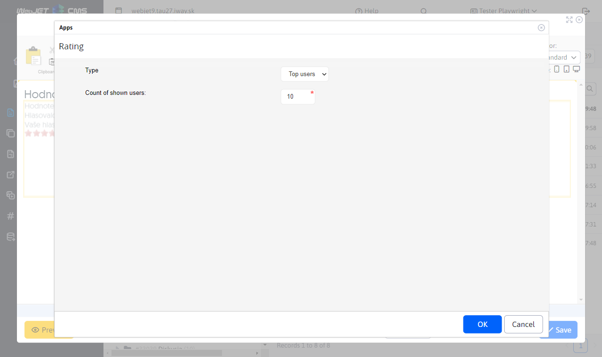
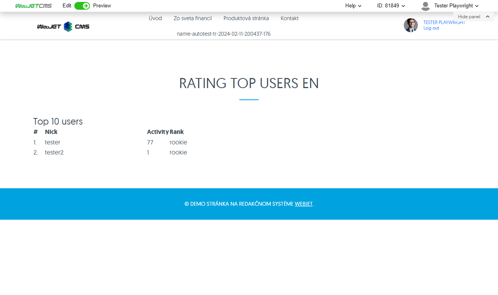
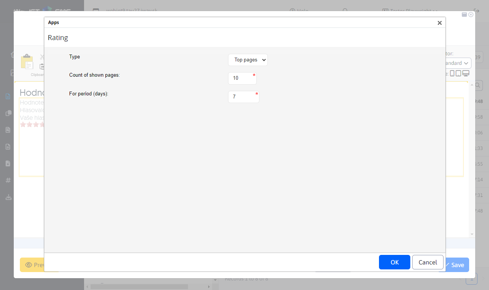
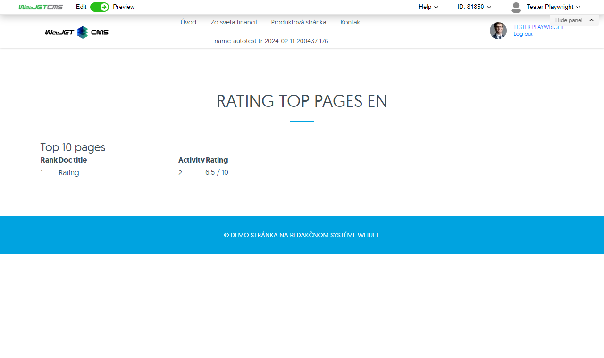

# Rating

The Rating application allows you to rate a page (its quality). It then offers a display of the rating on the page, statistical data on the number of voters, a list of the most frequently voting users, as well as a list of pages with the highest ratings.

The form for inserting an application into a page is available in the page editor. It provides the option to select the type of evaluation:

- Rating form
- Site rating
- Top users
- Top sites

## Rating form

You can add a page rating form as an app or directly using the ```!INCLUDE(/components/rating/rating_form.jsp, checkLogon=false, ratingDocId=70839, range=10)!``` code.

The form contains the following parameters:

- `checkLogon` - ​​Enable logged in user checking, if the option is selected, only logged in users can rate the page.
- `ratingDocId` - ​​Doc ID of the page that will be evaluated, if the entered value is less than 1, the ID of the currently displayed web page will be automatically used.
- `range` - ​​Rating scale range.



The generated form on the page itself works by clicking on the stars. The range of stars is given by the parameter `Rozsah stupnice hodnotenia`. After clicking on a specific star, the page is rated and it is no longer possible to rate it again.



## Site rating

You can add a page rating (or page rating score) as an application or directly using the code ```!INCLUDE(/components/rating/rating_page.jsp, ratingDocId=70839, range=10)!```. It displays the website rating without a form.



Contains parameters:

- `ratingDocId` - ​​Doc ID of the page to be evaluated.
- `range` - ​​Rating scale range.

Displays statistics on the current page rating.



## Top users

Top users (who rated) can be added as an application or directly using the code ```!INCLUDE(/components/rating/rating_top_users.jsp, usersLength=10)!```.

Contains the parameter:

- `usersLength` - ​​Number of users displayed.



Displays users with the highest number of ratings.



## Top sites

Top pages can be added as an application or directly using the code ```!INCLUDE(/components/rating/rating_top_pages.jsp, range=10, docsLength=10, period=7)!```.

Contains the parameter:

- `range` - ​​Rating scale range.
- `docsLength` - ​​Number of pages viewed.
- `period` - ​​For the period (number of previous days).



Displays the best-rated pages.

