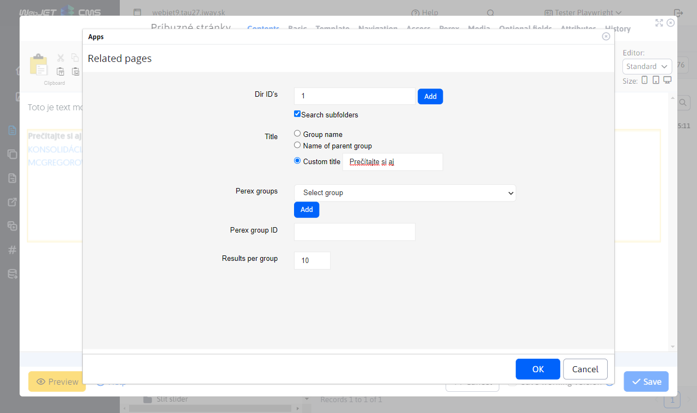
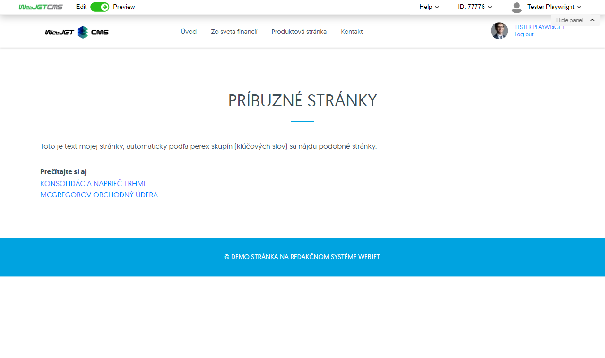

# Related sites

Inserts an application into the page that will display links to related pages. These will be found automatically by the tags (perex groups) assigned to the current page (other pages containing the same tags will be found).

## Application settings

In this section it is possible to set:
- Directory - the root folder in which related pages are searched
- Browse also subdirectories
- Title
  - Group name - the folder name of the current page
  - Parent Name. group - the name of the parent folder of the current page
  - Proper name
- Perex groups - if specified, the latest pages will be displayed according to the specified tags, if empty they will be displayed according to the tags of the currently displayed web page
- Number of links in the group - maximum number of pages displayed

## View application

