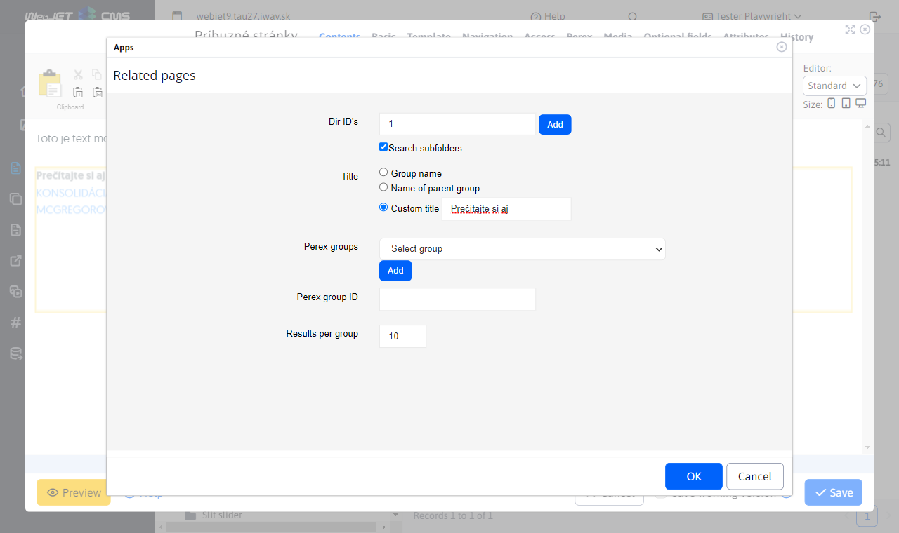
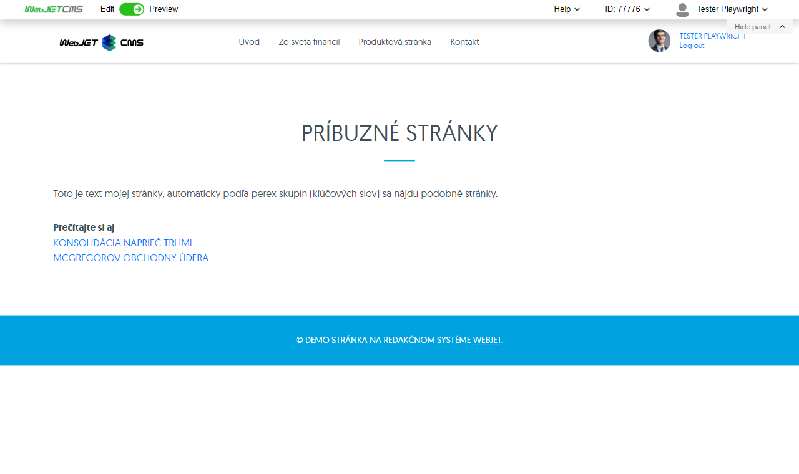

# Related pages

Inserts an application into the page that will display links to related pages. These are automatically searched for according to the tags (or groups) assigned to the current page (other pages containing the same tags are searched for).

## Application settings

In this section you can set:

- Directory - the root folder in which related pages are searched
- Search subdirectories as well
- Title
  - Group name - folder name of the current page
  - Parent group name - name of the parent folder of the current page
  - Custom name
- Perex groups - if specified, the latest pages will be displayed according to the specified tags, if empty, they will be displayed according to the tags of the currently displayed web page
- Number of links in the group - maximum number of pages displayed

## View the application

