# Booking days app

Application **Reservation of days** allows you to book selected reservation objects for one or more days, by selecting the desired days in the calendar.

## Using the app

You can add the app to your site via the app store

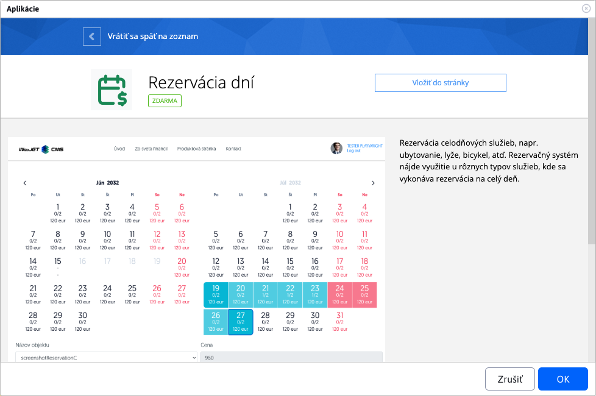

or directly as code to the page

```html
!INCLUDE(sk.iway.iwcm.components.reservation.DayBookApp, reservationObjectIds=&quot;3683+3684+3962&quot;, device=&quot;&quot;, cacheMinutes=&quot;&quot;)!
```

In the code you can notice the parameter `reservationObjectIds`. This is a list of **Forced** booking objects that will be bookable in the app. You can set them when editing the application using the multiple selection field, or add them directly to the parameter `reservationObjectIds`. If this list (parameter) is not set, the application will display all (all-day) available booking objects.

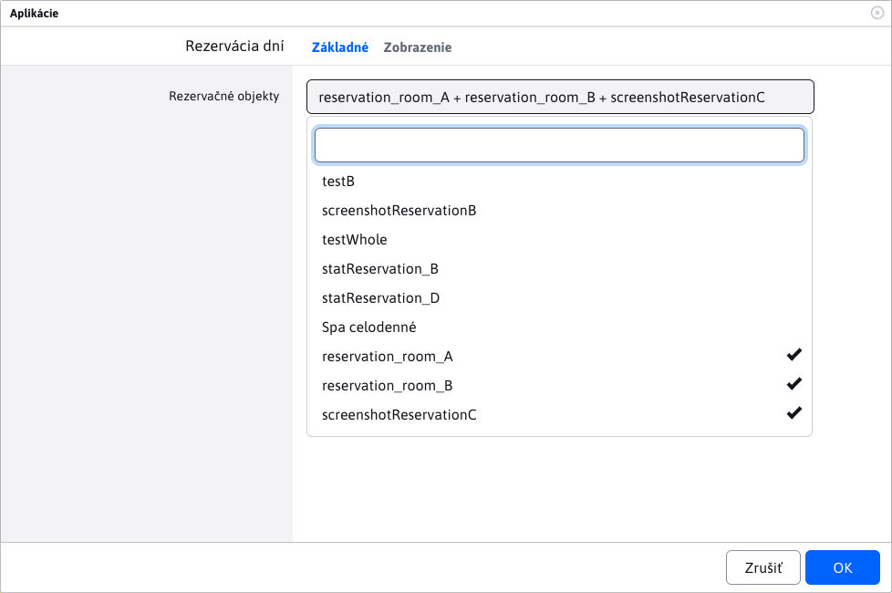

!>**Notice**: only reservation objects that **are set as a reservation for the whole day**. Because these objects can only be booked based on date. Unsuitable booking objects are not displayed in the multi-selection field.

!>**Notice**: manually adding the ID of the non-compliant reservation object to the parameter `reservationObjectIds`, or changing the "booking for the whole day" status of an already used booking object in the app **causes the application to misbehave**.

## Application construction

The application consists of 2 main parts:
- availability and price calendar
- booking form

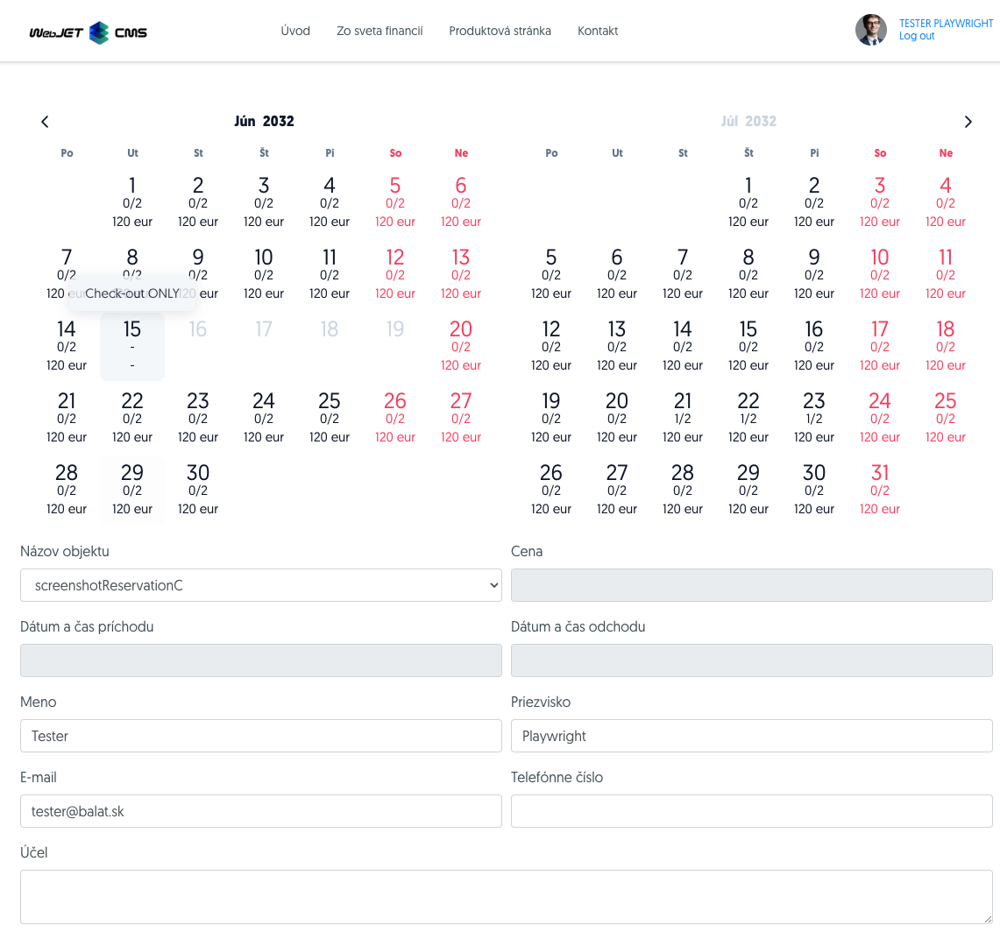

## Availability and price calendar

The calendar is used to select the date range in which you want to book the property. When displayed, the current month (right) and the next month (left) are automatically set.

### Date selection

If you want to change the currently displayed date, you can do so by clicking on the month/year in the header of the earlier month (left). Calendar **does not allow to view the history or to book in the history**.

**Selection of the month**

When you click on the name of the month in the calendar header, you will see a menu with a selection of all months. This is a selection of months for the specific year selected. If a month for that year is already in the past, it will be greyed out and you will not be able to select it.

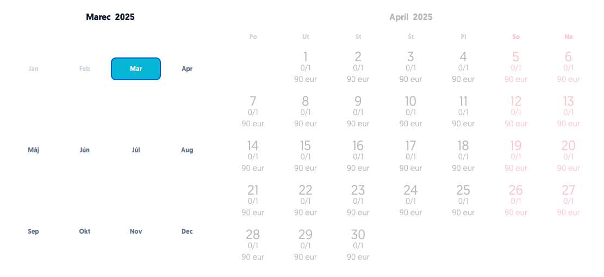

**Selection of the year**

Similar to selecting a month, when you click on a year in the calendar header, you will see the available years to select. Years in the past are greyed out and will not be selectable.

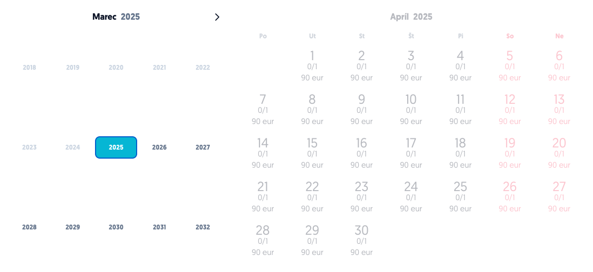

### Elements of the calendar

As you may notice, the calendar has different graphical elements that have different meanings.

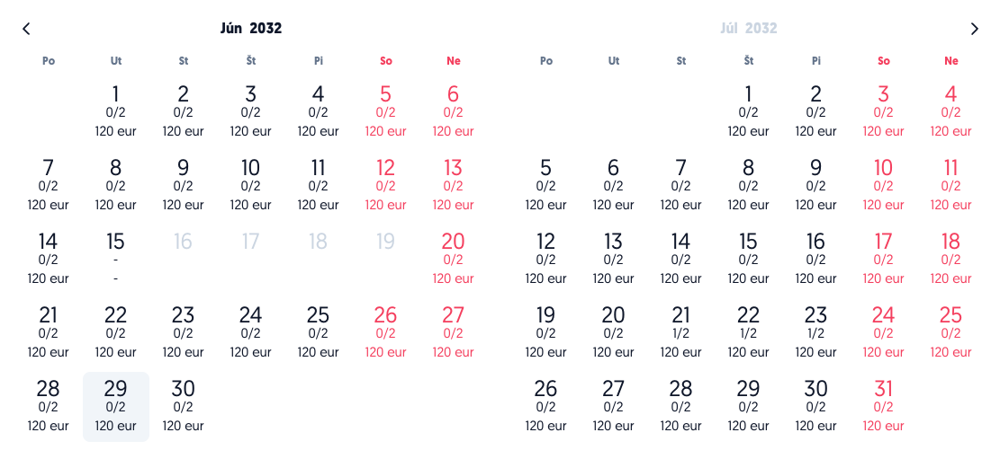

**Optional day**

The most common element of the calendar is the day you can choose to book. Each element contains information:
- day of the month
- information about availability, i.e. how many bookings have already been made for this day and from what maximum number. Example `0/1, 2/5, ...`.
- the price of the reservation for the day for the property with currency. Example `120 eur, 15 czk, ..`.

!>**Notice**: this booking price for the day is already calculated with the user's discount. This percentage discount is set for specific [user groups](../../../../admin/users/user-groups.md). If a user belongs to multiple **user groups** that have a set percentage discount, the largest of these will be used. If the discount has a value of `0%`, the booking amount does not change. If the discount has a value of `100%`, booking is free.

Weekend days are highlighted in red for a better overview.

| Ordinary day | Ordinary day (with another reservation) | Weekend day |
| :-----------------: | :-------------------------------: | :------------------: |
| 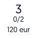 | 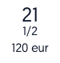    | 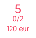 |

**An unelectable day**

Another common calendar feature is a day that cannot be selected. These are days that are already in the past or are already fully booked. Such elements are greyed out, cannot be selected and do not display availability/price information.


**Special `Check-out ONLY` Day**

This special calendar element shows a day that can be selected but not booked. Example: when booking a room, this is a day that someone else has already booked (their booking starts on that day) but you can use it in the booking to check out of the room. This is where the name comes from `Check-out ONLY`, which is also displayed as the element description.

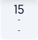

### The logic of range selection

The range selection in the calendar works on the simple principle of selecting a start and end date to book (or vice versa, it has no effect). You can only choose **optional days** except `Check-out ONLY` days. If you are not happy with the selected day, just click on it again (this will de-select it).

!>**Notice**: you can only select one range at a time, which must be valid for the whole duration, so it cannot be interrupted by a day in the past or a fully booked (reserved) day.

The calendar already has built-in checks to ensure that this condition is met. Therefore, it will not allow you to click on **non-elective days**, but in addition it will block those days that failed to form a continuous interval with the currently selected start day. **Example:** in the following pictures you can see how after choosing the day `19.07` block all days from `01.06` to `16.06`. They lock up because they cannot be selected in one range. This range would be interrupted by several fully booked (reserved) days and such a range is not valid.

| Before election | After election |
| :--------------------: | :-----------------: |
|  | 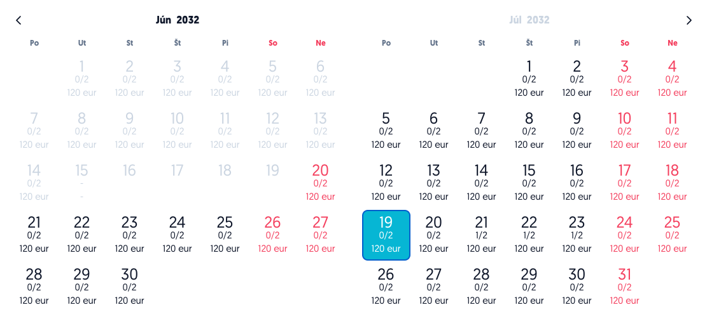 |

After selecting the first day (initial), just select the second allowed day (final). As you go over the days, the range will be pre-marked to give you an overview, and once you select the final day, it will already be fully marked.

| Before election | After election |
| :-----------------: | :-----------------: |
| 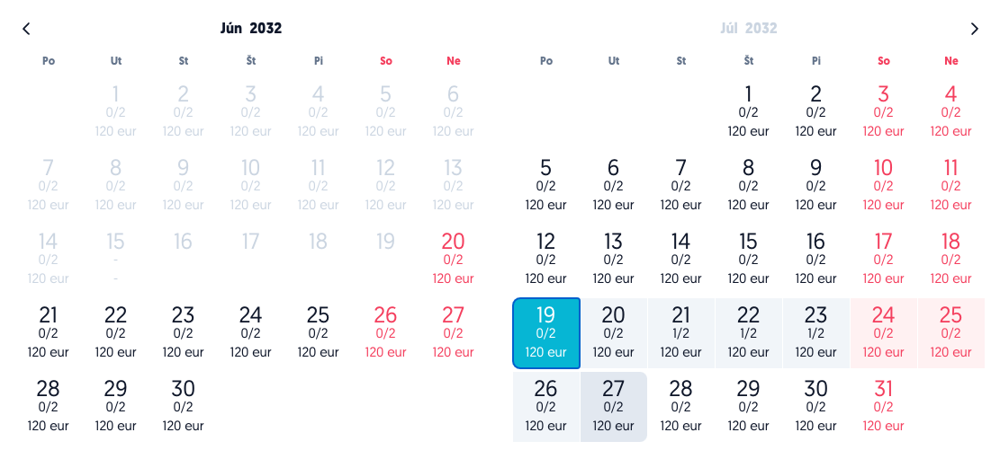 | 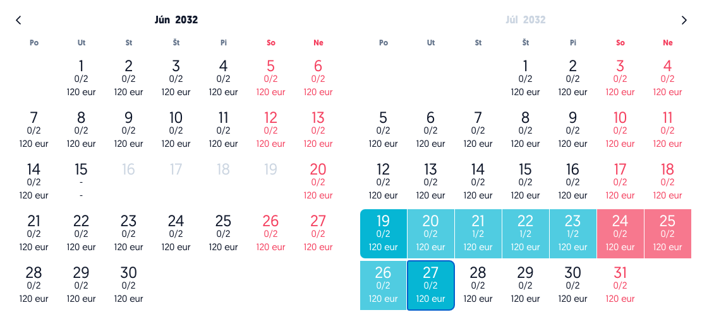 |

Note that after the election, the temporarily blocked days from `01.06` to `16.06`. Of course, we can change this choice. Just select a new starting day by clicking.

You may also notice that the calendar allowed us to choose days from `21.07` to `23.07` which are only partially booked.

!>**Notice**: the range must have at least 2 days, since the last day of the reservation is the last day to leave the reserved object and for this last day **is not paid**.

### Reservation Form

This is a simple form with basic information for booking a property.

Selection field **Name of the object** allows you to change the reservation object you want to book.

These required fields are automatically pre-populated if you are a logged in user, but of course they can be changed. If you are accessing as a non-logged-in user, you must enter them as mandatory:
- Name
- Last name
- E-mail

Fields **Date and time of arrival** a **Date and time of departure** cannot be changed and are for information purposes only. They will automatically change the value according to the selected range in the calendar.

!>**Notice**: values for **time of arrival** a **departure time** are obtained from the configuration variables `reservationAllDayStartTime` a `reservationAllDayEndTime`.

!>**Warning:** the button to add a booking will only appear if the selected range is in the calendar.

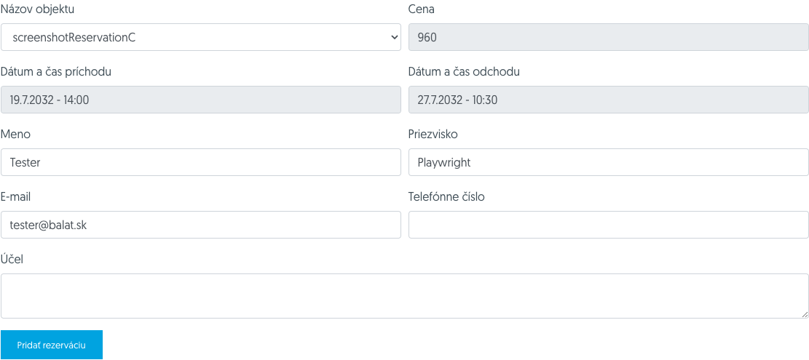

## Adding a reservation

After selecting a range on the calendar and filling in the information on the form (if required), you are ready to request your booking to be added. A button will appear in the bottom left corner **Add reservation**


If the booking has been successfully created, you will receive a notification that the booking has been successfully created and a confirmation will be sent to the email address you have entered.

If the reservation object **does not need approval**, the booking will be automatically approved and you will receive the following message. The availability of the property is then adjusted for each day.

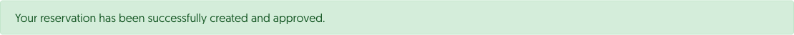

If the reservation object **needs approval**, the reservation will be in pending status. The availability of the property for each day in the calendar will not change as ONLY confirmed bookings are counted. The approver may approve or reject your booking, you will be notified by email.

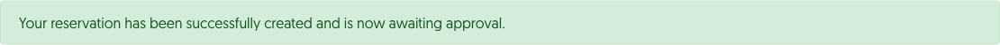
