# Day Booking Application

The **Day Reservation** application allows you to reserve selected reservation objects for one or more days by selecting the desired days in the calendar.

## Using the app

You can add an app to your site through the app store

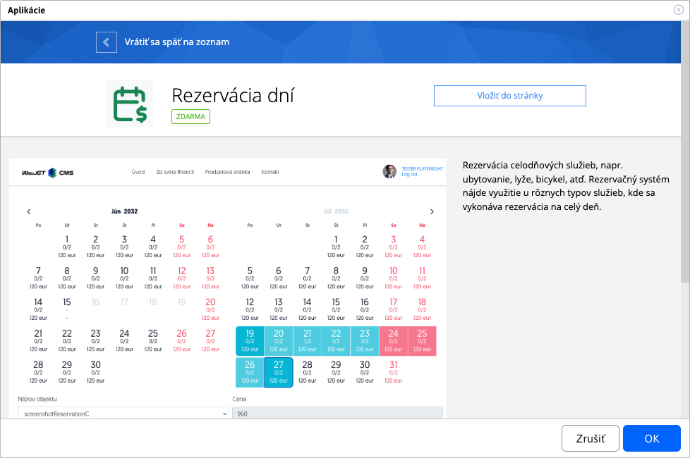

or directly as code into the page

```html
!INCLUDE(sk.iway.iwcm.components.reservation.DayBookApp, reservationObjectIds=&quot;3683+3684+3962&quot;, device=&quot;&quot;, cacheMinutes=&quot;&quot;)!
```

You can notice the parameter `reservationObjectIds` in the code. This is a list of **forced** booking objects that will be bookable in the application. You can set them when editing the application using a multi-select field, or add them directly to the parameter `reservationObjectIds`. If this list (parameter) is not set, the application will display all (all-day) available booking objects.

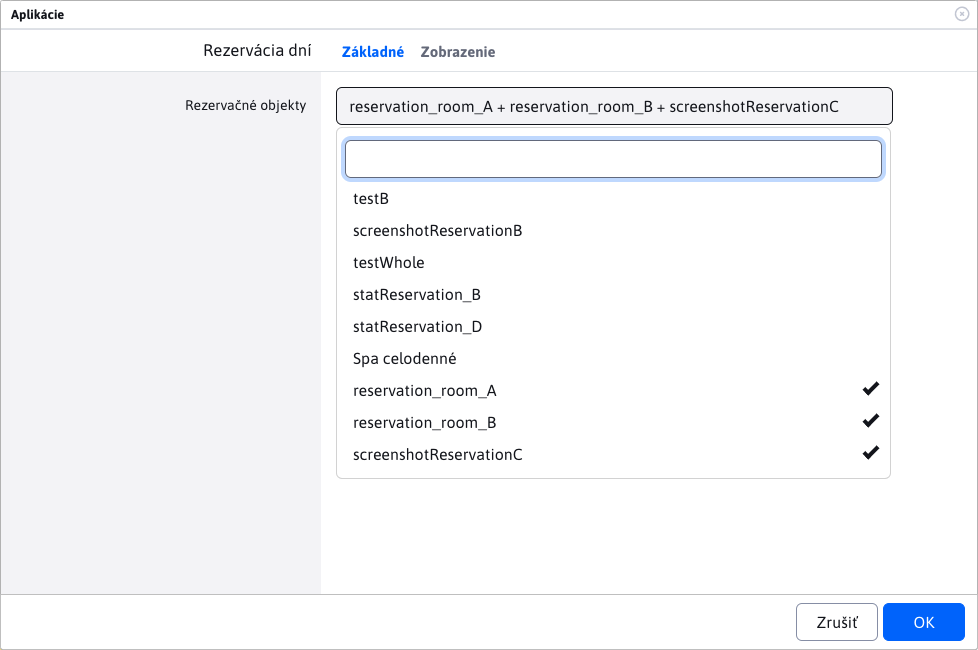

!>**Warning**: Only booking objects that **are set as full day booking** are supported. Because these objects can only be booked based on date. Incompatible booking objects are not displayed in the multi-select field.

!>**Warning**: manually adding the ID of a non-compliant booking object to the `reservationObjectIds` parameter, or changing the status of an already used booking object to "full day booking" in the application **will cause incorrect application behavior**.

## Application construction

The application consists of 2 main parts:

- availability and price calendar
- booking form

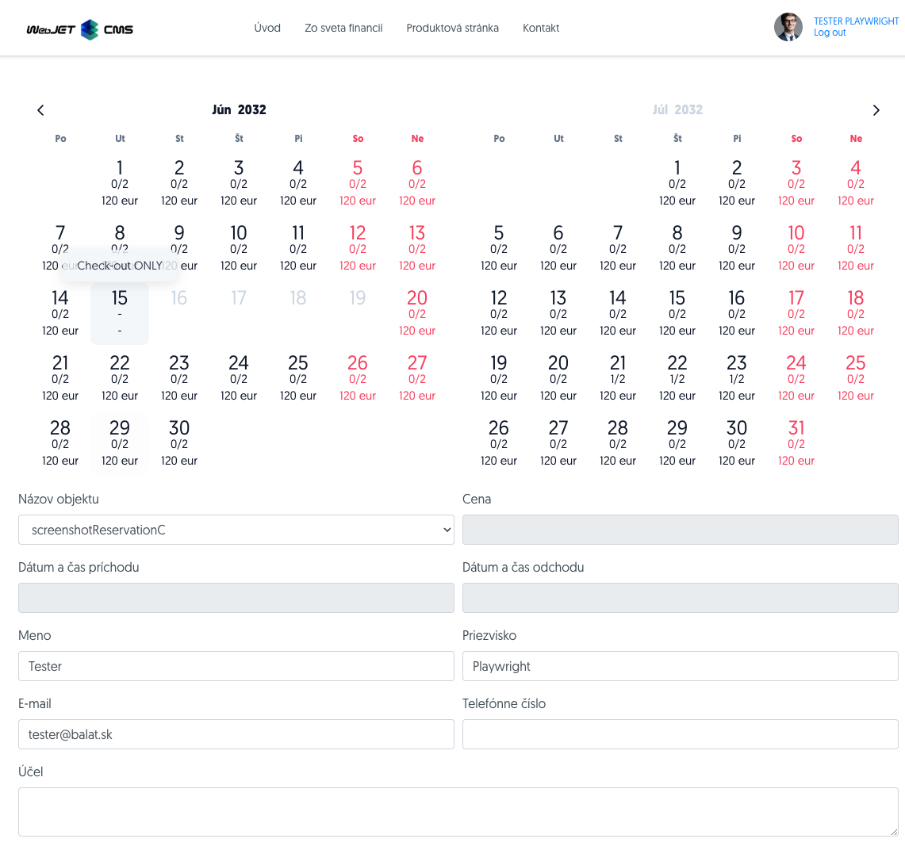

## Availability and pricing calendar

The calendar is used to select the date range in which you want to reserve the property. When displayed, the current month (on the right) and the next month (on the left) are automatically set.

### Date selection

If you want to change the currently displayed date, you can do so by clicking on the month/year in the header of the previous month (on the left). The calendar **does not allow viewing history or booking in history**.

**Select month**

When you click on the month name in the calendar header, a menu will appear with a selection of all months. This is a selection of months for a specific selected year. If a month for a given year is already in the past, it will be grayed out and you will not be able to select it.

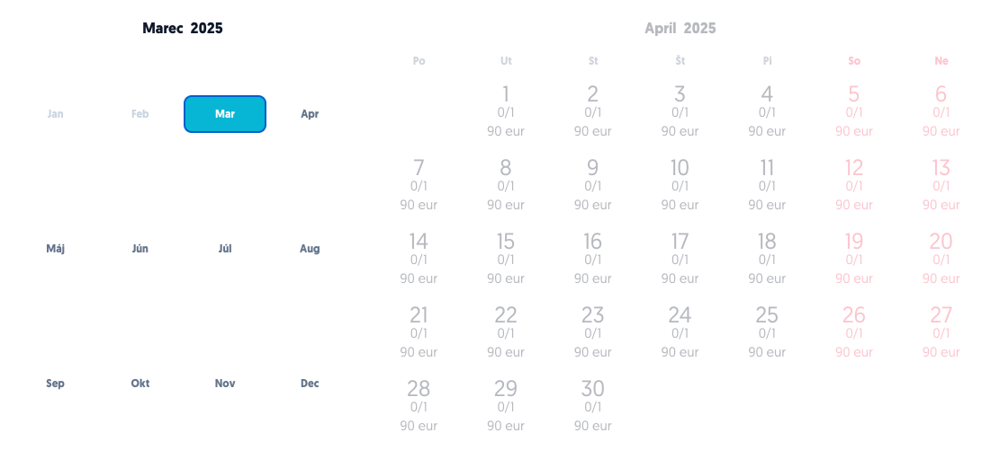

**Select year**

Similar to selecting a month, clicking on a year in the calendar header will display the available years to select. Years in the past are grayed out and will not be selectable.

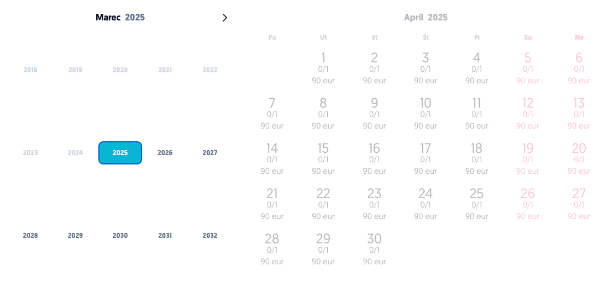

### Calendar elements

As you can notice, the calendar has various graphically distinct elements that have different meanings.

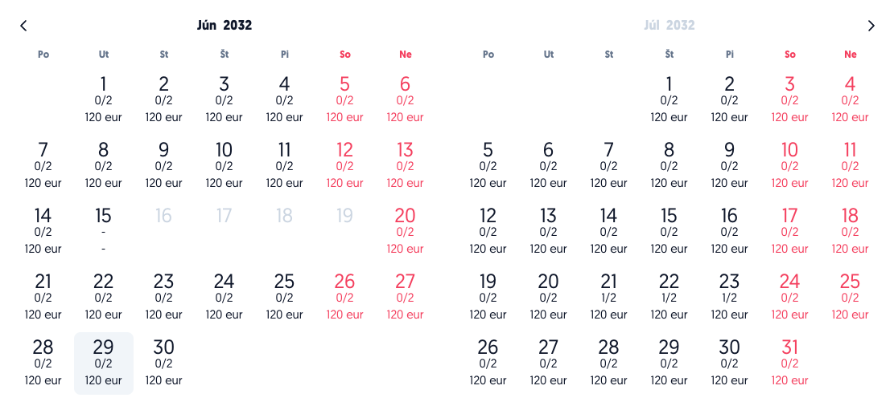

**Elective day**

The most common calendar element is the day you can select for bookings. Each element contains information:
- day of the month
- information about occupancy, i.e. how many reservations have already been created for this day and what is the maximum number. Example `0/1, 2/5, ...`.
- reservation price for a given day for a given object, including currency. Example `120 eur, 15 czk, ..`.

!>**Warning**: this reservation price for a given day is already calculated with the user discount. This percentage discount is set for specific [user groups](../../../../admin/users/user-groups.md). If a user belongs to multiple **user groups** that have a percentage discount set, the largest one will be used. If the discount is ```0%```, the reservation amount does not change. If the discount is ```100%```, the reservation is free.

Weekend days are highlighted in red for better visibility.

Ordinary day             |  Regular day (with another reservation)   | Weekend day
:--------------------:|:------------------------------------:|:------------------------------------:

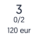

   |           | 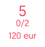


**Non-selectable day**

Another common calendar element is a day that cannot be selected. These are days that are in the past or are already fully booked. Such elements are grayed out, cannot be selected, and do not display availability/price information.


**Special `Check-out ONLY` day**

This special calendar element displays a day that can be selected but not booked.
Example: when booking a room, it is a day that someone else has already booked (their booking starts on that day) but you can use it in the booking to check out of the room. This is where the name `Check-out ONLY` comes from, which is also displayed as the element description.

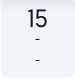

### Range selection logic

Selecting a range in the calendar works on the simple principle of selecting the start and end days for reservations (or vice versa, it has no effect). You can only select **selectable days**, with the exception of `Check-out ONLY` days. If you don't like the selected day, just click on it again (this will turn off its marking).

!>**Warning**: you can only select one range at a time, which must be valid for the entire duration, so it cannot be interrupted by a day in the past or a fully occupied (booked) day.

The calendar already has built-in checks to ensure this condition is met. Therefore, it will not allow clicking on **unselectable days**, but will also block those days that could not create a continuous interval with the currently selected starting day.
**Example:** In the following images you can see how after selecting the day `19.07`, all days from `01.06` to `16.06` are blocked. They are blocked because they cannot be selected in one range. This range would be interrupted by several fully occupied (booked) days and such a range is not valid.

Before election | After election
:---------------------:|:----------------------:


 | 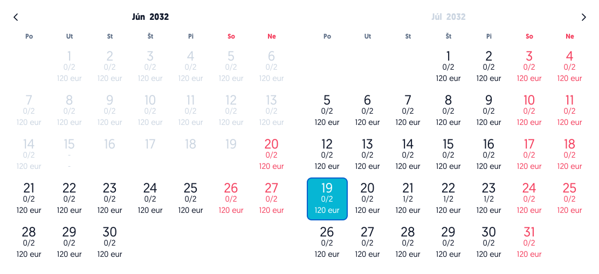

After selecting the first day (the initial day), simply select the second allowed day (the final day). When hovering over the individual days, the range will be pre-highlighted for you to see, and after selecting the final day, they will be fully highlighted.

Before election | After election
:---------------------:|:----------------------:

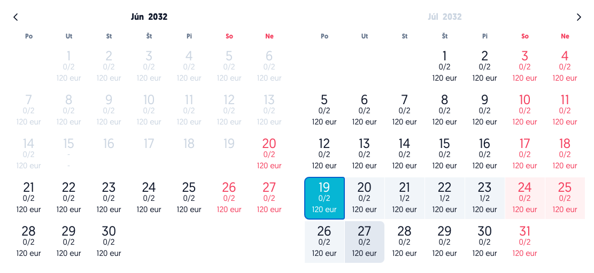

 | 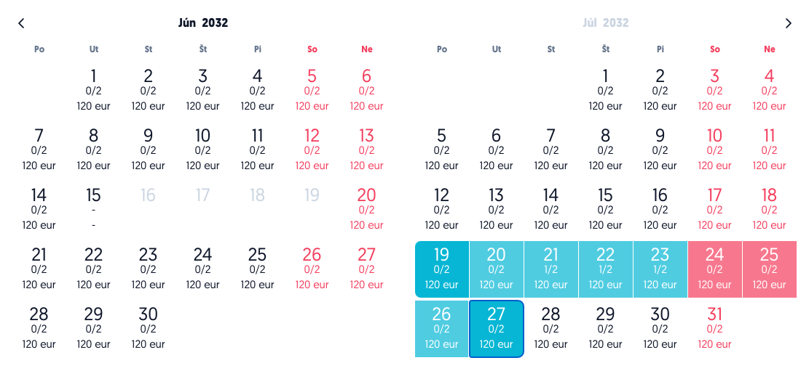

Note that after selecting, the temporarily blocked days from `01.06` to `16.06` are available again. Of course, we can change this selection. Just click to select a new starting day.

You may also notice that the calendar allowed us to select days from `21.07` to `23.07`, which are only partially booked.

!>**Warning**: the range must be at least 2 days, as the last day of the reservation is intended for leaving the reserved property and this last day **is not charged**.

### Reservation form

This is a simple form with basic information about booking an object.

The **Property Name** selection field allows you to change the booking property you want to book.

These required fields are automatically pre-filled if you are a logged in user, but of course they can be changed. If you are accessing as a non-logged in user, you must enter them:
- Name
- Last name
- Email

The **Arrival date and time** and **Departure date and time** fields cannot be changed and are for informational purposes only. They will automatically change the value according to the selected range in the calendar.

!>**Warning**: the values ​​for **arrival time** and **departure time** are obtained from the configuration variables `reservationAllDayStartTime` and `reservationAllDayEndTime`.

!>**Note:** The button to add a reservation will only appear if a range is selected in the calendar.

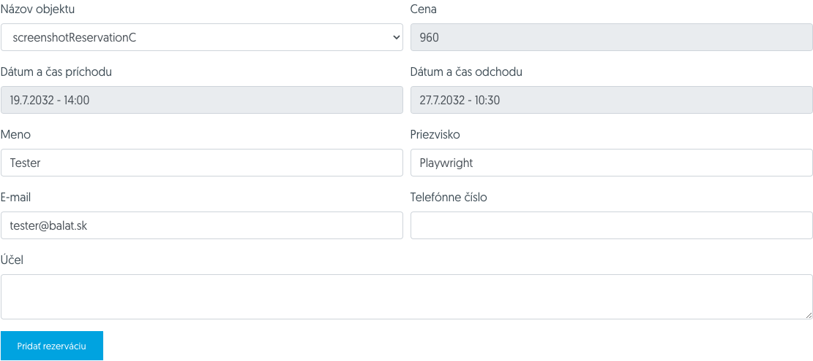

## Adding a reservation

After selecting a range in the calendar and filling in the information in the form (if necessary), you are ready to request to add your reservation. In the lower left corner, you will see a button **Add reservation**

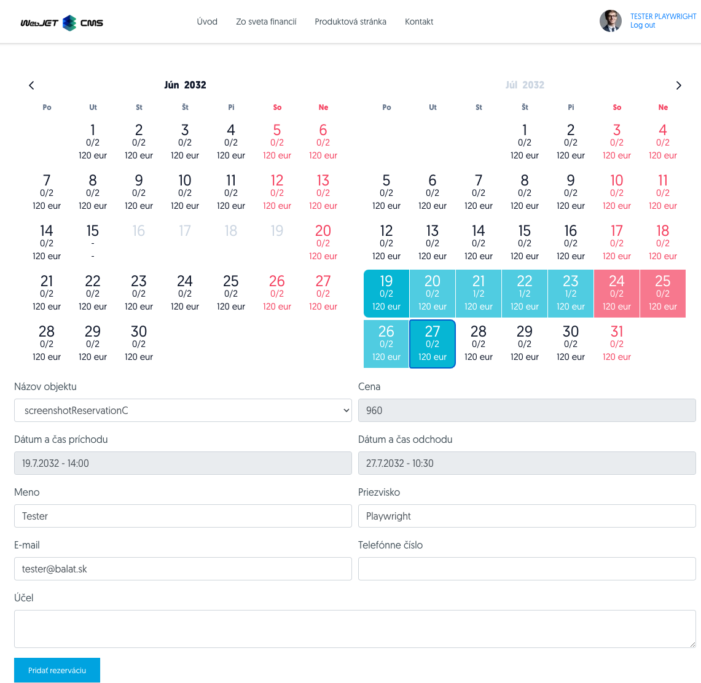

If the reservation was successfully created, you will receive a notification that the reservation was successfully created and a confirmation will be sent to the email address you provided.

If the booking object **does not require approval**, the reservation will be automatically approved and you will receive the following message. The availability of the object for individual days will then be adjusted.

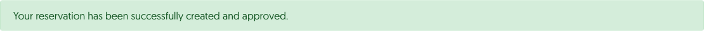

If the booking object **needs approval**, the reservation will be in a pending state. The availability of the object for individual days in the calendar will not change, as ONLY approved reservations are counted. The approver can approve or reject your reservation, of which you will be informed by email.

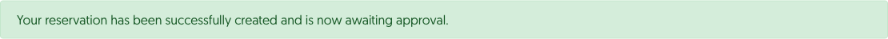