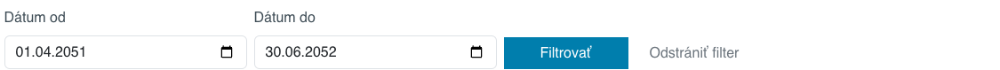

# My Bookings app

The **My Reservations** application shows the logged-in user an overview of their own reservations. The user can filter reservations by date, check their status, and delete those reservations where the booking property's rules still allow it.


## Using the app

You can add the app to your page through the app store by selecting the **My Reservations** app.


You can also add it directly as code to the page:

```html
!INCLUDE(sk.iway.iwcm.components.reservation.MyReservationsApp, device=&quot;&quot;, cacheMinutes=&quot;&quot;)!
```

The application does not have its own specific settings. The data displayed is determined by the currently logged in user and the current domain.

!>**Warning:** the application is intended for logged in users. Unlogged visitors will not see any reservations.

## Application construction

The application consists of 2 main parts:

- filter by booking date,
- table of your own reservations.

## Filtering reservations

At the top of the app are the **Date from** and **Date to** fields. You can use these to limit the list of reservations to the selected date range.



If no filter is set, the app will automatically display bookings from the last 30 days, including future bookings.

When filtering, reservations that overlap with the specified interval will be displayed:

- **Date from** will show bookings that end on or after this date,
- **Date to** will show reservations that start on or before this date.

The **Filter** button will apply the specified interval. The **Clear Filter** button will remove the specified dates and return the application to the default view.

## Reservation table

The table contains a list of reservations for the currently logged in user, sorted by the most recent reservation and by start date.


The table displays the following data:

- **Reservation object** - the name of the object to which the reservation relates.
- **Booking scope** - date or date with start and end time of the booking. For all-day bookings, only dates are displayed, for time-based bookings, also times.
- **Price** - calculated price of the reservation.
- **Status** - current reservation status.
- **Delete reservation** - button to delete the reservation, if deletion is allowed.

A reservation can have the following statuses:

- **Unconfirmed** - reservation is awaiting approval.
- **Approved** - the reservation is confirmed.
- **Rejected** - the reservation was rejected.

## Deleting a reservation

The delete button only appears for reservations that can be deleted. A reservation can only be deleted when:

- the reservation is approved,
- the start of the reservation is still in the future,
- the allowed cancellation time set for the booking object has not been exceeded.

For a full-day reservation, the reservation date must be later than the current day. For a time-based reservation, the reservation start time must be later than the current time.

If the reservation object has a password set for deleting the reservation, the application will request it before deleting. Without entering the password, the reservation will not be deleted.

After a successful deletion, a confirmation will be displayed and the reservation will disappear from the list. If the table was filtered before deletion, the selected filter will be retained.

If the reservation cannot be deleted, the application will display an error message with the reason for the failure.

## Related applications

Reservations displayed in this application can be created through applications such as:

- [Time booking](../time-book-app/README.md),
- [Day booking](../day-book-app/README.md).
