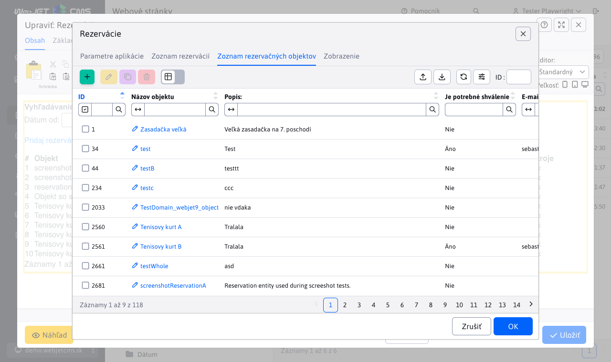
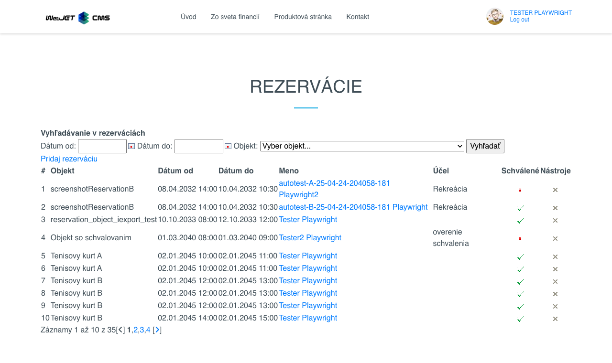

# Booking app

With this application, it is possible to manage the reservation system. It is necessary to add this application to the page and then it is possible to use the form to select from the reservation objects (e.g. room, cottage, tennis court) and request a reservation. The administrator can approve individual requests.

## Application settings

In the editor you can select the type of display:
- **List of reservations**
- **List of reservation objects**

Based on the selection, the content that will be displayed to the user will change.

### List of reservations

In this tab you can view, create and edit reservations.

[Go to List of reservations](../reservations/README.md)

### List of reservation objects

In this tab you can edit and manage the objects that can be reserved.

[Go to List of reservation objects](../reservation-objects/README.md)

## View application

This is what the app looks like when added to the page:

