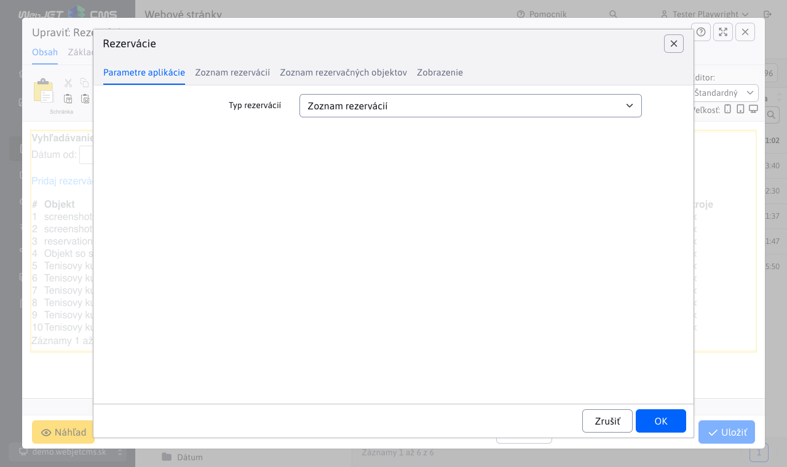
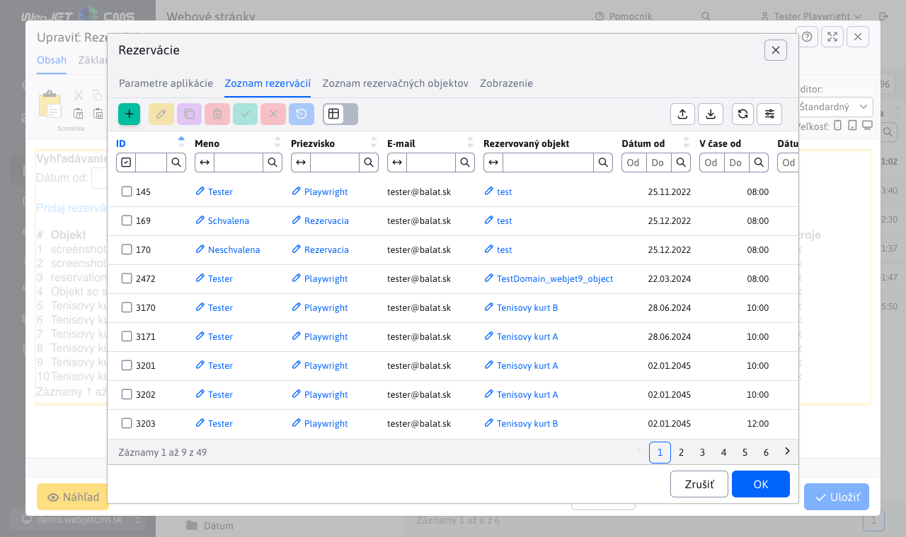
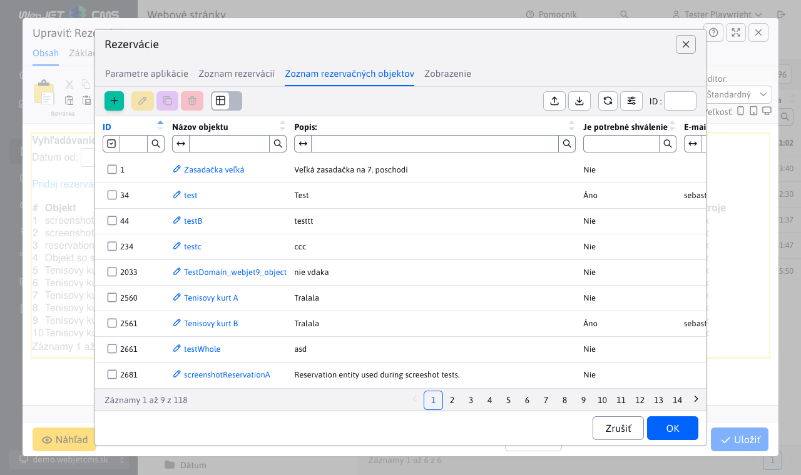
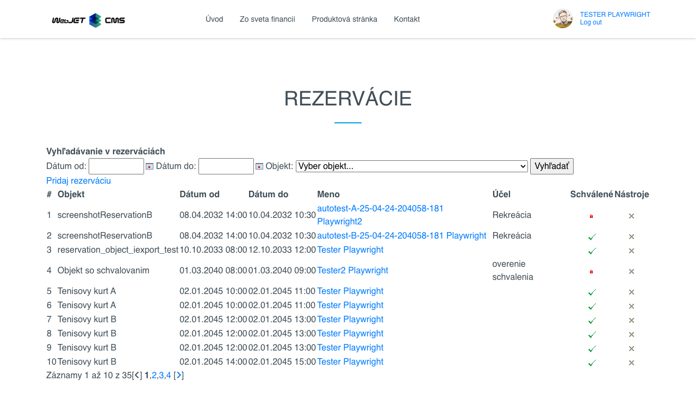

# Reservations app

This application allows you to manage your booking system. You need to add this application to your website and then you can use the form to select from booking objects (e.g. room, cottage, tennis court) and request a reservation. The administrator can approve individual requests.

## Application settings

In the editor, you can select the display type:

- **Reservation List**
- **List of reservation objects**

The content displayed to the user will change based on the selection.

### Reservation list

In this tab, you can view, create, and edit reservations.

[Go to Reservations List](../reservations/README.md)

### List of reservation objects

In this tab, you can edit and manage objects that can be reserved.

[Go to Reservation Objects List](../reservation-objects/README.md)

## View the application

This is what the app looks like after being added to the page:

