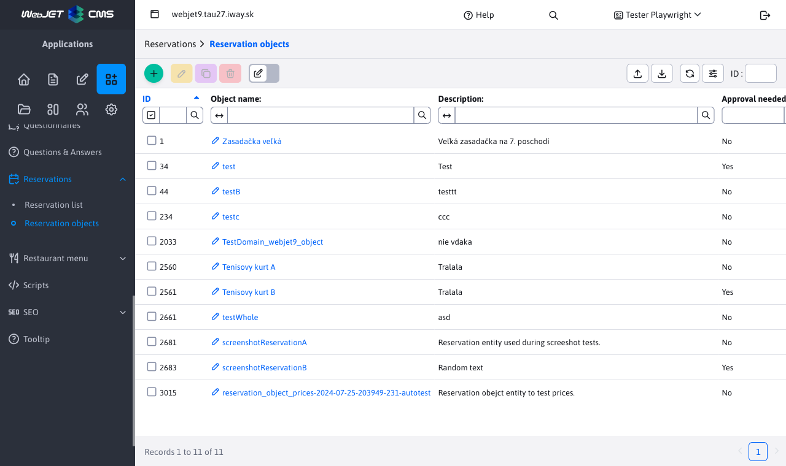
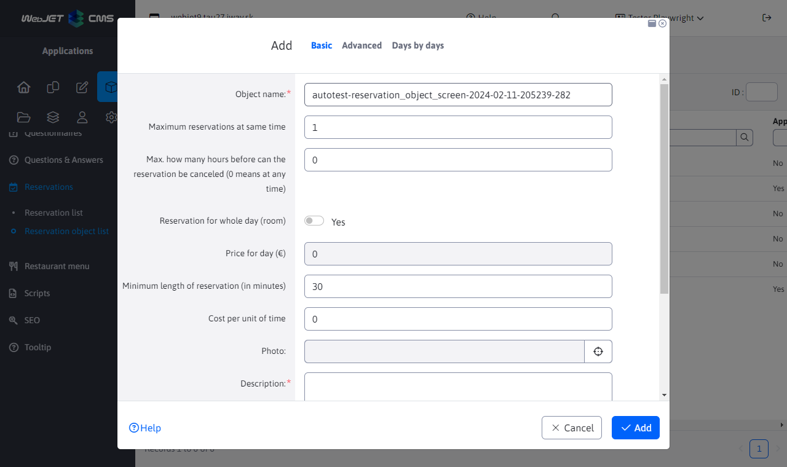
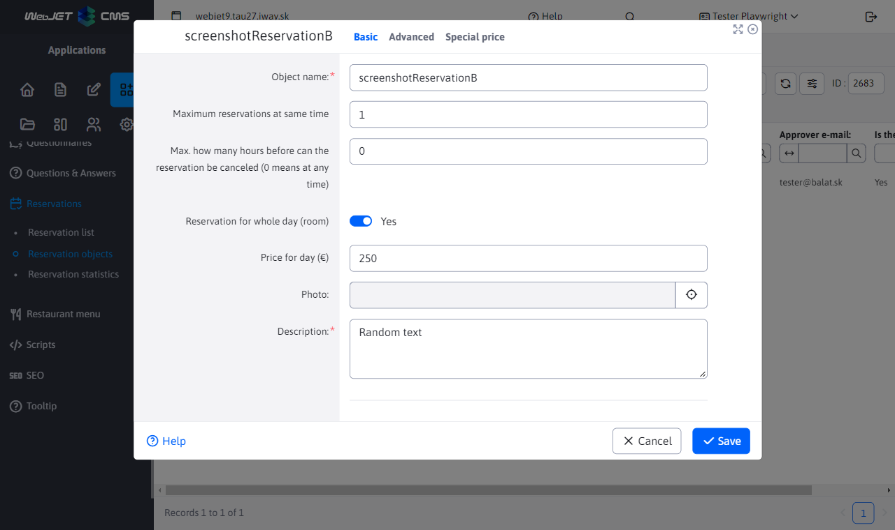
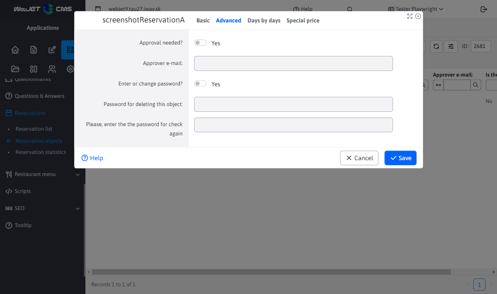
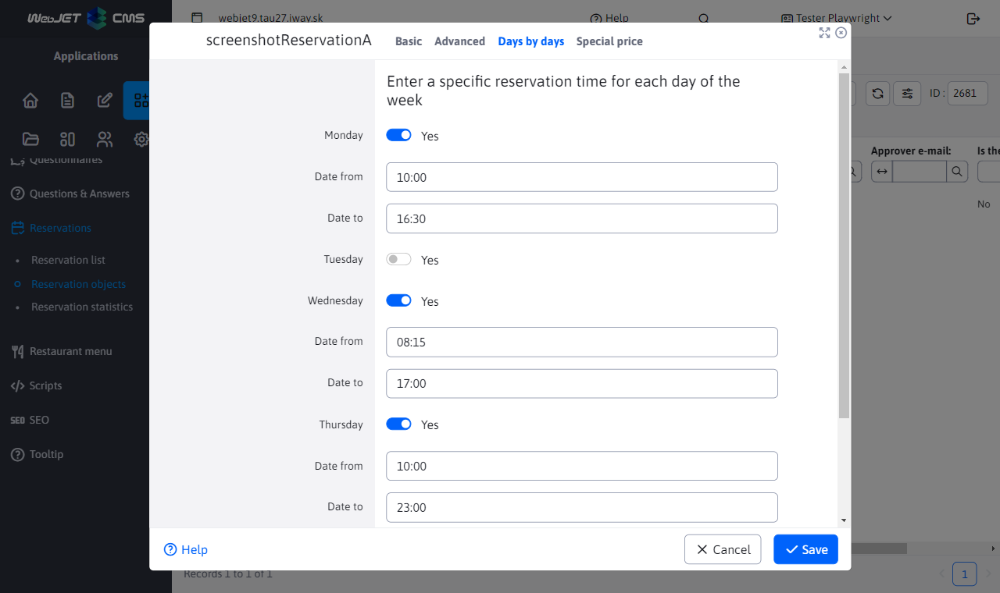
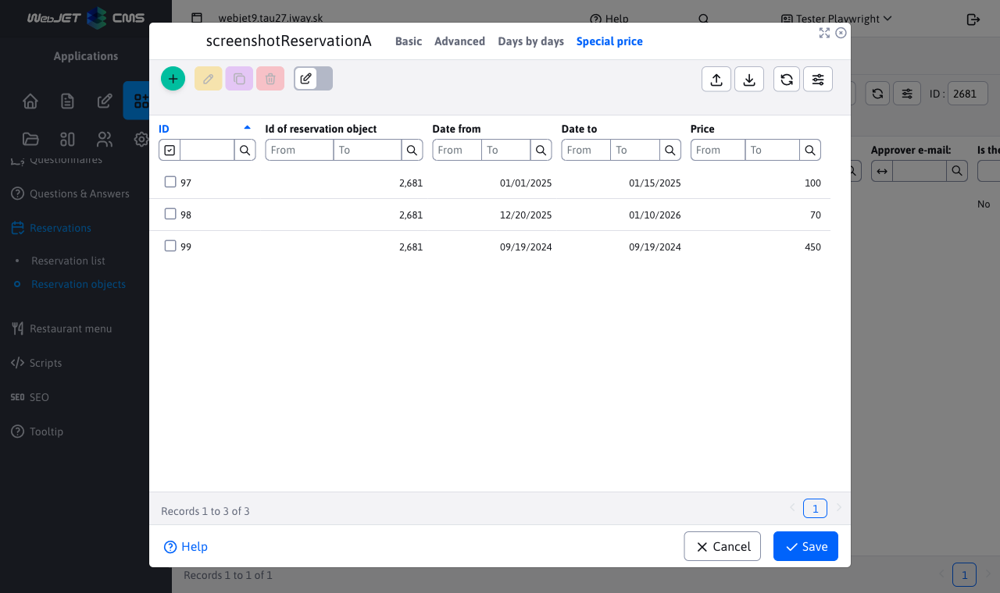
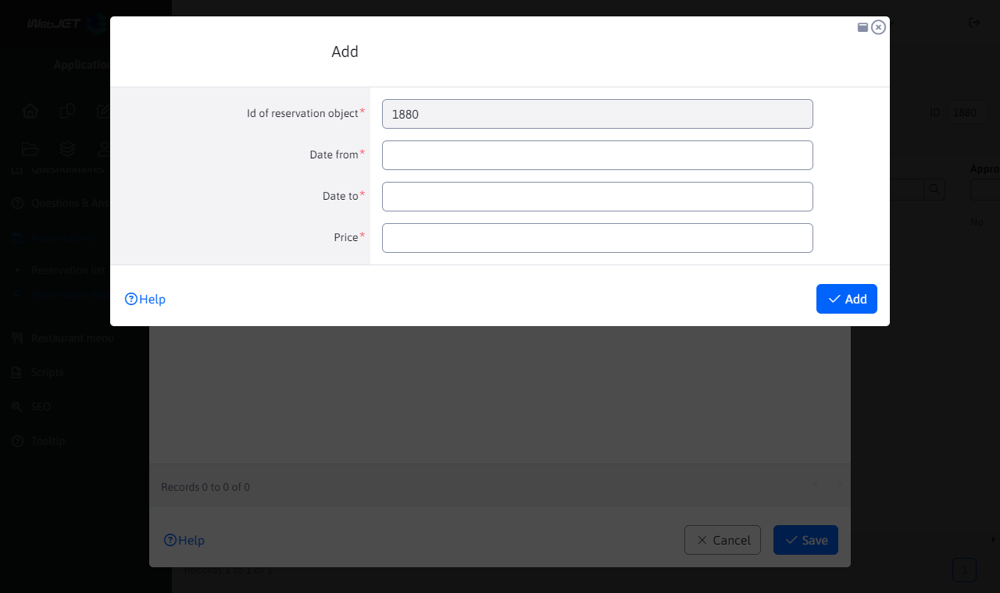

# Reservation objects

## List of reservation objects

The Reservation Object List application allows you to create/edit/delete reservation objects, as well as import them from an Excel file and export them to an Excel/CSV file (optionally also the option of immediate printing upon export).



The booking object editor contains 4 tabs:

## Basic

The **Basic** tab, as the name suggests, contains basic information about the booking object. It is mandatory to enter the name of the booking object as well as its description, the remaining parameters are optional. The lower part of the tab contains a time selection for entering the booking interval for the given object. This means that this object will only be bookable in the specified interval.

The parameter **Maximum number of reservations at the same time** is a very important parameter when validating new reservations - [more about validation](../reservations/readme.md#validation-of-reservations). This parameter indicates how many reservations can be created on a reservation object at the same time. If this parameter is set to a value of, for example, 3, it means that you can have a maximum of 3 reservations on this object at the same time, but it does not say how many reservations can be added during the entire interval.

Another important parameter is the switch for reserving a room for the whole day.

- If this option is disabled, you can enter the minimum reservation length in minutes and the price for the selected unit of time. The price can of course be zero, in which case the reservation of this object will be free of charge. The minimum reservation length must be a positive non-zero number, so at least 1 minute. This object will be bookable for at least the specified time value and at most for the period that is within the selected reservation interval.
- If this option is enabled, you will not be able to set a minimum booking length or price per unit of time. You will only be able to enter a price per day. This means in practice that you cannot book only part of the entire interval, but you can book the entire interval (the whole day).

!>**Warning:** In addition to some parameters being hidden depending on the state of the full-day booking switch, the entire [Times by day](#times-by-day) tab is also hidden/unhidden.





## Advanced

The **Advanced** tab contains only 2 options.

If you enable the **Approval required** option, you can enter the email address of the approver of the booking object. So, a reservation created for this booking object will first have to be approved and a message will be sent to the specified email address (you can learn more about this in the [reservations list](../reservations/readme.md#reservations-list) section).

If you enable the **Enter or change password** option and enter a matching password twice, the user will be prompted to enter this password when attempting to delete a reservation above the reservation object. If the password is already entered, it will be replaced with a new one, for more information see [Deleting reservations](../reservations/readme.md#deleting-reservations).



## Times by day

The **Times by day** tab expands the ability to specify a booking interval for an object. It allows you to specify a unique (or even the same) interval for individual days of the week. In practice, weekend days such as Saturday and Sunday may have a different booking interval than weekdays, or you may have a different interval for each day. If you do not specify a specific booking interval for a day of the week, the basic one set in the [Basic](#basic) tab will be used. The fields for selecting the time interval for individual days will only be displayed after you enable the option with the name of the given day of the week.

The card is not available if the full-day booking option is enabled (from the Basic tab).



## Special price

The **Special Price** tab is only displayed when editing a booking object. This tab contains a nested table for special prices for specific date ranges. For example, if a booking object is set to a full-day booking with a price of 15 euros per day, you can choose which days of the year this price will be different (higher or lower, e.g. during holidays).



You can create/edit/delete or import and export records in this nested table. When creating a new special price for a specified period, the ```id``` of the booking object is set automatically (without the possibility of changing it) and the remaining fields are mandatory. You enter the price and the interval in days from and to when this price should apply.

