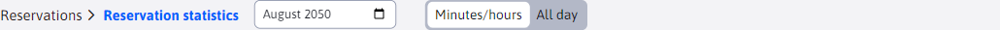
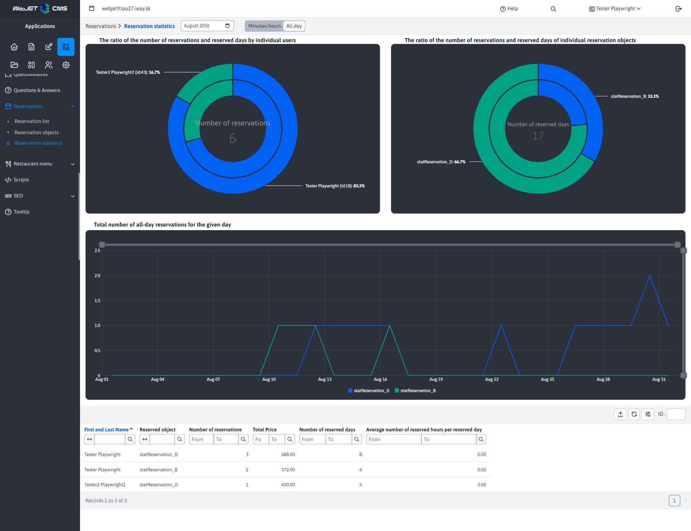

# Reservation statistics

Section **Reservation statistics** offers a quick and clear view of the most important statistics related to the created [reservations](../reservations/README.md). Only bookings that are **Approved**. Read more about the booking status in .

Statistics processes reservation data in **at monthly intervals**, i.e. always from the beginning to the end of the selected month. To select the month/year for which you want to display statistics, use the date filter next to the section name.

We can logically divide reservations into 2 groups, namely **Minute/hourly** reservations (those that reserve an object for a certain period of time) and **All Day** reservations (those that book the property for full days). The type of reservation is determined by [reservation object](../reservation-objects/README.md) which the reservation reserves.

From this point of view, we also had to split the statistics by reservation type, so the data are separated from each other. Therefore, next to the date filter there is a toggle to change whether you want to see the statistics of the reservation type **Minute/hourly** or **All Day**.

## Minute/hourly

Statistics for booking type **Minute/hourly** offers 3 charts as well as a data table. The data emphasizes the number of hours booked. Since these reservations can also be booked by the minute, the values are converted to hours to 2 decimal places.

### Table

Each record (row) in the table represents a combination of user and reservation statistics over a unique object. This means that a single user can appear multiple times in the table if they have made reservations for different reservation objects. Each such row provides a summary of how many bookings the user has created for a given property, how many average hours they have booked, or how much it has cost in total.

**Attention**if the booking was made by a non-logged-in user (as is possible, for example, with the app [Reservation of time](../time-book-app/README.md)), the data is mapped according to the specified email address. If different non-logged-in users enter the same email address, their data will be merged in the statistics.

### Charts

As you can see from the image above, there are 3 charts available, which we will discuss next.

**Chart - Ratio of number of bookings and booked hours by individual users**

This double pie chart represents the ratio of bookings to booked hours for each user. This makes it easy to determine which users have created the most bookings and booked the most hours.

- The outer layer shows how much **total bookings** created by individual users (over all objects together).
- The inner layer shows how much **hours in total** has been reserved by individual users (over all objects combined).
- The centre of the chart shows the summary **Number of bookings**, so the number of all bookings created.

**Attention**, you may notice that some users in the chart do not have **id** but they are worth **email**. These are the aforementioned unregistered users.

**Chart - Ratio of the number of bookings and booked hours for each booking object**

This double pie chart represents the ratio of bookings to hours booked over each property. This way you can easily determine which object was the most booked and had the most booked hours.

- The outer v layer shows how much **total bookings** was created over the object (by all users together).
- The inner layer shows how much **hours in total** has been reserved over the object (by all users combined).
- The centre of the chart shows the summary **Number of booked hours**, so the number of all booked hours over all objects.

**Chart - Total number of hours booked per day**

This bar chart shows how many hours were booked over all objects in total on each day. The graph thus gives an overview of which days were the most popular for bookings.

## All Day

Statistics for booking type **All Day** offers 3 charts as well as a data table. The data emphasises the number of days booked as these bookings are full days.

### Table

Each record (row) in the table represents a combination of user and reservation statistics over a unique object. This means that a single user can appear multiple times in the table if they have made reservations for different reservation objects. Each such row provides a summary of how many bookings for a given property the user has created, how many average days booked, or how much it cost in total.

**Attention**if the booking was made by a non-logged-in user (as is possible, for example, with the app [Reservation of time](../time-book-app/README.md)), the data is mapped according to the specified email address. If different non-logged-in users enter the same email address, their data will be merged in the statistics.

### Charts

As you can see from the image above, there are 3 charts available, which we will discuss next.

**Chart - Ratio of number of bookings and days booked by individual users**

This double pie chart represents the ratio of bookings to days booked for each user. This way you can easily determine which users have created the most bookings and booked the most days.

- The outer layer shows how much **total bookings** created by individual users (over all objects together).
- The inner layer shows how much **days in total** has been reserved by individual users (over all objects combined).
- The centre of the chart shows the summary **Number of bookings**, so the number of all bookings created.

**Chart - Ratio of number of bookings and days booked for each booking object**

This double pie chart represents the ratio of bookings to days booked over each property. This way you can easily determine which property was the most booked and had the most booked days.

- The outer v layer shows how much **total bookings** was created over the object (by all users together).
- The inner layer shows how much **days in total** has been reserved over the object (by all users combined).
- The centre of the chart shows the summary **Number of booked days**, so the number of all booked days over all objects.

**Chart - Total number of all-day bookings for the day**

This bar chart shows how many bookings there were in total over all objects on each day. The graph thus gives an overview of which days were the most popular for bookings.
