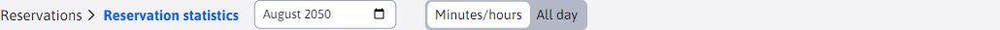
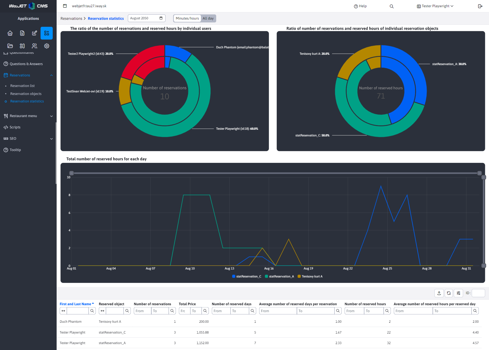
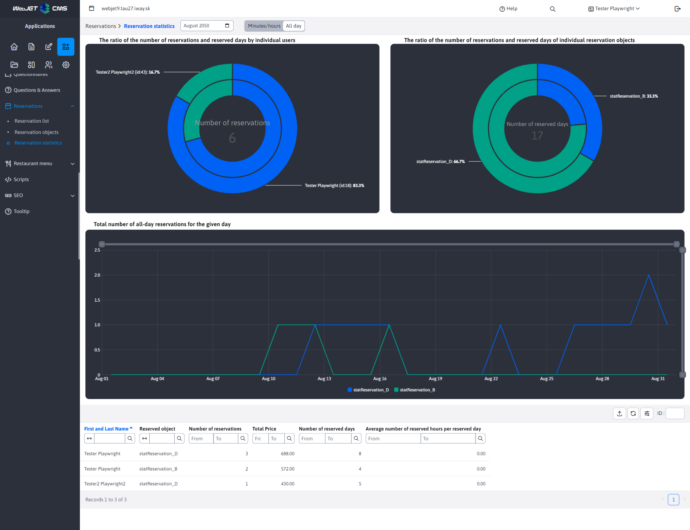

# Reservation statistics

The **Reservation Statistics** section offers a quick and clear display of the most important statistics regarding the [reservations](../reservations/README.md) created. Only reservations that are **approved** are taken into account. You can read more about the reservation status in the  section.

Statistics process reservation data in **monthly intervals**, i.e. always from the beginning to the end of the selected month. To select the month/year for which we want to display statistics, use the date filter next to the section name.

We can logically divide reservations into 2 groups: **Minute/Hour** reservations (those that reserve an object for a certain period of time) and **All-day** reservations (those that reserve an object for whole days). The reservation type is given by the [reservation object](../reservation-objects/README.md) that the reservation reserves.

From this perspective, we also had to divide the statistics by booking type, meaning the data is separate. Therefore, next to the date filter there is a switch that allows you to change whether you want to see statistics for bookings of the **Minute/Hour** or **All Day** type.

## Minute/hourly

Statistics for **Minute/Hour** reservations offer 3 graphs as well as a table with data. The data focuses on the number of hours booked. Since these reservations can also be booked for minutes, the values ​​are converted to hours with an accuracy of 2 decimal places.

### Table

Each record (row) in the table represents a combination of a user and booking statistics for a unique property. This means that a single user can appear in the table multiple times if they have made a booking for different booking properties. Each such row provides an overview of how many bookings a user has made for a given property, how many hours they have booked on average, or how much it cost in total.

**Attention**, if the reservation was created by an unlogged user (as is possible, for example, with the [Time Reservation](../time-book-app/README.md) application), the data is mapped according to the entered email address. If different unlogged users enter the same email address, their data will be combined in the statistics.

### Charts

As you can see from the image above, there are 3 charts available, which we will discuss next.

**Chart - Ratio of number of reservations to hours booked by individual users**

This double pie chart represents the ratio of bookings and booked hours for each user. This way you can easily determine which users have created the most bookings and booked the most hours.

- The outer layer shows how many **total reservations** individual users have created (over all objects combined).
- The inner layer shows how many **total hours** were booked by individual users (over all objects combined).
- The center of the graph shows the summary **Number of reservations**, i.e. the number of all reservations made.

**Note**, you may notice that some users in the graph do not have an **id** but have an **email** value. These are the aforementioned unlogged users.

**Chart - Ratio of number of reservations and reserved hours of individual reservation objects**

This double pie chart represents the ratio of bookings and booked hours over individual properties. This way you can easily determine which property was the most booked and had the most booked hours.

- The outer layer shows how many **total reservations** have been created for a given object (by all users combined).
- The inner layer shows how many **total hours** were reserved over the given object (by all users together).
- The center of the graph shows the **Number of booked hours** summary, so the number of all booked hours across all objects.

**Chart - Total number of booked hours per day**

This line chart shows how many hours were booked in total across all properties on each day. The chart thus provides an overview of which days were the most popular for bookings.

## All day

Statistics for **All-day** reservations offer 3 graphs as well as a table with data. The data emphasizes the number of days booked, as these reservations are all-day.

### Table

Each record (row) in the table represents a combination of a user and booking statistics for a unique property. This means that a single user can appear in the table multiple times if they have made a booking for different booking properties. Each such row provides an overview of how many bookings a user has made for a given property, how many days they have booked on average, or how much it cost in total.

**Attention**, if the reservation was created by an unlogged user (as is possible, for example, with the [Time Reservation](../time-book-app/README.md) application), the data is mapped according to the entered email address. If different unlogged users enter the same email address, their data will be combined in the statistics.

### Charts

As you can see from the image above, there are 3 charts available, which we will discuss next.

**Chart - Ratio of number of reservations to days booked by individual users**

This double pie chart represents the ratio of bookings and days booked for each user. This way you can easily determine which users have created the most bookings and booked the most days.

- The outer layer shows how many **total reservations** individual users have created (over all objects combined).
- The inner layer shows how many **days in total** were booked by individual users (over all objects combined).
- The center of the graph shows the summary **Number of reservations**, i.e. the number of all reservations made.

**Chart - Ratio of number of reservations and reserved days for individual reservation objects**

This double pie chart represents the ratio of bookings and days booked over individual properties. This way you can easily determine which property was the most booked and had the most days booked.

- The outer layer shows how many **total reservations** have been created for a given object (by all users combined).
- The inner layer shows how many **total days** were booked on the given object (by all users together).
- The center of the graph shows the **Number of days booked** summary, so the number of all days booked over all objects.

**Chart - Total number of all-day reservations for a given day**

This line chart shows how many bookings there were across all properties on each day. The chart provides an overview of which days were the most popular for bookings.