# List of reservations

The "Bookings" application includes a "Bookings List" node that allows you to create/edit/delete bookings, as well as import them from an Excel file and export them to an Excel/CSV file (or even print them immediately when exporting). The list also contains 3 buttons to approve/reject/reset the booking, see section [Approval of reservations](#schvaľovanie-rezervácií).

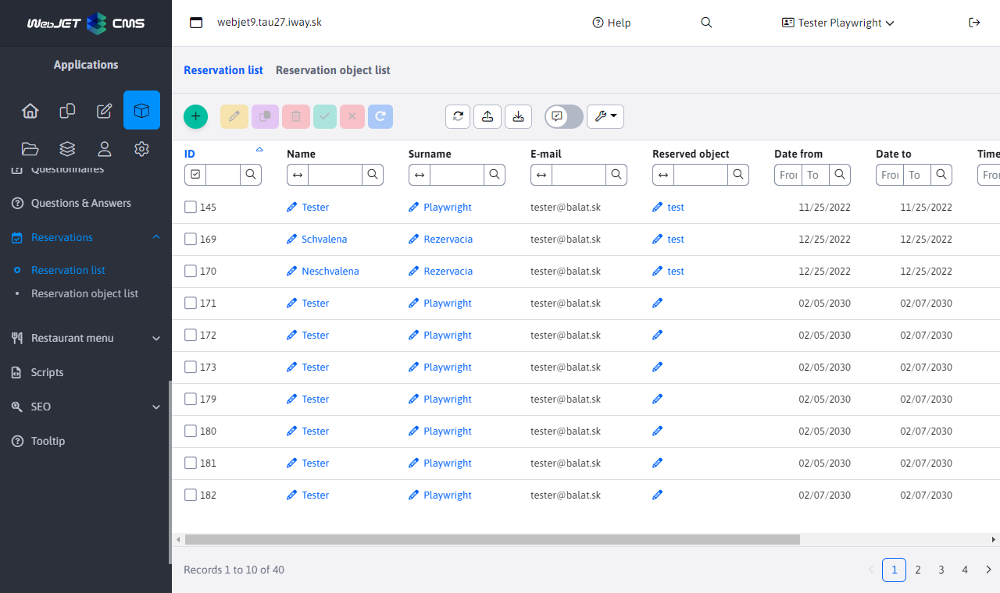

The booking editor contains 4 tabs, the functions of which are described in the following description.

## Tab - Basic

The "Basic" tab, as the name suggests, contains basic information about the reservation. The important part is the list with the selection of the reservation object to which the reservation relates.

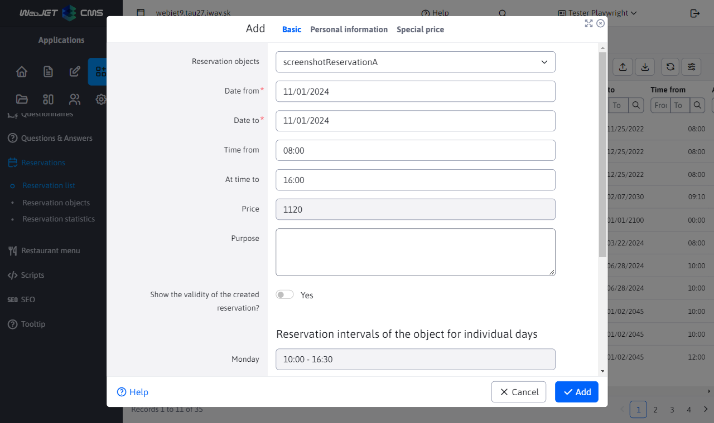

The tab also contains a date selection from/to and a time selection from/to. There is one important thing to remember about this selection. If you select the days from 01/01/2022 to 03/01/2022 between 08:00 and 16:00, it does not mean that the booking starts on 01/01/2022 at 08:00 and lasts until 03/01/2022 at 16:00 and everything in that range is booked. NO. With these selected values, it means in practice that you book this reservation object from 08:00 to 16:00 for each day separately. The reason for this is simple, this way you can book an object at a specific time for multiple days without having to book the entire interval. If the booking interval for the object is set from 05:00 to 20:00, only the specified time interval is booked for each day and the rest of the interval is not booked, even if the booking lasts for example 3 days.

**Notice**if the reservation object can be reserved [ONLY for the whole day](../reservation-objects/README.md) the following options will be hidden and unavailable:
- time selection
- an overview of the booking intervals of the facility for individual days

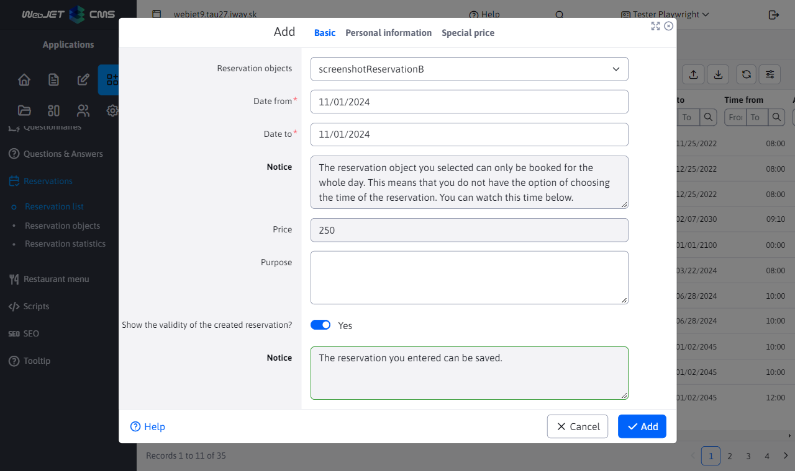

Switch **Show the validity of the reservation being created ?** When selected, a text box will be revealed informing you of the validity of the reservation. This means whether or not a reservation for the selected object can be created in the given range. More information about the possible states in this field is explained in the section [Validation of reservations](#validácia-rezervácií). If the reservation is valid, the border of the text box will turn green and if the reservation is not valid, it will turn red.

**Booking price** displays the current price of the booking being created. The price depends on the selected reservation object, the reservation interval and the special prices set for the reservation object.
The booking status and the price of the reservation are updated whenever the date, time or reservation object is changed.

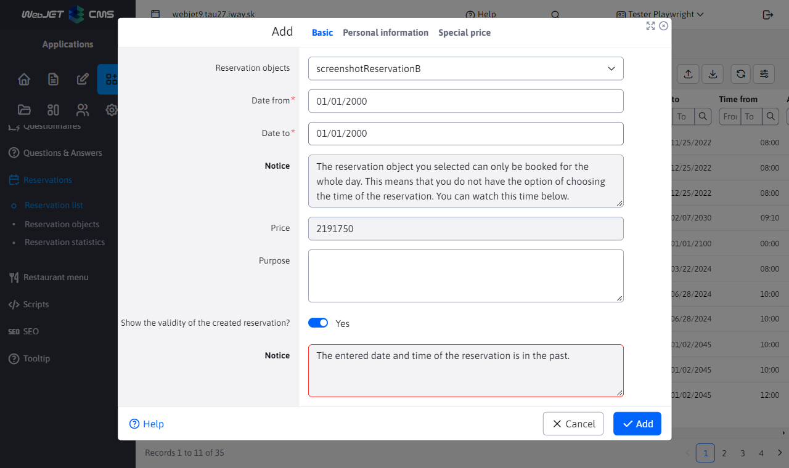

At the bottom of the tab, you can see an overview with the booking intervals for each day of the week. These times are set according to the currently selected booking object. This is a help when creating/editing a reservation if you don't remember exactly when a particular reservation object can be booked for a particular day of the week.

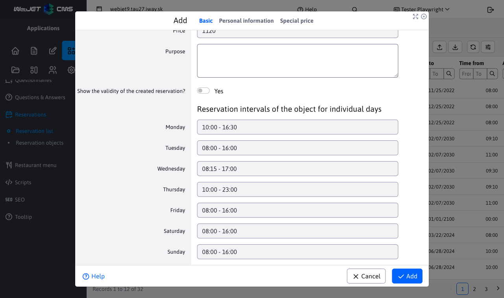

## Tab - Personal data

In the "Personal details" tab, you can set the details of the reservation applicant. Most of the data is automatically set from the logged-in person's profile, but these values can also be changed or not entered at all.

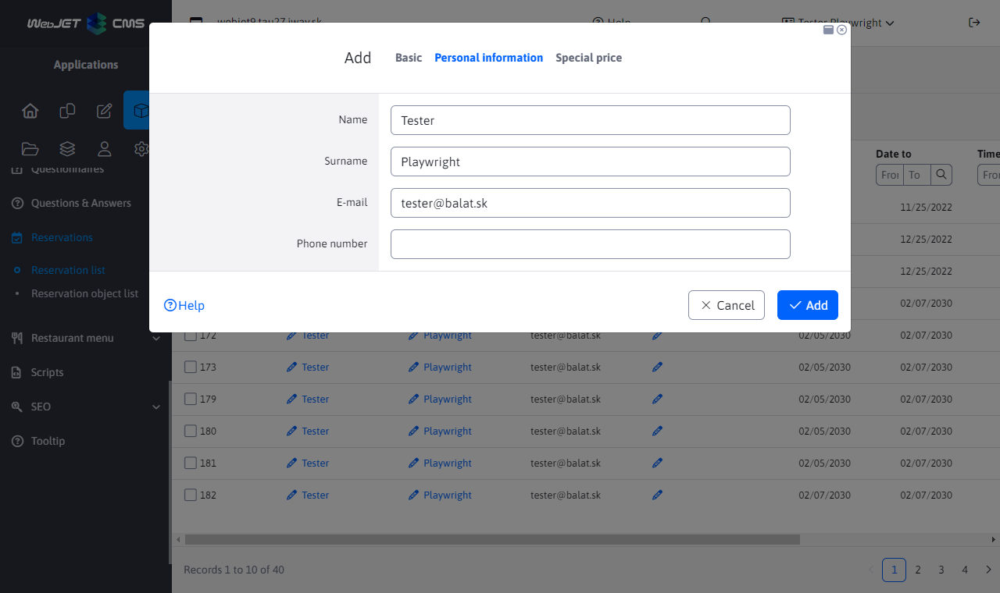

## Card - Special price

The "Special Price" tab contains a nested table with information about the special price of the reservation object for a specific period. The entries in the table are set according to the currently selected booking object from the "Basic" tab and can only be exported, but cannot be added, edited or deleted (they are for information purposes only).

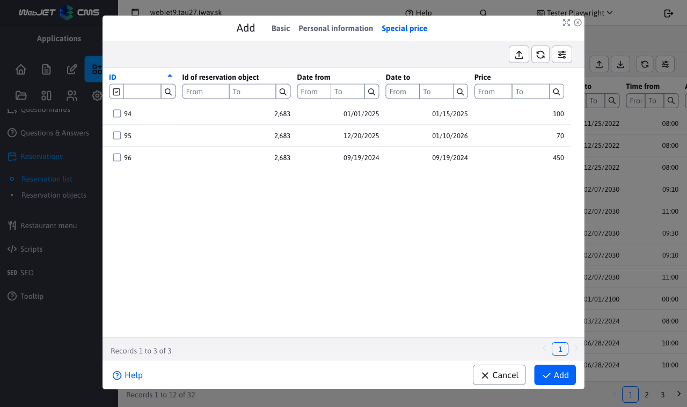

## Tab - Approval

The "Approval" tab is used to change the status of a reservation. This tab is only displayed under specific conditions.

Conditions to view the card:
- editing a record, the tab only appears when editing a booking record
- Approval required, the booking object that the booking is trying to book must have an "Approval required" parameter and must have the approver's email entered
- approver, the card can only be shown to the person who has permission to approve the booking. This means that if the email of the logged-in user matches the email of the approver entered in the booking system and the previous points have been met, the card will be displayed to the user
Once displayed, the tab contains a toggle between the three states that the reservation can enter. When switching from one state to the other, the action of changing the reservation state is triggered as if using the state change buttons. These actions will be better explained in the "Approving bookings" section.

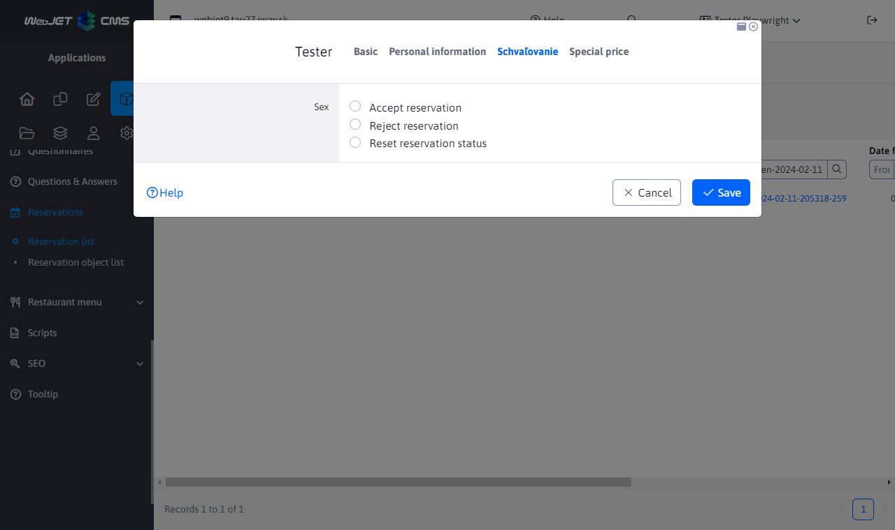

## Validation of reservations

The reservation validation logic is an important part of the "Reservation List" node that checks whether the reservation being created or edited meets all the rules and conditions. Validation is automatically triggered when you try to save a new reservation or modify an existing one. If the booking is valid (meets all the necessary requirements) the create/edit action will be successful, otherwise an error will occur and the user will be notified with either a specific or general error message.

The reservation will not be saved/edited until it meets all validation rules.

### Date range

The from date must be less than the to date (if the dates are the same, only one day is reserved).

### Time range

The time from must be sharply less than the time to, as you have to reserve at least 1 minute. At the same time, it is checked whether this time range is greater than or at least equal to the "Minimum reservation length (in minutes)" value set for the reservation object.

### Scope in the past

You cannot book the day(s) in the past. If you are trying to make a reservation for today then the time slot cannot be in the past.

### Valid booking range,

Checks whether the specified time range is within the reservation interval of the object. This check is performed for each booked day separately. For example, if you are trying to book a property between 08:00-09:00 for the next 3 days, and even one of these days has a different booking interval, the booking is not valid. Of course, special booking intervals for individual days of the week are also taken into account [more info](../reservation-objects/README.md).

### Maximum number of bookings at the same time

In this case, it is checked whether more bookings will not cross at the same time after adding the booking than allowed by the "Maximum number of bookings at the same time" parameter of the object. Bookings are considered to overlap if their time intervals overlap in at least one minute (intervals do not overlap if the start of one is the end of another in the same minute). For example, if you have 4 reservations, and their time intervals are `08:00-11:00 / 08:00-09:00 / 09:00-10:00 / 10:00-11:00` so we see that the reservation at the time of `08:00-11:00` intersects with 3 different reserves, but never more than 2 at the same time, because the other 3 reserves do not intersect with each other.

The check takes all reservations (but only those that have been approved) over the property on the same day and tests whether this limit will be exceeded after adding our reservation. This is tested for each day separately and if even one day exceeds the maximum number of bookings at the same time, the booking will be marked as invalid.

## Approval of reservations

Changing the status of a reservation is possible either by using the editor, more specifically in the "Approvals" tab, which only appears under certain specific conditions, or by using the buttons to change the status of a reservation.

As in the "Approval" tab, the buttons offer 3 different states, namely :
- Reservation approval (Reservation has been approved)
- Booking Rejected (Booking has been rejected)
- `Resetovať` Reservation status (Reservation pending approval)

### Approval required

A reservation needs to be approved if the reservation object has an approver set and the person creating/editing the reservation is not the approver. The person logged in is NOT the approver if their email does not match the set approver email in the booking object.

In this case, a booking approval request will be sent to the approver's email. This request contains basic information about the booking as well as a direct link to the booking.

### Automatic approval

You do not need to approve a reservation if the reservation object does not have an approver set, or if the reservation object has an approver set and the approver is the person who is currently logged in. The logged-in person IS the approver if their email matches the set approver email in the booking object.

### Making a reservation

When we try to create a reservation, validation will run in the background. If successful, the reservation is saved and its status is set according to the situation:
- if the booking does NOT NEED to be approved, the booking will be approved automatically and will be given the status "Booking approved".
- if the booking MUST be approved, it is automatically saved with the status "Booking pending approval" and a request for approval is sent to the approver's email. The approver can decide whether to approve, reject or make no change to the booking. However, if the status of the booking changes, a message will be sent to the booking requestor's email informing them of the change in status (this requestor email was automatically pre-set when the booking was created in the 'Personal Details' tab).

### Modifying the reservation

When we try to modify the reservation, validation will run in the background. If successful, the reservation is saved and its status is set according to the situation:
- if the booking does NOT NEED to be approved, the modified booking will be saved and automatically approved, giving it the status "Booking approved".
- if the booking MUST be approved, the previous status is reset to "Booking pending approval" (regardless of whether it was approved or rejected) and a message is sent again to the approver's email asking for approval. The approver can again decide whether to approve, reject or not make any changes to the reservation. However, if the status of the reservation changes, a message is again sent to the reservation requestor's email informing them of the change in status.

### Reservation status change

As mentioned above, you can try to change the reservation status by using the card or buttons. In the case of a card, this is handled in such a way that only the person who has the right to do so can see it. In the case of buttons, it is treated so that everyone can see them.

Each time you try to change your reservation, you will see a confirmation of the action.

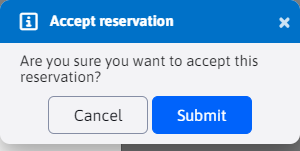If you decide to cancel, nothing will happen. If you decide to run the action anyway, our right over this booking will be checked in the background. If it is the case that we do not have the right, an error message will be displayed and the reservation status will not change.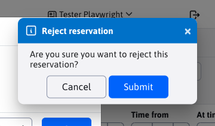If we have the right to change, it will depend on what state you are trying to set up: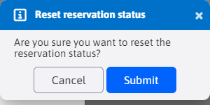

BOOKING APPROVAL, no matter what the original status of the booking is, a validation will be triggered in the background to decide what happens to the booking

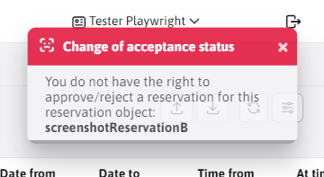

if the validation is successful, the reservation is approved, a confirmation message is displayed and an email is sent to the applicant

if the validation was unsuccessful, the reservation is automatically rejected, an error message with the reason for rejection is displayed and an email is sent to the applicant

- RESERVATION REJECTED, no matter the original status of the reservation, the reservation will simply be rejected, a confirmation message will be returned and an email will be sent to the requestor.
- &#x20;BOOKING STATUS, no matter the original booking status, the booking status will simply be&#x20;

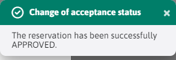

, a confirmation message is returned and a message is sent to the requester.

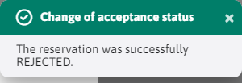

`RESETOVANIE`The emails sent to the applicant when the status of a reservation is changed contain basic information about the reservation, its new status and also the name of the approver who changed the status of this reservation.`resetovaný`Deleting reservations

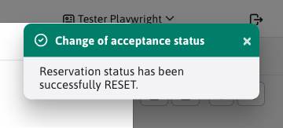

Deleting reservations depends on the reservation object over which the reservation was created. The reservation object can have a password set that changes the deletion process - the password was set in the tab&#x20;

## Advanced

.[If the password is NOT set, reservations over this reservation object will be deleted.](../reservation-objects/README.md)If a password IS set, you will be prompted to enter that password.

\-In case you are deleting multiple reservations over the same object (which has a password), you will be prompted only once to enter this password (you do not have to enter it duplicates for each reservation separately) -In case you are deleting multiple reservations over multiple objects with set password, you can be prompted to enter multiple passwords (again without duplicates).

The password request displayed will inform you for which reservation object you need to enter the password. If you enter multiple passwords and choose not to enter one or more of them (cancel the password entry action), the overall action of deleting the reservation will not be affected. An unentered password is automatically considered bad and therefore will not delete reservations and objects with this password.

Once you have entered all the necessary passwords, you will be prompted to delete your reservations. You can use the displayed window to abort the whole action or to confirm the decision.

If one or more passwords were incorrect, a message will be returned for each reservation that could not be deleted because of this. The message contains information about which reservation object password was not entered correctly and which reservation could not be deleted because of this.

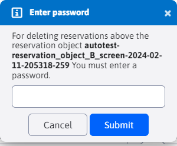

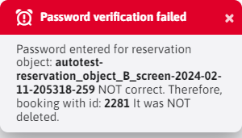
